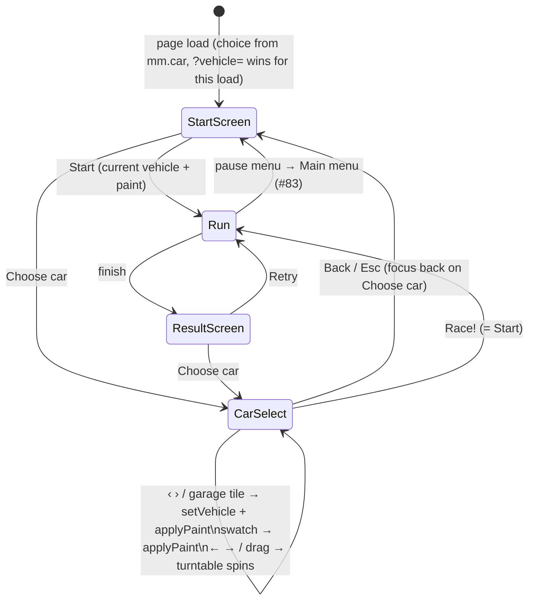

# Car selection — flow

**Keys while the screen is open:**

- **Esc** — back to start/result screen
- **← →** — spin the turntable (held; auto-resumes after release)
- **Tab / Shift+Tab** — move focus to next/previous control
- **Enter / Space** — activate the focused button (native)
- **All other keys** — ignored by the game, browser defaults untouched

**Focus order:** ‹ prev button → › next button → paint swatches → garage tiles → ‹ Back button → Race! › button

Focus opens on **Race!** button when the screen opens; **Back** or **Esc** returns focus to **Choose car** button on the start screen.

## Persistence

**localStorage key:** `mm.car`

**Value:** `{"id":"<vehicle-id>","paint":"<paint-id>"}` (JSON object)

**Lifecycle:**
1. Written on every change (vehicle switch, paint click)
2. Validated field by field on load (unknown id/paint → fallback to defaults)
3. Invalid or missing value falls back to default vehicle (compact) + paint (navy) without error
4. `?vehicle=<id>` URL parameter wins over the stored id for that load only (does not persist)

**Fallback chain:**
- Valid stored choice + valid paint → use both
- Unknown vehicle id → default to compact, keep the stored paint if valid
- Unknown paint id → default to navy, keep the vehicle choice
- Missing or invalid JSON → defaults to compact + navy
