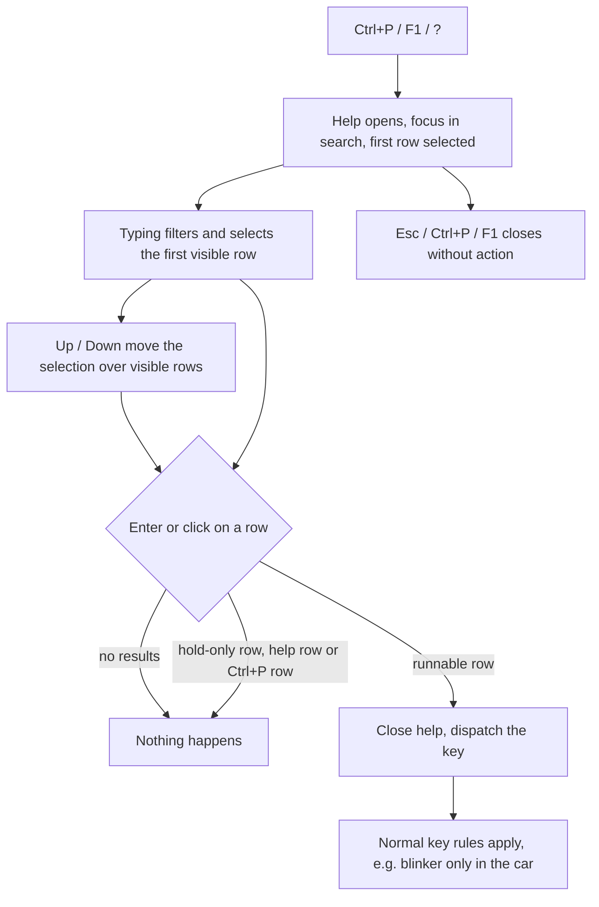

# Command search (#190) — flow

Approved by the maintainer 2026-10-22.

```mermaid
flowchart TD
  A[Ctrl+P / F1 / ?] --> B[Help opens, focus in search, first row selected]
  B --> C[Typing filters and selects the first visible row]
  C --> D[Up / Down move the selection over visible rows]
  D --> E{Enter or click on a row}
  C --> E
  E -->|no results| N[Nothing happens]
  E -->|hold-only row, help row or Ctrl+P row| N
  E -->|runnable row| F[Close help, dispatch the key]
  F --> G[Normal key rules apply, e.g. blinker only in the car]
  B --> X[Esc / Ctrl+P / F1 closes without action]
```
