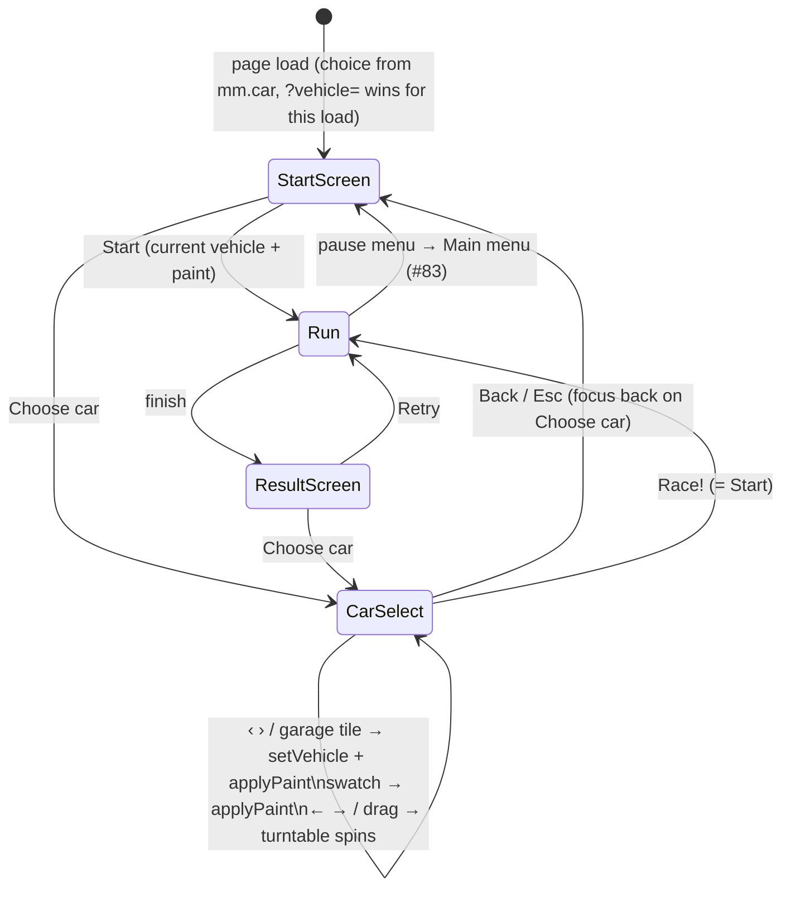

# Car Selection Screen Implementation Plan

> **For agentic workers:** REQUIRED SUB-SKILL: Use superpowers:subagent-driven-development (recommended) or superpowers:executing-plans to implement this plan task-by-task. Steps use checkbox (`- [ ]`) syntax for tracking.

**Goal:** A **Choose car** button on the start / result screen opens a full-screen car selection: the live car on a turntable (cut-out onto the real scene), ‹ › and garage tiles through every `VEHICLES` entry, four stat bars from the table, eleven paint swatches (absorbs #25: plum and flamingo added), **Back** / Esc and **Race!**. Vehicle and paint are remembered in `localStorage['mm.car']`; `?vehicle=<id>` (#6) still selects for one load. Keyboard, mouse and touch, 360 px wide, en / de (#7).

**Architecture:** A new pure module `prototype/carselect.js` holds the rules (`PAINTS`, `statBars`, `barCells`, `cycle`, `paintable`, `parseChoice`, `initialChoice`, `carselKeyAction`, `spinStep`, `lookShift`, `vehicleText`), unit-tested with `node --test`. `prototype/index.html` adds `#carbtn`, the `#carsel` dialog and its CSS, a `CHOICE` restored before the first frame, `applyPaint`, the `CARSEL` state with `openCarSel` / `closeCarSel` / `selectVehicle` / `renderCarSel`, a `stepTurntable` branch in `stepCamera`, a `carselKey` guard at the top of the `keydown` listener (after the J dialog) and the `__mm.carsel()` / `__mm.registerVehicle()` hooks. Strings through `tr()` (#9). Design artefacts in `docs/design/car-select/`.

**Tech Stack:** vanilla JS + three.js in the buildless `prototype/index.html`, `node --test` for pure modules, pytest + Playwright browser tests.

**Spec:** `docs/superpowers/specs/2026-10-03-car-select-design.md`

## Global Constraints

- **No new game key.** While `#carsel` is open only Esc (back), ← → (spin), Tab / Shift+Tab, Enter and Space (native focus and button activation, **not** `preventDefault`ed) do anything; every other key is swallowed by the game and left to the browser. **F** belongs to #10, **B** to #65, **Esc / P** in a run to #83, **L** to #2.
- The screen opens only from the start / result screen (`R.state === 'ready'`). It never touches physics, `applyStyle`, night lighting or the cameras of a run. `test_vehicles.py::test_golden_trace_of_the_compact_car` must stay green after every task.
- Mockup tokens only (`design/mockups/CarSelect.dc.html`, `TODO.md` „UI mockups"): existing `:root` vars (`--sun --signal --cream --steel --steel-l --ink`) plus the mockup's hexes (`#4a515e #3a404b #23272f #8d96a3 #2a2e38 #ff9a1a #0b0d12 #66707e #9ea7b3 #c24a00`). Bungee for the title and the arrows, Barlow Condensed (inherited) for everything else. Real `<button>`s, `:focus-visible` outlines, no logos.
- Dropped from the mockup on purpose: step tabs, „Fan favourite", unlocks, opponents, the painted stage backdrop. Do not add them back.
- Default stays the default: without a stored `mm.car` the game is compact / navy and looks exactly as today.
- Strings go through `tr()`; `prototype/strings.js` gets the same keys in `en` and `de` (`strings.test.mjs` enforces it; Swiss spelling, no `ß`).
- `prototype/index.html`: dense one-line style (long single-line statements, short `//` comments); match the surrounding code, do not reformat neighbours. No framework, no bundler, no `package.json`, no new dependency. New code must **not** call `rr()` or `rnd()` (the seeded RNG).
- Do not touch `data/` or `pipeline/`. Existing tests stay unchanged and green.
- Commands (from the repo root): node tests `node --test prototype/tests/*.test.mjs` (the glob is needed on Node 24). Playwright: `cd pipeline && systemd-run --user --scope -q -p MemoryMax=2G -p MemorySwapMax=0 ./.venv/bin/python -m pytest ../prototype/tests/test_carselect.py -q`. These runs are slow (minutes). Run them in the **foreground only, never `run_in_background`**. Exit 137 means the memory cap was hit: stop and report. Without `systemd-run --user` (CI runner), run the same command without the prefix. One-time setup if the venv is missing: `cd pipeline && python3 -m venv .venv && ./.venv/bin/pip install -r requirements-dev.txt && ./.venv/bin/python -m playwright install chromium`.
- **Headless renderer:** it draws under 1 fps and `loop` clamps `dt` to 0.05 s. Browser tests **poll end states** with `page.wait_for_function(…, timeout=120000)` and wait for frames with the `wait_frames` helper (copied from `test_vehicles.py`), never a fixed `wait_for_timeout` for something the loop writes.
- Commit after every task with Conventional Commits and explicit paths (`git add <paths>`, never `-A`). Push the branch **before** the long Playwright runs.

## Review Focus

- **Look-target sign:** `stepTurntable` shifts the look target along the camera's right vector `(sin a, 0, −cos a)` so the car sits in the *stage's* centre. If the car visibly sits off to one side of the stage after Task 6, flip the sign of `sx` in `stepTurntable` — the pure `lookShift` and its test are right (`lookShift` of a stage left of centre returns a positive „right" shift).
- **Arrow state is not `keys`:** ← → while choosing write `CARSEL.dir`, never `keys.ArrowLeft`; otherwise pressing Race! with an arrow held steers the car on the first frame of the run. `openCarSel` clears `keys`.
- **Native Enter / Space:** the carsel branch returns **before** the listener's `preventDefault` list. If Enter on Race! does not start the race or Tab does not move focus, something swallowed them.
- **Focus after re-render:** swatches and tiles are re-rendered with `innerHTML`; `renderCarSelKeepFocus` re-finds the focused node by `data-paint` / `data-id`. Pinned by `test_second_vehicle_and_race` (a tile click keeps focus on a tile).
- **Phone width:** `test_phone_layout_de` runs at 360 × 740 in `de-CH` with touch; „Beschleunigung" must not overflow the stat label column.
- **#6 interplay:** if #6 has landed first, its startup `?vehicle=` line (`setVehicle(VEHICLES[vehicleFromQuery(...)])`) is **replaced** by `initialChoice` (Task 6, Step 2); keep `vehicleFromQuery` and its tests. `paintable` already treats `model: 'gltf'` as fixed-paint — no field needed on the tractor / bus entries.

---

## File map

- Create: `docs/design/car-select/wireframe.md`, `docs/design/car-select/flow.md`.
- Create: `prototype/carselect.js`, `prototype/tests/carselect.test.mjs`, `prototype/tests/test_carselect.py`.
- Modify `prototype/strings.js`: car select keys in `en` (after `chipAll`, ~L106) and `de` (after `chipAll`, ~L201).
- Modify `prototype/tests/strings.test.mjs`: one new test at the end.
- Modify `prototype/index.html`:
  - CSS before `@media (prefers-reduced-motion:reduce)` (~L84)
  - `#carbtn` in the `.row` (~L186); `#carsel` dialog after `#overlay` (~L197)
  - `carselect.js` import after the `strings.js` import (~L206)
  - startup `setVehicle(VEH)` (~L897) → choice restore + `applyPaint`
  - `keydown` / `keyup` listeners (~L915)
  - `stepCamera` (~L1022-1027)
  - car select glue + hooks after `$('startbtn').onclick` (~L1042)
  - `rerenderAll` (~L1075)
  - the `#game-nav` phone rule (~L1145)
- Modify: `CHANGELOG.md`, `test-todo.md`.

Line numbers are from `main` @ `13a4ef7`. Verify them with `grep -n` before editing, because other PRs (#6, #83, #2, #10) may have shifted them.

---

### Task 0: Preconditions

**Files:** none.

- [ ] **Step 1: Check the anchors.** Run each on its own from the repo root:

```bash
grep -c "const tr = " prototype/index.html
grep -c "^setVehicle(VEH);" prototype/index.html
grep -c "id=\"carsel\"" prototype/index.html
grep -c "mm.car" prototype/index.html
grep -n "function stepCamera" prototype/index.html
grep -n "if (!\$('jump').hidden) { jumpKey(e); return; }" prototype/index.html
```

Expected: `1`, `1`, `0`, `0`, one line each for the last two. **If `id="carsel"` or `mm.car` already appears**, STOP and report.

- [ ] **Step 2: Note which neighbours have landed.** `grep -c "vehicleFromQuery" prototype/index.html` (#6: `1` or more means its startup line exists — see Task 6, Step 2), `grep -c "pauseKey" prototype/index.html` (#83), `grep -c "nightbtn" prototype/index.html` (#2). Nothing else to do; the plan says where each one interacts.

- [ ] **Step 3: Baseline.** `node --test prototype/tests/*.test.mjs` → all pass. Note the count.

---

### Task 1: Design artefacts (UI workflow phases 1 and 2)

**Files:**
- Create: `docs/design/car-select/wireframe.md`, `docs/design/car-select/flow.md`

- [ ] **Step 1: Wireframe pointer.** Write `docs/design/car-select/wireframe.md`:

```markdown
# Car selection — wireframe

The approved wireframe is the mockup `design/mockups/CarSelect.dc.html` (artboard 03, 1920 × 1080; user decision 2026-10-03, issue #7). Read its markup for colours, sizes, spacing and fonts; do not render it (it needs the Claude Design runtime).

## What the prototype builds from it

- Header: title **Choose car** (Bungee, skewed, Sunflower with the burnt / ink shadow), subtitle = the game's `mode` string.
- Body: stage left (58 %), info panel right. The stage is a **see-through cut-out onto the live scene** — the real car turns on it — with the mockup's bevel border; everything outside the stage is dimmed. ‹ › buttons inside the stage, „Car i of n" top left, „Rotate · drag or ← →" at the bottom.
- Info panel: class line, name, description; four 10-cell stat bars with the score (Top speed, Acceleration, Handling, Mass); „Paint" with the colour name and eleven swatches in two rows; „Garage · n vehicles" with one tile per vehicle.
- Footer bar: **‹ Back** left, **Race! ›** right.

## Dropped on purpose

- The 1 · 2 · 3 step tabs (no race setup screen exists).
- „Fan favourite" badge, lock tiles and „Next unlock" (nothing is locked).
- Opponents line (v0 has no opponents).
- The painted radial stage backdrop (the live scene is the backdrop).

## Phone width (≤ 700 px)

Header, stage (38 vh), info panel and footer stack in one column; the screen scrolls vertically only; swatches sit in two rows of six columns (6 + 5), tiles wrap; footer buttons share the width. All buttons ≥ 44 px tall.
```

- [ ] **Step 2: Flow.** Write `docs/design/car-select/flow.md`:

````markdown
# Car selection — flow



Keys while the screen is open: **Esc** back · **← →** spin (held) · **Tab / Shift+Tab** focus · **Enter / Space** press the focused button · everything else ignored. Focus order: ‹, ›, swatches, garage tiles, Back, Race!; opens on Race!.

Persistence: `localStorage['mm.car'] = {"id","paint"}`, written on every change, validated field by field on load; `?vehicle=<id>` overrides the id for one load without storing it.
````

- [ ] **Step 3: Commit.**

```bash
git add docs/design/car-select/wireframe.md docs/design/car-select/flow.md
git commit -m "docs(design): car selection wireframe pointer and flow (#7)"
```

---

### Task 2: Pure rules `prototype/carselect.js`

**Files:**
- Create: `prototype/carselect.js`
- Test: `prototype/tests/carselect.test.mjs`

**Interfaces:**
- `PAINTS: { id, hex, nameKey }[]` (eleven, navy first; plum and flamingo absorb #25), `DEFAULT_CHOICE = { id: 'compact', paint: 'navy' }`
- `STAT_REF`, `STAT_KEYS = ['top', 'accel', 'handling', 'mass']`, `STAT_LABEL_KEYS: { top: 'statTop', … }`
- `statBars(def) → { top, accel, handling, mass }` integers 1..10; `barCells(score) → ('lit' | 'tip' | 'off')[10]`
- `cycle(i, n, step) → number`; `paintable(def) → boolean`
- `parseChoice(raw, ids, paintIds) → { id, paint }`; `initialChoice(raw, search, ids, paintIds) → { id, paint }`
- `carselKeyAction({ code }) → 'back' | 'spin' | 'pass' | 'ignore'`
- `SPIN_AUTO, SPIN_KEY, SPIN_DRAG, SPIN_RESUME`; `spinStep({ angle, idle }, dt, { dir, drag }) → { angle, idle }`
- `lookShift(ox, oy, dist, fovDeg, aspect) → [right, up]`; `vehicleText(tr, id, part) → string`

- [ ] **Step 1: Write the failing test** `prototype/tests/carselect.test.mjs`:

```js
// #7: the car selection screen's pure rules. Pure module, so node --test can import it without a browser.
import { test } from 'node:test';
import assert from 'node:assert/strict';
import { PAINTS, DEFAULT_CHOICE, STAT_KEYS, statBars, barCells, cycle, paintable, parseChoice, initialChoice, carselKeyAction, spinStep, lookShift, vehicleText, SPIN_RESUME, SPIN_AUTO, SPIN_KEY } from '../carselect.js';

const COMPACT = { model: 'compact', drive: { top: 60, accel: 16, grip: 9, steerRate: 2.6 }, mass: 1.0 };
const TRACTOR = { model: 'gltf', drive: { top: 11.1, accel: 6, grip: 30, steerRate: 2.2 }, mass: 2.5 };   // #6 spec values
const BUS = { model: 'gltf', drive: { top: 22, accel: 4, grip: 6, steerRate: 1.1 }, mass: 8 };
const IDS = ['compact', 'bus'], PAINT_IDS = PAINTS.map(p => p.id);

test('PAINTS: eleven unique ids and hexes, navy first, purple and pink from #25, one orange, every hex #rrggbb', () => {
  assert.equal(PAINTS.length, 11);
  assert.equal(new Set(PAINT_IDS).size, 11);
  assert.equal(new Set(PAINTS.map(p => p.hex)).size, 11);
  assert.equal(PAINTS[0].id, 'navy'); assert.equal(PAINTS[0].hex, '#1b2d5e');
  assert.equal(PAINTS.find(p => p.id === 'plum')?.hex, '#7b3fa0');
  assert.equal(PAINTS.find(p => p.id === 'flamingo')?.hex, '#ff6fa8');
  assert.deepEqual(PAINTS.filter(p => p.hex === '#ff7a1a').map(p => p.id), ['signal']);   // #25's orange is the mockup's Signal, not a second entry
  for (const p of PAINTS) { assert.match(p.hex, /^#[0-9a-f]{6}$/, p.id); assert.ok(p.nameKey.startsWith('paint'), p.id); }
  assert.deepEqual(DEFAULT_CHOICE, { id: 'compact', paint: 'navy' });
});

test('statBars: compact 8 / 8 / 8 / 3, tractor and bus from the #6 table, integers clamped to 1..10', () => {
  assert.deepEqual(statBars(COMPACT), { top: 8, accel: 8, handling: 8, mass: 3 });
  assert.deepEqual(statBars(TRACTOR), { top: 1, accel: 3, handling: 8, mass: 8 });
  assert.deepEqual(statBars(BUS), { top: 3, accel: 2, handling: 4, mass: 10 });
  assert.deepEqual(statBars({ ...COMPACT, drive: { ...COMPACT.drive, top: 30 }, mass: 2 }), { top: 4, accel: 8, handling: 8, mass: 7 });
  const zero = statBars({ drive: { top: 0, accel: 0, grip: 0, steerRate: 0 }, mass: 0 }), huge = statBars({ drive: { top: 1e9, accel: 1e9, grip: 1e9, steerRate: 1e9 }, mass: 1e9 });
  for (const k of STAT_KEYS) { assert.equal(zero[k], 1, k); assert.equal(huge[k], 10, k); assert.ok(Number.isInteger(statBars(COMPACT)[k]), k); }
});

test('barCells: lit cells, the last lit one is the tip, the rest off', () => {
  assert.deepEqual(barCells(3), ['lit', 'lit', 'tip', 'off', 'off', 'off', 'off', 'off', 'off', 'off']);
  assert.deepEqual(barCells(1), ['tip', ...Array(9).fill('off')]);
  assert.deepEqual(barCells(10), [...Array(9).fill('lit'), 'tip']);
});

test('cycle wraps both ways', () => {
  assert.equal(cycle(0, 3, 1), 1); assert.equal(cycle(2, 3, 1), 0); assert.equal(cycle(0, 3, -1), 2); assert.equal(cycle(0, 1, 1), 0); assert.equal(cycle(0, 1, -1), 0);
});

test('paintable: procedural models yes, glTF only when the entry opts in, paint: false always wins', () => {
  assert.equal(paintable(COMPACT), true);
  assert.equal(paintable(BUS), false);
  assert.equal(paintable({ ...BUS, paint: true }), true);
  assert.equal(paintable({ ...COMPACT, paint: false }), false);
});

test('parseChoice: a valid choice passes, every kind of garbage falls back field by field', () => {
  assert.deepEqual(parseChoice('{"id":"bus","paint":"ice"}', IDS, PAINT_IDS), { id: 'bus', paint: 'ice' });
  assert.deepEqual(parseChoice(null, IDS, PAINT_IDS), DEFAULT_CHOICE);
  assert.deepEqual(parseChoice('', IDS, PAINT_IDS), DEFAULT_CHOICE);
  assert.deepEqual(parseChoice('not json', IDS, PAINT_IDS), DEFAULT_CHOICE);
  assert.deepEqual(parseChoice('42', IDS, PAINT_IDS), DEFAULT_CHOICE);
  assert.deepEqual(parseChoice('{"id":"tank","paint":"ice"}', IDS, PAINT_IDS), { id: 'compact', paint: 'ice' });
  assert.deepEqual(parseChoice('{"id":"bus","paint":"zebra"}', IDS, PAINT_IDS), { id: 'bus', paint: 'navy' });
  assert.deepEqual(parseChoice('{"id":"constructor"}', IDS, PAINT_IDS), DEFAULT_CHOICE);
  assert.notEqual(parseChoice(null, IDS, PAINT_IDS), DEFAULT_CHOICE);   // a copy, never the constant itself
});

test('initialChoice: ?vehicle= wins over the stored id for this load, unknown ids are ignored, paint stays', () => {
  assert.deepEqual(initialChoice('{"id":"compact","paint":"ice"}', '?vehicle=bus', IDS, PAINT_IDS), { id: 'bus', paint: 'ice' });
  assert.deepEqual(initialChoice('{"id":"bus","paint":"ice"}', '?vehicle=tank', IDS, PAINT_IDS), { id: 'bus', paint: 'ice' });
  assert.deepEqual(initialChoice(null, '?debug&vehicle=bus', IDS, PAINT_IDS), { id: 'bus', paint: 'navy' });
  assert.deepEqual(initialChoice(null, '', IDS, PAINT_IDS), DEFAULT_CHOICE);
});

test('carselKeyAction: Esc backs out, arrows spin, Tab / Enter / Space stay native, every game key is ignored', () => {
  assert.equal(carselKeyAction({ code: 'Escape' }), 'back');
  assert.equal(carselKeyAction({ code: 'ArrowLeft' }), 'spin'); assert.equal(carselKeyAction({ code: 'ArrowRight' }), 'spin');
  for (const c of ['Tab', 'Enter', 'NumpadEnter', 'Space']) assert.equal(carselKeyAction({ code: c }), 'pass', c);
  for (const c of ['KeyT', 'KeyC', 'KeyR', 'KeyH', 'KeyM', 'KeyJ', 'KeyF', 'KeyB', 'KeyV', 'KeyG', 'KeyP', 'KeyL', 'F1', 'F3', 'ArrowUp', 'ArrowDown', 'KeyW', 'ControlLeft']) assert.equal(carselKeyAction({ code: c }), 'ignore', c);
});

test('spinStep: idle turntable turns by itself, a held arrow takes over, auto resumes after SPIN_RESUME seconds', () => {
  const idle = spinStep({ angle: 0, idle: SPIN_RESUME }, 0.1, { dir: 0, drag: 0 });
  assert.ok(Math.abs(idle.angle - SPIN_AUTO * 0.1) < 1e-12, idle.angle);
  const held = spinStep({ angle: 1, idle: SPIN_RESUME }, 0.1, { dir: 1, drag: 0 });
  assert.ok(Math.abs(held.angle - (1 + SPIN_KEY * 0.1)) < 1e-12, held.angle); assert.equal(held.idle, 0);
  const still = spinStep(held, 0.5, { dir: 0, drag: 0 });
  assert.equal(still.angle, held.angle); assert.equal(still.idle, 0.5);
  let s = still; for (let i = 0; i < 20; i++) s = spinStep(s, 0.1, { dir: 0, drag: 0 });
  assert.ok(s.idle >= SPIN_RESUME && s.angle > still.angle, JSON.stringify(s));
  const dragged = spinStep({ angle: 0, idle: 5 }, 0.1, { dir: 0, drag: 50 });
  assert.ok(Math.abs(dragged.angle - 0.5) < 1e-12, dragged.angle); assert.equal(dragged.idle, 0);
  const wrapped = spinStep({ angle: 6.2, idle: 0 }, 0.1, { dir: 1, drag: 0 });
  assert.ok(wrapped.angle >= 0 && wrapped.angle < 2 * Math.PI, wrapped.angle);
  const back = spinStep({ angle: 0.05, idle: 0 }, 0.1, { dir: -1, drag: 0 });
  assert.ok(back.angle > 6 && back.angle < 2 * Math.PI, back.angle);
});

test('lookShift: a centred stage shifts nothing; a stage left of centre moves the look target to the right of the car', () => {
  assert.deepEqual(lookShift(0, 0, 10, 62, 16 / 9), [0, 0]);
  const [right, up] = lookShift(-0.4, 0.2, 10, 62, 2);
  const halfH = 10 * Math.tan(31 * Math.PI / 180);
  assert.ok(Math.abs(right - 0.4 * halfH * 2) < 1e-12, right); assert.ok(right > 0);
  assert.ok(Math.abs(up + 0.2 * halfH) < 1e-12, up); assert.ok(up < 0);
});

test('vehicleText: strings when they exist, the id as the name otherwise, never a raw key', () => {
  const tr = (k) => ({ veh_compact_name: 'Sissle Speedster', veh_compact_class: 'Compact · Class B' })[k] ?? k;
  assert.equal(vehicleText(tr, 'compact', 'name'), 'Sissle Speedster');
  assert.equal(vehicleText(tr, 'compact', 'class'), 'Compact · Class B');
  assert.equal(vehicleText(tr, 'compact', 'desc'), '');
  assert.equal(vehicleText(tr, 'bus', 'name'), 'bus');
  assert.equal(vehicleText(tr, 'bus', 'class'), '');
});
```

- [ ] **Step 2: Run it, watch it fail.** `node --test prototype/tests/*.test.mjs` → `carselect.test.mjs` fails with `Cannot find module '../carselect.js'`.

- [ ] **Step 3: Implement** `prototype/carselect.js`:

```js
// #7: pure rules for the car selection screen -- no DOM, no three.js. Unit-tested with `node --test prototype/tests/*.test.mjs`.

// paint swatches in display (hue) order; navy is today's factory colour (index.html carMats.body) and the default;
// plum and flamingo are #25's purple and pink, its orange is the mockup's signal
export const PAINTS = [
  { id: 'navy', hex: '#1b2d5e', nameKey: 'paintNavy' },
  { id: 'sunflower', hex: '#ffc61a', nameKey: 'paintSunflower' },
  { id: 'signal', hex: '#ff7a1a', nameKey: 'paintSignal' },
  { id: 'swiss', hex: '#e0322d', nameKey: 'paintSwiss' },
  { id: 'flamingo', hex: '#ff6fa8', nameKey: 'paintFlamingo' },   // pink, #25
  { id: 'plum', hex: '#7b3fa0', nameKey: 'paintPlum' },           // purple, #25
  { id: 'rhine', hex: '#2f6a96', nameKey: 'paintRhine' },
  { id: 'ice', hex: '#7fd1ff', nameKey: 'paintIce' },
  { id: 'meadow', hex: '#5f8a4c', nameKey: 'paintMeadow' },
  { id: 'cream', hex: '#f5efe0', nameKey: 'paintCream' },
  { id: 'charcoal', hex: '#2a2e38', nameKey: 'paintCharcoal' },
];
export const DEFAULT_CHOICE = { id: 'compact', paint: 'navy' };

// fixed reference ceilings: a new vehicle never moves an existing bar (compact reads 8 / 8 / 8 / 3)
export const STAT_REF = { top: 80, accel: 20, grip: 12, steerRate: 3.2, mass: 3 };
export const STAT_KEYS = ['top', 'accel', 'handling', 'mass'];
export const STAT_LABEL_KEYS = { top: 'statTop', accel: 'statAccel', handling: 'statHandling', mass: 'statMass' };

const unit = (v, ref) => Math.max(0, Math.min(1, v / ref));
const score = (u) => Math.max(1, Math.min(10, Math.round(u * 10)));
// def: a VEHICLES entry (drive.top, drive.accel, drive.grip, drive.steerRate, mass) → four integer scores 1..10
export function statBars(def) {
  const d = def.drive;
  return {
    top: score(unit(d.top, STAT_REF.top)),
    accel: score(unit(d.accel, STAT_REF.accel)),
    handling: score(0.5 * unit(d.grip, STAT_REF.grip) + 0.5 * unit(d.steerRate, STAT_REF.steerRate)),
    mass: score(unit(def.mass, STAT_REF.mass)),
  };
}
// ten cells: 'lit' (Sunflower), the last lit one 'tip' (Signal orange), the rest 'off'
export function barCells(score) {
  return Array.from({ length: 10 }, (_, i) => (i >= score ? 'off' : i === score - 1 ? 'tip' : 'lit'));
}

export function cycle(i, n, step) { return ((i + step) % n + n) % n; }

// procedural models take the paint (carMats.body); glTF models carry their colour in a texture and are fixed unless the entry opts in
export function paintable(def) { return def.paint === true || (def.paint !== false && def.model !== 'gltf'); }

// localStorage['mm.car'] → { id, paint }; each field falls back on its own (an unknown id after a table rename keeps the paint)
export function parseChoice(raw, ids, paintIds) {
  let c = null;
  try { c = JSON.parse(raw); } catch (e) { return { ...DEFAULT_CHOICE }; }
  const id = c && ids.includes(c.id) ? c.id : DEFAULT_CHOICE.id;
  const paint = c && paintIds.includes(c.paint) ? c.paint : DEFAULT_CHOICE.paint;
  return { id, paint };
}
// the stored choice, with ?vehicle=<id> (#6) winning for this load when it names a table entry
export function initialChoice(raw, search, ids, paintIds) {
  const c = parseChoice(raw, ids, paintIds);
  const q = new URLSearchParams(search).get('vehicle');
  return q && ids.includes(q) ? { ...c, id: q } : c;
}

const PASS = new Set(['Tab', 'Enter', 'NumpadEnter', 'Space']);
// key = { code } (a KeyboardEvent works) → 'back' | 'spin' | 'pass' (native focus / button activation) | 'ignore' (no game key while choosing)
export function carselKeyAction(key) {
  if (key.code === 'Escape') return 'back';
  if (key.code === 'ArrowLeft' || key.code === 'ArrowRight') return 'spin';
  return PASS.has(key.code) ? 'pass' : 'ignore';
}

export const SPIN_AUTO = 0.35, SPIN_KEY = 1.8, SPIN_DRAG = 0.01, SPIN_RESUME = 2;
const TAU = Math.PI * 2;
// state = { angle, idle }, input = { dir: -1 | 0 | 1 (arrow held), drag: pixels since the last frame }
// idle turntable: SPIN_AUTO rad/s; any input stops it and it resumes SPIN_RESUME seconds after the last input
export function spinStep(state, dt, input) {
  const dir = input.dir || 0, drag = input.drag || 0, active = dir !== 0 || drag !== 0;
  const idle = active ? 0 : state.idle + dt;
  let angle = state.angle + dir * SPIN_KEY * dt + drag * SPIN_DRAG;
  if (!active && idle >= SPIN_RESUME) angle += SPIN_AUTO * dt;
  return { angle: ((angle % TAU) + TAU) % TAU, idle };
}

// the stage is not at the screen's centre: shift the look target so the car sits in the stage's centre.
// ox, oy: stage centre in normalised device coordinates (-1..1, x right, y up); dist: camera → car; → [right, up] world metres
export function lookShift(ox, oy, dist, fovDeg, aspect) {
  const halfH = dist * Math.tan(fovDeg * Math.PI / 360), halfW = halfH * aspect;
  return [0 - ox * halfW, 0 - oy * halfH];   // 0 - x, not -x: a centred stage must give +0, not -0
}

// veh_<id>_<part> through tr(); a vehicle without strings shows its id as the name and nothing else -- never a raw key
export function vehicleText(tr, id, part) {
  const key = `veh_${id}_${part}`, text = tr(key);
  if (text !== key) return text;
  return part === 'name' ? id : '';
}
```

- [ ] **Step 4: Run, watch it pass.** `node --test prototype/tests/*.test.mjs` → all pass (baseline + 11). (This code and test were dry-run green during enrichment.)

- [ ] **Step 5: Commit.**

```bash
git add prototype/carselect.js prototype/tests/carselect.test.mjs
git commit -m "feat(ui): pure car selection rules — stats, paints, choice, spin (#7)"
```

---

### Task 3: Strings

**Files:**
- Modify: `prototype/strings.js` (`en` after `chipAll` ~L106, `de` after `chipAll` ~L201)
- Test: `prototype/tests/strings.test.mjs`

- [ ] **Step 1: Write the failing test.** Append to `prototype/tests/strings.test.mjs`:

```js
test('car selection texts exist in both languages (#7)', () => {
  assert.equal(translate('en', 'chooseCar'), 'Choose car');
  assert.equal(translate('en', 'carselCount', 2, 3), 'Car 2 of 3');
  assert.equal(translate('en', 'garageLabel', 1), 'Garage · 1 vehicle');
  assert.equal(translate('en', 'garageLabel', 3), 'Garage · 3 vehicles');
  assert.equal(translate('en', 'veh_compact_name'), 'Sissle Speedster');
  assert.equal(translate('de', 'chooseCar'), 'Auto wählen');
  assert.equal(translate('de', 'carselCount', 2, 3), 'Auto 2 von 3');
  assert.equal(translate('de', 'garageLabel', 1), 'Garage · 1 Fahrzeug');
  assert.equal(translate('de', 'garageLabel', 3), 'Garage · 3 Fahrzeuge');
  assert.equal(translate('de', 'veh_compact_class'), 'Kompakt · Klasse B');
  assert.equal(translate('de', 'carselRace'), 'Los! ›');
  for (const k of ['carselTitle', 'carselPrev', 'carselNext', 'carselRotate', 'statTop', 'statAccel', 'statHandling', 'statMass', 'paintLabel', 'paintFixed', 'paintNavy', 'paintSunflower', 'paintSignal', 'paintSwiss', 'paintFlamingo', 'paintPlum', 'paintRhine', 'paintIce', 'paintMeadow', 'paintCream', 'paintCharcoal', 'carselBack', 'veh_compact_desc']) assert.notEqual(translate('de', k), k, k);
});
```

- [ ] **Step 2: Run it, watch it fail.** `node --test prototype/tests/*.test.mjs` → the new test fails (`'chooseCar' !== 'Choose car'`).

- [ ] **Step 3: Implement.** In `en`, after `chipAll: 'All',`:

```js
  // ---- car selection (#7) ----
  chooseCar: 'Choose car',
  carselTitle: 'Choose car',
  carselCount: (i, n) => `Car ${i} of ${n}`,
  carselPrev: 'Previous car',
  carselNext: 'Next car',
  carselRotate: 'Rotate · drag or ← →',
  statTop: 'Top speed',
  statAccel: 'Acceleration',
  statHandling: 'Handling',
  statMass: 'Mass',
  paintLabel: 'Paint',
  paintFixed: 'fixed',
  paintNavy: 'Navy',
  paintSunflower: 'Sunflower',
  paintSignal: 'Signal orange',
  paintSwiss: 'Swiss red',
  paintFlamingo: 'Flamingo',
  paintPlum: 'Plum',
  paintRhine: 'Rhine blue',
  paintIce: 'Ice',
  paintMeadow: 'Meadow',
  paintCream: 'Cream',
  paintCharcoal: 'Charcoal',
  garageLabel: (n) => `Garage · ${n} ${n === 1 ? 'vehicle' : 'vehicles'}`,
  carselBack: '‹ Back',
  carselRace: 'Race! ›',
  veh_compact_name: 'Sissle Speedster',
  veh_compact_class: 'Compact · Class B',
  veh_compact_desc: 'Small, light, a bit too eager. Fits through the old town like it was measured for it.',
```

In `de`, after `chipAll: 'Alle',`:

```js
  chooseCar: 'Auto wählen',
  carselTitle: 'Auto wählen',
  carselCount: (i, n) => `Auto ${i} von ${n}`,
  carselPrev: 'Vorheriges Fahrzeug',
  carselNext: 'Nächstes Fahrzeug',
  carselRotate: 'Drehen · ziehen oder ← →',
  statTop: 'Höchsttempo',
  statAccel: 'Beschleunigung',
  statHandling: 'Handling',
  statMass: 'Masse',
  paintLabel: 'Lack',
  paintFixed: 'fest',
  paintNavy: 'Marine',
  paintSunflower: 'Sonnenblume',
  paintSignal: 'Signalorange',
  paintSwiss: 'Schweizer Rot',
  paintFlamingo: 'Flamingo',
  paintPlum: 'Pflaume',
  paintRhine: 'Rheinblau',
  paintIce: 'Eis',
  paintMeadow: 'Wiese',
  paintCream: 'Creme',
  paintCharcoal: 'Anthrazit',
  garageLabel: (n) => `Garage · ${n} ${n === 1 ? 'Fahrzeug' : 'Fahrzeuge'}`,
  carselBack: '‹ Zurück',
  carselRace: 'Los! ›',
  veh_compact_name: 'Sissle Speedster',
  veh_compact_class: 'Kompakt · Klasse B',
  veh_compact_desc: 'Klein, leicht, etwas übereifrig. Passt durch die Altstadt, als wäre sie dafür vermessen worden.',
```

- [ ] **Step 4: Run, watch it pass.** `node --test prototype/tests/*.test.mjs` → all pass (the equal-keys and no-`ß` tests included).

- [ ] **Step 5: Commit.**

```bash
git add prototype/strings.js prototype/tests/strings.test.mjs
git commit -m "feat(i18n): car selection strings (#7)"
```

---

### Task 4: Failing browser tests

**Files:**
- Create: `prototype/tests/test_carselect.py`

**Interfaces (consumed, built in Tasks 5–6):** `__mm.carsel()` → `{ open, id, index, count, paint, paintable, bars, bodyColor, angle, focus, carVisible }`; `__mm.registerVehicle(id, def)`; ids `#carbtn`, `#carsel`, `#csstage`, `#cscount`, `#csprev`, `#csnext`, `#csclass`, `#csname`, `#csdesc`, `#csstats`, `#cspaintname`, `#cspaints`, `#csgaragelabel`, `#csgarage`, `#csback`, `#csrace`. Existing hooks used: `__mm.vehicles()`, `__mm.vehicle()`, `__mm.cam()`, `__mm.hud()`.

- [ ] **Step 1: Write the failing tests** `prototype/tests/test_carselect.py`:

```python
"""#7: the car selection screen -- Choose car opens it, the live car turns on the stage, stat bars and texts come from the
vehicle table, paint swatches recolour the body, the choice is remembered, a second table entry appears by itself.
Hand-traced layout (world + terrain blocked): no data files needed, deterministic and fast.
Slow (Playwright): run in the foreground."""
import json

import pytest
from playwright.sync_api import sync_playwright

MMH_ROUTE = "**/data/terrain_hochrhein.mmh"
ARGS = ["--use-angle=swiftshader", "--enable-unsafe-swiftshader", "--ignore-gpu-blocklist"]
READY = "() => window.__mm && window.__mm.sim && window.__mm.carsel && document.querySelector('#worldstatus')?.textContent"
T = 120000
SLOW = "(() => { const c = window.__mm.vehicles().compact; c.drive.top = 30; c.mass = 2; return c; })()"
FIXED = "(() => { const c = window.__mm.vehicles().compact; c.paint = false; return c; })()"


def open_page(p, server, phone=False, stored=None, query=""):
    b = p.chromium.launch(args=ARGS)
    if phone:
        ctx = b.new_context(viewport={"width": 360, "height": 740}, has_touch=True, is_mobile=True, locale="de-CH")
    else:
        ctx = b.new_context(viewport={"width": 1280, "height": 720}, locale="en-US")
    if stored is not None:
        ctx.add_init_script(f"try {{ localStorage.setItem('mm.car', {json.dumps(stored)}); }} catch (e) {{}}")
    page = ctx.new_page()
    errors = []
    page.on("pageerror", lambda e: errors.append(str(e)))
    page.route(MMH_ROUTE, lambda r: r.fulfill(status=404, body=""))
    page.route("**/data/world_hochrhein.json", lambda r: r.fulfill(status=404, body=""))
    page.goto(f"{server}/prototype/index.html{query}")
    page.wait_for_function(READY, timeout=240000)
    return b, page, errors


def carsel(page):
    return page.evaluate("() => window.__mm.carsel()")


def wait_frames(page, n=2):
    """Wait until the game loop has drawn n more frames (see test_vehicles.py: a headless renderer can draw under 1 fps)."""
    page.evaluate("() => { if (!window.__frames) { window.__frames = { n: 0 }; const tick = () => { window.__frames.n++; requestAnimationFrame(tick); }; requestAnimationFrame(tick); } window.__frames.n = 0; }")
    page.wait_for_function(f"() => window.__frames.n >= {n}", timeout=T)


def open_carsel(page):
    page.click("#carbtn")
    page.wait_for_function("() => !document.querySelector('#carsel').hidden && window.__mm.carsel().open", timeout=T)


def lit_counts(page):
    return page.evaluate("() => [...document.querySelectorAll('#csstats .cs-stat')].map(s => ({ lit: s.querySelectorAll('.cs-cells i.lit, .cs-cells i.tip').length, score: +s.querySelector('.cs-score').textContent }))")


def test_choose_car_opens_the_screen_with_the_compact(server):
    with sync_playwright() as p:
        b, page, errors = open_page(p, server)
        assert page.evaluate("() => document.querySelector('#overlay .row').children[1].id") == "carbtn"
        open_carsel(page)
        wait_frames(page)
        got = carsel(page)
        shown = page.evaluate("""() => ({
            overlayHidden: document.querySelector('#overlay').hidden,
            role: document.querySelector('#carsel').getAttribute('role'), modal: document.querySelector('#carsel').getAttribute('aria-modal'),
            title: document.querySelector('#carseltitle').textContent, count: document.querySelector('#cscount').textContent,
            name: document.querySelector('#csname').textContent, cls: document.querySelector('#csclass').textContent,
            desc: document.querySelector('#csdesc').textContent,
            paintName: document.querySelector('#cspaintname').textContent,
            swatches: [...document.querySelectorAll('#cspaints button')].map(b => b.getAttribute('aria-pressed')),
            tiles: [...document.querySelectorAll('#csgarage button')].map(b => b.getAttribute('aria-pressed')),
            garage: document.querySelector('#csgaragelabel').textContent,
            back: document.querySelector('#csback').textContent, race: document.querySelector('#csrace').textContent })""")
        bars = lit_counts(page)
        b.close()
    assert shown["overlayHidden"] is True and shown["role"] == "dialog" and shown["modal"] == "true"
    assert shown["title"] == "Choose car" and shown["count"] == "Car 1 of 1"
    assert shown["name"] == "Sissle Speedster" and shown["cls"] == "Compact · Class B" and shown["desc"].startswith("Small, light")
    assert shown["paintName"] == "Navy" and shown["swatches"] == ["true"] + ["false"] * 10 and shown["tiles"] == ["true"]
    assert shown["garage"] == "Garage · 1 vehicle" and shown["back"] == "‹ Back" and shown["race"] == "Race! ›"
    assert bars == [{"lit": 8, "score": 8}, {"lit": 8, "score": 8}, {"lit": 8, "score": 8}, {"lit": 3, "score": 3}]
    assert got["open"] is True and got["id"] == "compact" and got["paint"] == "navy" and got["focus"] == "csrace"
    assert got["carVisible"] is True and got["bodyColor"] == "1b2d5e" and got["paintable"] is True
    assert errors == []


def test_turntable_spins_and_esc_goes_back(server):
    """V before opening: the car must still show on the turntable and be hidden again after Back."""
    with sync_playwright() as p:
        b, page, errors = open_page(p, server)
        page.keyboard.press("KeyV"); wait_frames(page)
        assert page.evaluate("() => window.__mm.hud().carVisible") is False
        view_before = page.evaluate("() => window.__mm.cam().view")
        open_carsel(page)
        wait_frames(page); a0 = carsel(page)["angle"]
        wait_frames(page, 3); a1 = carsel(page)["angle"]              # idle: the turntable turns by itself
        page.keyboard.down("ArrowRight"); wait_frames(page, 3); a2 = carsel(page)["angle"]
        page.keyboard.up("ArrowRight"); wait_frames(page); a3 = carsel(page)["angle"]
        wait_frames(page, 2); a4 = carsel(page)["angle"]              # just released: still, auto resumes only after 2 s
        visible_on_stage = carsel(page)["carVisible"]
        no_game_key = page.evaluate("() => window.__mm.cam().view")
        page.keyboard.press("KeyC"); page.keyboard.press("KeyB"); wait_frames(page)
        view_inside = page.evaluate("() => window.__mm.cam().view")
        page.keyboard.press("Escape")
        page.wait_for_function("() => document.querySelector('#carsel').hidden && !document.querySelector('#overlay').hidden", timeout=T)
        wait_frames(page, 2)
        after = page.evaluate("() => ({ focus: document.activeElement?.id, view: window.__mm.cam().view, carVisible: window.__mm.hud().carVisible, open: window.__mm.carsel().open })")
        b.close()
    assert a1 != a0 and a2 != a1 and a4 == a3, (a0, a1, a2, a3, a4)
    assert visible_on_stage is True
    assert view_inside == view_before == no_game_key            # C is ignored while choosing
    assert after == {"focus": "carbtn", "view": view_before, "carVisible": False, "open": False}
    assert errors == []


def test_paint_recolours_and_persists(server):
    with sync_playwright() as p:
        b, page, errors = open_page(p, server)
        open_carsel(page)
        page.click("#cspaints button[data-paint=sunflower]")
        got = carsel(page)
        shown = page.evaluate("""() => ({ stored: localStorage.getItem('mm.car'), name: document.querySelector('#cspaintname').textContent,
            pressed: document.querySelector('#cspaints button[data-paint=sunflower]').getAttribute('aria-pressed'),
            focus: document.activeElement?.dataset?.paint })""")
        page.reload(); page.wait_for_function(READY, timeout=240000)
        reloaded = carsel(page)
        b.close()
    assert got["bodyColor"] == "ffc61a" and got["paint"] == "sunflower"
    assert json.loads(shown["stored"]) == {"id": "compact", "paint": "sunflower"} and shown["name"] == "Sunflower" and shown["pressed"] == "true"
    assert shown["focus"] == "sunflower"                        # the re-render kept the focus on the clicked swatch
    assert reloaded["bodyColor"] == "ffc61a" and reloaded["paint"] == "sunflower" and reloaded["open"] is False
    assert errors == []


@pytest.mark.parametrize("stored,query", [
    ('{"id":"tank","paint":"zebra"}', ""),
    ("not json", ""),
    (None, "?vehicle=tank"),
])
def test_bad_stored_choice_or_unknown_query_falls_back(server, stored, query):
    with sync_playwright() as p:
        b, page, errors = open_page(p, server, stored=stored, query=query)
        got = carsel(page)
        top = page.evaluate("() => window.__mm.vehicle().drive.top")
        b.close()
    assert got["id"] == "compact" and got["paint"] == "navy" and got["bodyColor"] == "1b2d5e" and top == 60
    assert errors == []


def test_second_vehicle_and_race(server):
    """A second table entry appears in the counter, ‹ ›, the garage and the bars without any change to the screen; Race! starts
    the run with it. The entry has no strings, so its id is the name."""
    with sync_playwright() as p:
        b, page, errors = open_page(p, server)
        page.evaluate(f"() => window.__mm.registerVehicle('slow', {SLOW})")
        open_carsel(page)
        count1 = page.text_content("#cscount")
        page.click("#csnext")
        page.wait_for_function("() => window.__mm.carsel().id === 'slow'", timeout=T)
        shown = page.evaluate("""() => ({ count: document.querySelector('#cscount').textContent, name: document.querySelector('#csname').textContent,
            cls: document.querySelector('#csclass').textContent, tiles: [...document.querySelectorAll('#csgarage button')].map(b => b.getAttribute('aria-pressed')),
            garage: document.querySelector('#csgaragelabel').textContent, top: window.__mm.vehicle().drive.top })""")
        bars = lit_counts(page)
        page.click("#csnext")                                       # wraps back to compact
        page.wait_for_function("() => window.__mm.carsel().id === 'compact'", timeout=T)
        page.click("#csgarage button[data-id=slow]")                # a tile selects too, and keeps the focus
        page.wait_for_function("() => window.__mm.carsel().id === 'slow'", timeout=T)
        tile_focus = page.evaluate("() => document.activeElement?.dataset?.id")
        page.click("#csrace")
        page.wait_for_function("() => document.querySelector('#carsel').hidden && document.querySelector('#overlay').hidden", timeout=T)
        raced = page.evaluate("() => ({ open: window.__mm.carsel().open, top: window.__mm.vehicle().drive.top, stored: localStorage.getItem('mm.car') })")
        b.close()
    assert count1 == "Car 1 of 2"
    assert shown["count"] == "Car 2 of 2" and shown["name"] == "slow" and shown["cls"] == "" and shown["tiles"] == ["false", "true"]
    assert shown["garage"] == "Garage · 2 vehicles" and shown["top"] == 30
    assert bars[0] == {"lit": 4, "score": 4} and bars[3] == {"lit": 7, "score": 7}, bars
    assert tile_focus == "slow"
    assert raced["open"] is False and raced["top"] == 30 and json.loads(raced["stored"]) == {"id": "slow", "paint": "navy"}
    assert errors == []


def test_fixed_paint_disables_the_swatches(server):
    with sync_playwright() as p:
        b, page, errors = open_page(p, server)
        page.evaluate(f"() => window.__mm.registerVehicle('yellow', {FIXED})")
        open_carsel(page)
        page.click("#csnext")
        page.wait_for_function("() => window.__mm.carsel().id === 'yellow'", timeout=T)
        fixed = page.evaluate("() => ({ disabled: [...document.querySelectorAll('#cspaints button')].every(b => b.disabled), name: document.querySelector('#cspaintname').textContent, paintable: window.__mm.carsel().paintable })")
        page.click("#csprev")
        page.wait_for_function("() => window.__mm.carsel().id === 'compact'", timeout=T)
        back = page.evaluate("() => ({ disabled: [...document.querySelectorAll('#cspaints button')].some(b => b.disabled), paintable: window.__mm.carsel().paintable })")
        b.close()
    assert fixed == {"disabled": True, "name": "fixed", "paintable": False}
    assert back == {"disabled": False, "paintable": True}
    assert errors == []


def test_phone_layout_de(server):
    with sync_playwright() as p:
        b, page, errors = open_page(p, server, phone=True)
        open_carsel(page)
        wait_frames(page)
        got = page.evaluate("""() => { const cs = document.querySelector('#carsel'); return {
            title: document.querySelector('#carseltitle').textContent, count: document.querySelector('#cscount').textContent,
            labels: [...document.querySelectorAll('#csstats .cs-label')].map(e => e.textContent),
            scrollW: cs.scrollWidth, docScrollW: document.documentElement.scrollWidth,
            minBtn: Math.min(...[...cs.querySelectorAll('button')].map(b => b.getBoundingClientRect().height)),
            swatchRows: new Set([...document.querySelectorAll('#cspaints button')].map(b => Math.round(b.getBoundingClientRect().top))).size,
            nav: getComputedStyle(document.querySelector('#game-nav')).display, touch: getComputedStyle(document.querySelector('#touch')).display,
            race: document.querySelector('#csrace').textContent }; }""")
        b.close()
    assert got["title"] == "Auto wählen" and got["count"] == "Auto 1 von 1" and got["race"] == "Los! ›"
    assert got["labels"] == ["Höchsttempo", "Beschleunigung", "Handling", "Masse"]
    assert got["scrollW"] <= 360 and got["docScrollW"] <= 360, got
    assert got["minBtn"] >= 44, got
    assert got["swatchRows"] == 2, got                          # eleven swatches in a fixed six-column grid: 6 + 5
    assert got["nav"] == "none" and got["touch"] == "none"
    assert errors == []


def test_language_toggle_rerenders_the_open_screen(server):
    with sync_playwright() as p:
        b, page, errors = open_page(p, server)
        open_carsel(page)
        page.click("#gg-lang-toggle")
        page.wait_for_function("() => document.querySelector('#cscount').textContent === 'Auto 1 von 1'", timeout=T)
        got = page.evaluate("""() => ({ title: document.querySelector('#carseltitle').textContent, name: document.querySelector('#csname').textContent,
            cls: document.querySelector('#csclass').textContent, paint: document.querySelector('#cspaintname').textContent,
            garage: document.querySelector('#csgaragelabel').textContent, race: document.querySelector('#csrace').textContent,
            prev: document.querySelector('#csprev').getAttribute('aria-label'), carbtn: document.querySelector('#carbtn').textContent })""")
        b.close()
    assert got == {"title": "Auto wählen", "name": "Sissle Speedster", "cls": "Kompakt · Klasse B", "paint": "Marine",
                   "garage": "Garage · 1 Fahrzeug", "race": "Los! ›", "prev": "Vorheriges Fahrzeug", "carbtn": "Auto wählen"}
    assert errors == []
```

- [ ] **Step 2: Run one test, watch it fail.** `cd pipeline && systemd-run --user --scope -q -p MemoryMax=2G -p MemorySwapMax=0 ./.venv/bin/python -m pytest ../prototype/tests/test_carselect.py -q -k opens` → fails on `READY` (`window.__mm.carsel` is undefined) with a timeout. That is the expected red.

- [ ] **Step 3: Commit.**

```bash
git add prototype/tests/test_carselect.py
git commit -m "test(ui): car selection screen browser tests (#7)"
```

---

### Task 5: Markup and CSS

**Files:**
- Modify: `prototype/index.html` (CSS ~L84, `.row` ~L186, after `#overlay` ~L197, `#game-nav` rule ~L1145)

- [ ] **Step 1: The button.** In the `.row` (~L186), between `#startbtn` and `#stylebtn2`:

```html
      <button id="carbtn" class="btn" type="button" data-i18n="chooseCar">Choose car</button>
```

- [ ] **Step 2: The dialog.** After `#overlay`'s closing `</div>` (~L197), before the import map:

```html
<div id="carsel" hidden role="dialog" aria-modal="true" aria-labelledby="carseltitle">
  <div class="cs-head"><h1 id="carseltitle" data-i18n="carselTitle">Choose car</h1><div class="sub" data-i18n="mode">Time trial · Hochrhein</div></div>
  <div class="cs-body">
    <div id="csstage"><div id="cscount" class="cs-tag"></div><button id="csprev" class="cs-arrow" type="button" aria-label="Previous car" data-i18n-aria="carselPrev">‹</button><button id="csnext" class="cs-arrow" type="button" aria-label="Next car" data-i18n-aria="carselNext">›</button><div class="cs-hint" data-i18n="carselRotate">Rotate · drag or ← →</div></div>
    <div class="cs-info">
      <div><div id="csclass" class="cs-label"></div><div id="csname" class="cs-name"></div><div id="csdesc" class="cs-desc"></div></div>
      <div id="csstats" class="cs-stats"></div>
      <div><div class="cs-label cs-split"><span data-i18n="paintLabel">Paint</span><span id="cspaintname"></span></div><div id="cspaints" class="cs-swatches"></div></div>
      <div class="cs-garage"><div id="csgaragelabel" class="cs-label"></div><div id="csgarage" class="cs-tiles"></div></div>
    </div>
  </div>
  <div class="cs-foot"><button id="csback" class="btn" type="button" data-i18n="carselBack">‹ Back</button><button id="csrace" class="btn primary" type="button" data-i18n="carselRace">Race! ›</button></div>
</div>
```

- [ ] **Step 3: CSS.** Before `@media (prefers-reduced-motion:reduce)` (~L84):

```css
/* #7 car selection: full-screen dialog without a background -- the stage is a see-through cut-out onto the live scene and its
   huge box-shadow dims everything around it; header, panel and footer sit above the dim (z-index 1) */
#carsel{position:fixed;inset:0;z-index:15;display:flex;flex-direction:column;gap:16px;padding:16px 24px 0;box-sizing:border-box;overflow-y:auto;overflow-x:hidden;color:var(--cream)}
#carsel[hidden]{display:none}
#carsel .cs-head,#carsel .cs-info,#carsel .cs-foot{position:relative;z-index:1}
.cs-head{display:flex;align-items:baseline;gap:18px;flex-wrap:wrap;border-bottom:5px solid #4a515e;padding-bottom:10px}
#carsel h1{margin:0;font-family:Bungee,sans-serif;font-weight:400;font-size:clamp(30px,5vw,62px);line-height:1;color:var(--sun);transform:skewX(-8deg);text-shadow:4px 4px 0 #c24a00,8px 8px 0 var(--ink)}
.cs-body{display:flex;gap:24px;flex:1;min-height:0}
#csstage{position:relative;flex:0 0 58%;min-height:240px;border:4px solid;border-color:#8d96a3 var(--ink) var(--ink) #8d96a3;box-shadow:0 0 0 200vmax rgba(10,8,20,.72);touch-action:none;cursor:grab;user-select:none;-webkit-user-select:none}
.cs-arrow{position:absolute;top:50%;transform:translateY(-50%);width:56px;height:76px;cursor:pointer;font-family:Bungee,sans-serif;font-size:32px;color:var(--ink);background:linear-gradient(#f2f4f7,#b9bfc9 50%,#7d8593);border:5px solid;border-color:#fff #3a404b #3a404b #fff;box-shadow:5px 5px 0 var(--ink)}
#csprev{left:16px}#csnext{right:16px}
.cs-tag{position:absolute;left:16px;top:14px;padding:6px 14px;background:rgba(20,23,29,.8);border:3px solid #4a515e;font-size:16px;font-weight:700;letter-spacing:2px;text-transform:uppercase;color:var(--steel-l)}
.cs-hint{position:absolute;left:0;right:0;bottom:10px;text-align:center;font-size:15px;font-weight:700;letter-spacing:4px;text-transform:uppercase;color:#8d96a3;pointer-events:none}
.cs-info{flex:1;min-width:0;display:flex;flex-direction:column;gap:14px;padding:18px;background:linear-gradient(#3a404b,#23272f);border:4px solid;border-color:#8d96a3 var(--ink) var(--ink) #8d96a3;box-shadow:4px 4px 0 var(--ink)}
.cs-label{font-size:16px;font-weight:700;letter-spacing:3px;text-transform:uppercase;color:var(--steel-l)}
.cs-split{display:flex;justify-content:space-between;gap:12px}#cspaintname{color:var(--sun)}
.cs-name{font-size:clamp(28px,3.2vw,48px);font-weight:800;font-style:italic;text-transform:uppercase;line-height:1;color:var(--sun);text-shadow:3px 3px 0 var(--ink)}
.cs-desc{font-size:18px;font-weight:600;line-height:1.3;margin-top:4px}
.cs-stats{display:flex;flex-direction:column;gap:10px;padding:12px;background:var(--ink);border:3px solid;border-color:#0b0d12 #4a515e #4a515e #0b0d12}
.cs-stat{display:grid;grid-template-columns:minmax(0,1fr) 2fr 36px;gap:10px;align-items:center}
.cs-stat .cs-label{overflow:hidden;text-overflow:ellipsis;white-space:nowrap;letter-spacing:1px}
.cs-cells{display:grid;grid-template-columns:repeat(10,minmax(0,1fr));gap:3px}.cs-cells i{display:block;height:18px;background:#2a2e38}.cs-cells i.lit{background:var(--sun)}.cs-cells i.tip{background:#ff9a1a}
.cs-score{font-size:20px;font-weight:800;text-align:right}
.cs-swatches{display:grid;grid-template-columns:repeat(6,minmax(0,1fr));gap:8px}
.cs-swatches button{height:56px;cursor:pointer;padding:0;border:4px solid;border-color:#fff #3a404b #3a404b #fff}
.cs-swatches button[aria-pressed=true]{border:5px solid var(--cream);box-shadow:0 0 0 3px var(--sun),4px 4px 0 var(--ink)}
.cs-swatches button:disabled{cursor:default;opacity:.4}
.cs-garage{margin-top:auto;display:flex;flex-direction:column;gap:6px}
.cs-tiles{display:grid;grid-template-columns:repeat(auto-fill,minmax(44px,1fr));gap:6px}
.cs-tiles button{height:44px;cursor:pointer;padding:0;background:#4a515e;border:3px solid #8d96a3}
.cs-tiles button[aria-pressed=true]{background:var(--sun);border-color:var(--cream)}
.cs-foot{margin:0 -24px;padding:16px 24px calc(16px + env(safe-area-inset-bottom,0px));display:flex;justify-content:space-between;gap:12px;background:linear-gradient(#66707e,#3a404b 40%,#23272f);border-top:5px solid #9ea7b3}
.cs-arrow:focus-visible,.cs-swatches button:focus-visible,.cs-tiles button:focus-visible{outline:3px solid var(--sun);outline-offset:3px}
body:has(#carsel:not([hidden])) #touch{display:none}
@media (max-width:700px){#carsel{padding:12px 16px 0;gap:12px}.cs-body{flex-direction:column}#csstage{flex:0 0 38vh;min-height:200px}.cs-swatches button{height:44px}.cs-foot{margin:0 -16px;padding:12px 16px calc(12px + env(safe-area-inset-bottom,0px))}.cs-foot .btn{flex:1;padding:0 10px;font-size:22px}}
```

- [ ] **Step 4: Phone nav rule.** In the `<style>` block near the end (~L1145), change the selector to:

```css
  @media (max-width: 600px) { body:has(#overlay:not([hidden]), #carsel:not([hidden])) #game-nav { display: none !important; } }
```

- [ ] **Step 5: Smoke.** `node --test prototype/tests/*.test.mjs` still green (no JS changed). Load the page once in Playwright (foreground, a short Python snippet or the existing `test_smoke.py::test_hand_traced_fallback`): the start screen shows three buttons, `#carsel` stays hidden, console empty.

- [ ] **Step 6: Commit.**

```bash
git add prototype/index.html
git commit -m "feat(ui): car selection dialog markup and styles (#7)"
```

---

### Task 6: Glue — choice restore, paint, turntable, keys, render, hooks

**Files:**
- Modify: `prototype/index.html` (import ~L206, startup `setVehicle(VEH)` ~L897, `keydown` / `keyup` ~L915, `stepCamera` ~L1022-1027, glue after `$('startbtn').onclick` ~L1042, `rerenderAll` ~L1075)

- [ ] **Step 1: Import.** After `import { translate } from './strings.js';`:

```js
import { PAINTS, STAT_KEYS, STAT_LABEL_KEYS, statBars, barCells, cycle, paintable, initialChoice, carselKeyAction, spinStep, lookShift, vehicleText, SPIN_RESUME } from './carselect.js';
```

- [ ] **Step 2: Restore the choice before the first frame.** Replace the line `setVehicle(VEH);` (~L897) with:

```js
// #7: the player's vehicle and paint (localStorage mm.car; ?vehicle=<id> wins for this load), restored before the first frame
const CHOICE = initialChoice((() => { try { return localStorage.getItem('mm.car'); } catch (e) { return null; } })(), location.search, Object.keys(VEHICLES), PAINTS.map(p => p.id));
function saveChoice() { try { localStorage.setItem('mm.car', JSON.stringify(CHOICE)); } catch (e) { } }
// the body colour: the shared compact material plus any mesh whose material opted in (userData.paint, glTF vehicles with paint: true)
function applyPaint(id) { const p = PAINTS.find(p => p.id === id) || PAINTS[0]; CHOICE.paint = p.id; carMats.body.color.set(p.hex); car.traverse(o => { if (o.material?.userData?.paint) o.material.color.set(p.hex); }); }
setVehicle(VEHICLES[CHOICE.id]); applyPaint(CHOICE.paint);
```

  **If #6 has landed** (Task 0 Step 2 found `vehicleFromQuery` in `index.html`): delete its startup line (`const vq = vehicleFromQuery(...); if (vq) setVehicle(VEHICLES[vq]);` or equivalent) — `initialChoice` covers it. Keep the `vehicleFromQuery` import only if something else still uses it; otherwise drop the import too (no unused imports).

- [ ] **Step 3: Keys.** In the `keydown` listener (~L915), right after `if (!$('jump').hidden) { jumpKey(e); return; }` insert:

```js
 if (CARSEL.on) { carselKey(e); return; }
```

  (before `if (e.repeat) return;` and before the `preventDefault` list; if #83's `if (pauseKey(e)) return;` is already there, either order is fine — the two states are exclusive.) Change the `keyup` listener on the same line from `addEventListener('keyup', e => keys[e.code] = false);` to:

```js
addEventListener('keyup', e => { keys[e.code] = false; if (CARSEL.on) carselKeyUp(e); });
```

- [ ] **Step 4: Camera.** In `stepCamera` (~L1022-1027): after the `CAM.back = back;` line (end of the `const back = …` line) insert as its own line:

```js
  if (CARSEL.on) { stepTurntable(dt); camTail(); return; }   // #7: the turntable owns the camera while the car selection is open
```

  Replace the last line of `stepCamera` (`sky.position.copy(camera.position); sunSprite.position.set(…); sun.position.set(…); sun.target.position.set(P.x, 0, P.z); }`) with `camTail(); }` and add right after the function:

```js
function camTail() { sky.position.copy(camera.position); sunSprite.position.set(camera.position.x - 1200, camera.position.y + 560, camera.position.z - 900); sun.position.set(P.x - 300, 400, P.z - 200); sun.target.position.set(P.x, 0, P.z); }
// #7 turntable: orbit the standing car at the chase distance, car.visible whatever V / the eye views say, look target shifted so the car sits in the stage's centre
function stepTurntable(dt) { CARSEL.spin = spinStep(CARSEL.spin, dt, { dir: CARSEL.dir, drag: CARSEL.drag }); CARSEL.drag = 0; const a = CARSEL.spin.angle, d = VEH.camera.chase.dist, h = VEH.camera.chase.h * 0.65, cy = P.y + 0.8 * VEH.scale; car.visible = true; camPos.set(P.x + Math.cos(a) * d, P.y + h, P.z + Math.sin(a) * d); camera.position.copy(camPos); const r = $('csstage').getBoundingClientRect(), ox = (r.left + r.width / 2) / innerWidth * 2 - 1, oy = 1 - (r.top + r.height / 2) / innerHeight * 2; const [sx, sy] = lookShift(ox, oy, Math.hypot(d, h - 0.8 * VEH.scale), camera.fov, camera.aspect); camera.lookAt(P.x + Math.sin(a) * sx, cy + sy, P.z - Math.cos(a) * sx); }   // right vector of a camera at angle a looking at the car: (sin a, 0, -cos a)
```

- [ ] **Step 5: Glue and hooks.** After `$('startbtn').onclick = () => { SFX.start(); startRace(); };` (~L1042):

```js
// ---------- car selection (#7): the live car on a turntable, stats from the table, paint, garage ----------
const CARSEL = { on: false, spin: { angle: 0, idle: SPIN_RESUME }, dir: 0, drag: 0, dragX: null };
function openCarSel() { CARSEL.on = true; CARSEL.dir = 0; CARSEL.drag = 0; CARSEL.dragX = null; CARSEL.spin = { angle: P.th - 0.6, idle: SPIN_RESUME }; for (const k in keys) keys[k] = false; $('overlay').hidden = true; $('carsel').hidden = false; renderCarSel(); $('csrace').focus(); }
function closeCarSel() { CARSEL.on = false; CARSEL.dir = 0; $('carsel').hidden = true; $('overlay').hidden = false; $('carbtn').focus(); }
function selectVehicle(id) { if (!Object.hasOwn(VEHICLES, id)) return; CHOICE.id = id; setVehicle(VEHICLES[id]); applyPaint(CHOICE.paint); saveChoice(); renderCarSelKeepFocus(); }
function stepVehicle(step) { const ids = Object.keys(VEHICLES); selectVehicle(ids[cycle(Math.max(0, ids.indexOf(CHOICE.id)), ids.length, step)]); }
function carselKey(e) { const act = carselKeyAction(e); if (act === 'back') { e.preventDefault(); closeCarSel(); } else if (act === 'spin') { e.preventDefault(); CARSEL.dir = e.code === 'ArrowLeft' ? -1 : 1; } }   // 'pass': native Tab / Enter / Space; 'ignore': no game key while choosing, browser default kept
function carselKeyUp(e) { if ((e.code === 'ArrowLeft' && CARSEL.dir < 0) || (e.code === 'ArrowRight' && CARSEL.dir > 0)) CARSEL.dir = 0; }
function renderCarSel() { const ids = Object.keys(VEHICLES), i = Math.max(0, ids.indexOf(CHOICE.id)), def = VEHICLES[CHOICE.id] || VEH; $('cscount').textContent = tr('carselCount', i + 1, ids.length); $('csclass').textContent = vehicleText(tr, CHOICE.id, 'class'); $('csname').textContent = vehicleText(tr, CHOICE.id, 'name'); $('csdesc').textContent = vehicleText(tr, CHOICE.id, 'desc');
  const bars = statBars(def); $('csstats').innerHTML = STAT_KEYS.map(k => `<div class="cs-stat"><div class="cs-label">${tr(STAT_LABEL_KEYS[k])}</div><div class="cs-cells">${barCells(bars[k]).map(c => `<i class="${c}"></i>`).join('')}</div><div class="cs-score">${bars[k]}</div></div>`).join('');
  const can = paintable(def), cur = PAINTS.find(p => p.id === CHOICE.paint) || PAINTS[0]; $('cspaintname').textContent = can ? tr(cur.nameKey) : tr('paintFixed'); $('cspaints').innerHTML = PAINTS.map(p => `<button type="button" data-paint="${p.id}" aria-label="${tr(p.nameKey)}" aria-pressed="${p.id === CHOICE.paint}" style="background:${p.hex}"${can ? '' : ' disabled'}></button>`).join('');
  $('csgaragelabel').textContent = tr('garageLabel', ids.length); $('csgarage').innerHTML = ids.map(id => `<button type="button" data-id="${id}" aria-label="${vehicleText(tr, id, 'name')}" title="${vehicleText(tr, id, 'name')}" aria-pressed="${id === CHOICE.id}"></button>`).join(''); }
// the swatch and tile lists are rebuilt with innerHTML: re-find the focused one by its data attribute so Tab / Enter continue where the player was
function renderCarSelKeepFocus() { const a = document.activeElement, sel = a?.dataset?.paint ? `[data-paint="${a.dataset.paint}"]` : a?.dataset?.id ? `[data-id="${a.dataset.id}"]` : null; renderCarSel(); if (sel) $('carsel').querySelector(sel)?.focus(); }
$('carbtn').onclick = openCarSel; $('csback').onclick = closeCarSel; $('csprev').onclick = () => stepVehicle(-1); $('csnext').onclick = () => stepVehicle(1);
$('csrace').onclick = () => { CARSEL.on = false; CARSEL.dir = 0; $('carsel').hidden = true; SFX.start(); startRace(); };
$('cspaints').onclick = (e) => { const b = e.target.closest('button[data-paint]'); if (!b || b.disabled) return; applyPaint(b.dataset.paint); saveChoice(); renderCarSelKeepFocus(); };
$('csgarage').onclick = (e) => { const b = e.target.closest('button[data-id]'); if (b) selectVehicle(b.dataset.id); };
{ const st = $('csstage'); st.addEventListener('pointerdown', e => { if (e.target.closest('button')) return; CARSEL.dragX = e.clientX; st.setPointerCapture(e.pointerId); }); st.addEventListener('pointermove', e => { if (CARSEL.dragX === null) return; CARSEL.drag += e.clientX - CARSEL.dragX; CARSEL.dragX = e.clientX; }); for (const t of ['pointerup', 'pointercancel']) st.addEventListener(t, () => { CARSEL.dragX = null; }); }
window.__mm.carsel = () => { const ids = Object.keys(VEHICLES); return { open: CARSEL.on, id: CHOICE.id, index: ids.indexOf(CHOICE.id), count: ids.length, paint: CHOICE.paint, paintable: paintable(VEH), bars: statBars(VEH), bodyColor: carMats.body.color.getHexString(), angle: CARSEL.spin.angle, focus: document.activeElement?.id || '', carVisible: car.visible }; };
window.__mm.registerVehicle = (id, def) => { checkVehicle(def); VEHICLES[id] = structuredClone(def); if (CARSEL.on) renderCarSel(); };   // test hook: a second table entry before #6 exists
```

- [ ] **Step 6: Language change.** In `rerenderAll` (~L1075) append `renderCarSel();` to the body:

```js
function rerenderAll() { applyStaticStrings(); renderStyleName(); renderOverlay(); renderStatus(); renderJump(); renderOdo(); renderCarSel(); }
```

- [ ] **Step 7: Run the node tests.** `node --test prototype/tests/*.test.mjs` → all pass.

- [ ] **Step 8: Commit and push** (before the slow run):

```bash
git add prototype/index.html
git commit -m "feat(ui): car selection screen — turntable, stats, paint, garage, remembered choice (#7)"
git push
```

- [ ] **Step 9: Run the browser tests (foreground).** `cd pipeline && systemd-run --user --scope -q -p MemoryMax=2G -p MemorySwapMax=0 ./.venv/bin/python -m pytest ../prototype/tests/test_carselect.py ../prototype/tests/test_vehicles.py ../prototype/tests/test_i18n.py -q` → all green. If a test fails 3 times, stop and report what goes wrong instead of iterating. Likely first-run issues and their one-line fixes: car off-centre on the stage → flip the sign of `sx` in `stepTurntable` (Review Focus); `minBtn < 44` at phone width → the failing button's CSS height; `scrollW > 360` → a `min-width: 0` missing on `.cs-info` or a swatch grid that does not wrap.

---

### Task 7: Changelog, playtest notes and full verification

**Files:**
- Modify: `CHANGELOG.md`, `test-todo.md`

- [ ] **Step 1: CHANGELOG.** Under `## [Unreleased]` → `### Added`, add as the first entry, in the player-facing voice (never regenerate the file with `git cliff -o`):

```markdown
- **Choose car** on the start screen opens the garage: your car turns on a turntable in the real scene, four bars show its top speed, acceleration, handling and mass, and eleven paints, now with purple and pink, recolour it on the spot — the familiar navy stays the default. Vehicle and paint are remembered, and new vehicles show up here as soon as they exist.
```

- [ ] **Step 2: test-todo.** Append:

```markdown
## Car selection (#7)

- [ ] **Choose car** on the start screen: the real car turns on the stage with the scene behind it, the rest of the screen is dimmed; the Sissle Speedster reads 8 / 8 / 8 / 3. Does the car sit in the middle of the stage (not off to one side)? Is the three-quarter view a good first angle?
- [ ] ← → and dragging spin it; let go and it keeps turning by itself after two seconds.
- [ ] Click a paint: the body changes at once; reload: still that colour; **Race!** drives it. Navy is the one you had before.
- [ ] Tab reaches ‹ › , every swatch, every garage tile, Back and Race!; the yellow outline is visible on each; Enter on Race! starts the run; Esc goes back and the focus is on **Choose car** again.
- [ ] While the screen is open: T, C, M, R, J, F1, F3, V do nothing. After Back they work again.
- [ ] Phone (portrait, German): header, stage, panel and footer stack; no sideways scrolling; the eleven swatches sit in two rows; swatches and tiles are big enough for a thumb; the bottom nav links and the round steering buttons are hidden while choosing.
- [ ] After #6 lands: tractor and bus appear in the garage with their own bars; their paint reads „fixed"; `?vehicle=bus` in the address opens the game with the bus selected and the screen shows it.
- [ ] Night (#2) on, then Choose car: does the dimmed night scene still read, or does the stage need a lighter dim?
```

- [ ] **Step 3: Full verification (foreground).** `node --test prototype/tests/*.test.mjs`, then `cd pipeline && systemd-run --user --scope -q -p MemoryMax=2G -p MemorySwapMax=0 ./.venv/bin/python -m pytest ../prototype/tests -q` (several minutes) → all green, `test_vehicles.py` untouched. Take one Playwright screenshot of the open screen at 1280 × 720 and one at 360 × 740 (`de-CH`) and save them to `docs/ai-notes/screenshots/2026-10-03-car-select/` for the human reviewer (precedent: #45); confirm the console is empty.

- [ ] **Step 4: Commit and push.**

```bash
git add CHANGELOG.md test-todo.md docs/ai-notes/screenshots/2026-10-03-car-select
git commit -m "docs(changelog): car selection screen (#7)"
git push
```
