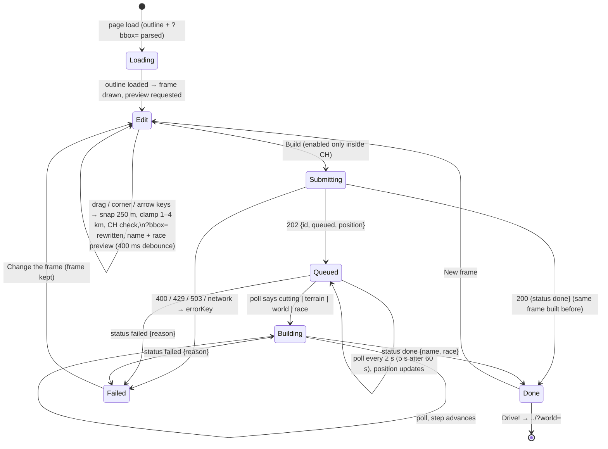

# Region editor page (editor phase 4, #169) — Implementation Plan

> **For agentic workers:** REQUIRED SUB-SKILL: Use superpowers:subagent-driven-development (recommended) or superpowers:executing-plans to implement this plan task-by-task. Steps use checkbox (`- [ ]`) syntax for tracking.

**Goal:** `editor/index.html` on GitHub Pages: a swisstopo map with a draggable, resizable frame (1 × 1 to 4 × 4 km, snapped to 250 m in LV95, inside Switzerland), the world's name and a "free driving only" note before building, **Build** → job polling with the queue position and the build steps → **Drive!** (`../?world=<id>`), share link, **Download world**; a plain sentence for every API failure; de/en via the shared `i18n.js`; works at 360 px.

**Architecture:** Pure ES modules first — `editor/geo.js` (LV95 ↔ WGS84, snap, clamp, move/resize, `?bbox=`, rectangle-inside-outline), `editor/api.js` (the single `API_BASE`, URLs, `parseJob`, `errorKey`, `pollDelay`, `gemeindeName`), `editor/strings.js` (en/de) — all `node --test`ed. `editor/frame.js` is the Leaflet overlay (drag body, 4 corner handles, keyboard) that only emits `commit(rect)`. `editor/editor.js` is the page's state machine (`edit → submitting → queued/building → done | failed`) and renders the panel with `textContent` only. Leaflet 1.9.4 is vendored under `vendor/leaflet/`. Browser behaviour is pinned by Playwright against stubbed WMTS, geo.admin, outline and API routes.

**Tech Stack:** vanilla JS ES modules, Leaflet 1.9.4 (vendored), swisstopo WMTS, `node --test`, pytest + Playwright (existing `prototype/tests/conftest.py` server fixture).

**Spec:** `docs/superpowers/specs/2026-10-10-region-editor-page-design.md` (this phase) on top of `docs/superpowers/specs/2026-10-09-region-editor-design.md` (sections 1, 2, 4, 5).

## Global Constraints

- **Buildless.** No `package.json`, no bundler, no framework. Leaflet is the only vendored dependency (`vendor/leaflet/leaflet.js`, `leaflet.css`, `LICENSE`) — nothing else from a CDN except the Google Fonts the game already uses.
- **Never the public OSM tile servers or Overpass.** Tiles come from `wmts.geo.admin.ch`, names from `api3.geo.admin.ch` (both free, `© swisstopo`).
- **`textContent` only for data** (names, reasons, ids, anything from the API, geo.admin or the URL). The page has no `innerHTML` with a variable in it (#176).
- **One API constant.** `API_BASE` in `editor/api.js`; every URL is built by a function there. Nothing else knows the host.
- Strings go through `t(key, ...args)` from `editor/strings.js`; `en` and `de` have the same keys, Swiss spelling (no `ß`). Re-render on `gg-langchange`.
- `prototype/`, `pipeline/`, `data/` are not modified (tests are added under `prototype/tests/` only). Do not touch `index.html` at the root.
- Tests: node `node --test prototype/tests/editor-*.test.mjs`. Playwright: `cd pipeline && systemd-run --user --scope -q -p MemoryMax=2G -p MemorySwapMax=0 ./.venv/bin/python -m pytest ../prototype/tests/test_editor.py -q -x` — **foreground only, never `run_in_background`**; exit 137 = memory cap, stop and report. Without `systemd-run --user` (CI) drop the prefix. Venv setup if missing: `cd pipeline && python3 -m venv .venv && ./.venv/bin/pip install -r requirements-dev.txt && ./.venv/bin/python -m playwright install chromium`. Only this test file, never the full suite.
- Commit after every task, Conventional Commits, explicit `git add <paths>` (never `-A`). Push the branch **before** the Playwright run in Task 7.
- CHANGELOG `[Unreleased]` / Added entry in the player's voice (Task 7). `test-todo.md` gets a playtest section (Task 7).

## Review Focus

- **Frame drag vs map pan:** the overlay `#frame` is a sibling of `#map` inside `#mapwrap`, above it; its `.body` and `.h` have `pointer-events:auto`, the container `pointer-events:none`. If dragging the frame also pans the map, the overlay is inside the Leaflet container — move it out.
- **Snapping happens on release**, not during the drag (`ghost` rect while moving, `commit` on `pointerup`/key). `__ed.rect()` is always a multiple of 250 and 1000–4000 m a side.
- **LV95 rectangle, not a Mercator box:** the polygon uses the 4 LV95 corners (slightly rotated against the screen in eastern Switzerland); the handles sit on the projected corners, the `.body` on their bounding box. Do not "fix" the rotation.
- **Outline with a hole:** Büsingen and Campione are holes in `ch_outline.geojson`. `rectInside` must return `false` when a hole lies entirely inside the frame (vertex-inside-rect check), not only when a corner is in the hole.
- **`parseJob` throws on an unknown status** — the page shows `errServer` then, never a blank panel. Adapting to #168's final JSON is this function plus its test.
- **Done from `POST`:** a cached world answers `200 { status: "done" }` on the POST itself; the page must not start polling an id it already knows is done.
- **Disabled Build:** while the outline is loading, while outside Switzerland, and while submitting.
- **#167's entry point:** `../editor.html?bbox=2666500,1257750,2670000,1261750` from `prototype/` must land on the editor with that frame. The root `editor.html` keeps `location.search` in its redirect, exactly like the root `index.html:9`. Whole metres only; the value is snapped and validated (`parseBbox`), junk falls back to the default frame.
- **Status endpoint is `/api/worlds/<id>`** (shared with #167's expired-world tombstone), not `/api/jobs/<id>`; `POST /api/jobs` starts a build. `expired` is a valid status and is shown like a failed build.

---

## File map

- Create: `docs/design/region-editor/wireframe.md`, `docs/design/region-editor/flow.md` (Task 1)
- Create: `vendor/leaflet/leaflet.js`, `vendor/leaflet/leaflet.css`, `vendor/leaflet/LICENSE`, `vendor/README.md` (Task 2)
- Create: `editor/geo.js`, `prototype/tests/editor-geo.test.mjs` (Task 2)
- Create: `editor/api.js`, `editor/strings.js`, `prototype/tests/editor-api.test.mjs`, `prototype/tests/editor-strings.test.mjs` (Task 3)
- Create: `editor.html` (root redirect stub for #167's `../editor.html?bbox=` link), `editor/index.html`, `editor/editor.css` (Task 4)
- Create: `editor/frame.js` (Task 5); `editor/editor.js` (Tasks 4–6)
- Create: `prototype/tests/test_editor.py` (Task 7)
- Modify: `CHANGELOG.md`, `test-todo.md`, `README.md` (one line) (Task 7)

---

### Task 0: Preconditions

**Files:** none.

- [ ] **Step 1: Branch and check the neighbours**

```bash
git fetch origin && git checkout -b feature/169-region-editor-page origin/main
test -f pipeline/ch_outline.geojson && echo "166-OUTLINE-PRESENT" || echo "166-OUTLINE-MISSING"
node --version   # 20+
```

- **166-OUTLINE-MISSING:** the page fetches `../pipeline/ch_outline.geojson` at runtime and the tests stub it, so nothing here blocks. For a manual check in a browser, generate it once with the 20-line `pipeline/ch_outline.py` from the #166 plan (`docs/superpowers/plans/2026-10-09-region-editor-phase1.md`, Task 1 Step 3) but **do not commit it in this PR** — #166 owns it. If #166 has merged meanwhile, use its file.

---

### Task 1: Design artefacts — wireframe and flow

**Files:**
- Create: `docs/design/region-editor/wireframe.md`, `docs/design/region-editor/flow.md`

- [ ] **Step 1: Write `docs/design/region-editor/wireframe.md`**

````markdown
# Region editor — wireframe

Page `editor/index.html`, dark, the game's tokens (`--charcoal --ink --sun --cream --steel-l --red --go`), Bungee title,
Barlow Condensed text. Map: swisstopo WMTS via vendored Leaflet, `© swisstopo` bottom-right.

## Desktop (≥ 900 px) — state `edit`

```
┌──────────────────────────────────────────────────────────────────────────────────────────┐
│ REGION EDITOR  Drag a frame anywhere in Switzerland — drive there in two minutes.        │
├───────────────────────────────────────────────────────────┬──────────────────────────────┤
│                                                           │ FRAME                        │
│        swisstopo map (Leaflet, pan + zoom)                │ 2.5 × 3.0 km                 │
│                                                           │ Ehrendingen                  │
│            ■───────────────■                              │                              │
│            │               │  ← LV95 rectangle (yellow)   │ ⚠ Few roads here: free       │
│            │   drag body   │     corner handles 44×44 px  │   driving only, no race.     │
│            │               │                              │                              │
│            ■───────────────■                              │ Drag the frame, pull a corner│
│                                                           │ to resize. Arrow keys move,  │
│                                                           │ Shift + arrows resize.       │
│                                                 [+] [–]   │                              │
│                                 100 m ──  © swisstopo     │ ┌──────────────────────────┐ │
│                                                           │ │        BUILD             │ │  ← .btn.primary, 64 px
│                                                           │ └──────────────────────────┘ │
│                                                           │ OpenStreetMap (ODbL),        │
│                                                           │ swisstopo                    │
├───────────────────────────────────────────────────────────┴──────────────────────────────┤
│                         v0.2.0 · More Games… · Source · Feedback · ★ · EN                 │  ← #game-nav
└──────────────────────────────────────────────────────────────────────────────────────────┘
```

Outside Switzerland: rectangle red, panel line „The frame must lie entirely inside Switzerland", BUILD disabled.

## Panel — states `queued` / `building`, `done`, `failed`

```
┌ queued / building ──────────┐  ┌ done ───────────────────────┐  ┌ failed ─────────────────────┐
│ BUILDING                    │  │ READY                       │  │ SORRY                       │
│ Ehrendingen                 │  │ Ehrendingen                 │  │ Too many buildings or roads │
│                             │  │ ┌─────────────────────────┐ │  │ in this frame. Try a smaller│
│ ● Queued (#3)               │  │ │        DRIVE!           │ │  │ one.                        │
│ ○ Cutting                   │  │ └─────────────────────────┘ │  │                             │
│ ○ Terrain                   │  │ Share  [https://…?world=…]  │  │ ┌─────────────────────────┐ │
│ ○ World                     │  │        [ Copy ]             │  │ │    CHANGE THE FRAME     │ │
│ ○ Race                      │  │ [ Download world ]          │  │ └─────────────────────────┘ │
│ ○ Done                      │  │ ⚠ Free driving only.        │  │                             │
│ about 1–2 minutes           │  │ [ New frame ]               │  │                             │
└─────────────────────────────┘  └─────────────────────────────┘  └─────────────────────────────┘
```

Active step lit (`--sun`), finished steps `--go`, waiting steps `--steel-l`. Share: read-only input + Copy (44 px).

## Phone (360 px)

```
┌──────────────────────┐
│ REGION EDITOR        │
├──────────────────────┤
│                      │
│   map, 52 vh         │
│   ■──────■           │
│   │      │           │
│   ■──────■           │
│          © swisstopo │
├──────────────────────┤
│ 2.0 × 2.0 km         │
│ Ehrendingen          │
│ Drag the frame…      │
│ ┌──────────────────┐ │
│ │      BUILD       │ │  ← 64 px
│ └──────────────────┘ │
│ ODbL · swisstopo     │
│  v0.2.0 · More… · DE │  ← #game-nav, static at the bottom
└──────────────────────┘
```

Single column, page scrolls, no horizontal scroll; every button and handle ≥ 44 px; `touch-action:none` on the frame.

## Dropped (v1 scope)

Map search, "use my location", rotated frames, job cancel, gallery row (phase 5), hub card.
````

- [ ] **Step 2: Write `docs/design/region-editor/flow.md`**

````markdown
# Region editor — flow



**Keys while the frame has focus:** ← → ↑ ↓ move 250 m · Shift + ← → ↑ ↓ shrink/grow 250 m (right/up grow, left/down shrink; the
south-west corner stays) · Tab moves on to Build. The map keeps its own +/− and drag.

**Preview** (on every commit, debounced 400 ms, both in parallel, each ignored when a newer commit happened):
1. `GET api3.geo.admin.ch …/identify?geometry=<centre E,N>&layers=all:ch.swisstopo.swissboundaries3d-gemeinde-flaeche.fill&timeInstant=<year>&sr=2056` → `gemname`.
2. `GET ${API_BASE}/api/preview?bbox=e0,n0,e1,n1` → `{ race }`; 404 / error → no note before the build.

**Polling:** `GET ${API_BASE}/api/worlds/<id>` (the status endpoint #167 reads too; `expired` counts as failed); network miss → retry after the same delay, "Connection lost, retrying…" after 3 misses; never gives up.

**URL:** `?bbox=e0,n0,e1,n1` in LV95 whole metres (snapped) is read on load and rewritten with `history.replaceState` on every commit — #167's expired-world panel links `../editor.html?bbox=…` (root stub → `editor/`).
````

- [ ] **Step 3: Commit** — `git add docs/design/region-editor && git commit -m "docs(design): region editor wireframe and flow (#169)"`

---

### Task 2: Vendor Leaflet and the pure geometry module

**Files:**
- Create: `vendor/leaflet/leaflet.js`, `vendor/leaflet/leaflet.css`, `vendor/leaflet/LICENSE`, `vendor/README.md`
- Create: `editor/geo.js`
- Test: `prototype/tests/editor-geo.test.mjs`

**Interfaces:**
- Produces: `GRID=250`, `MIN_SIDE=1000`, `MAX_SIDE=4000`, `DEFAULT_RECT`; `wgsToLv95(lat, lon) -> [E, N]`; `lv95ToWgs(E, N) -> [lat, lon]`; `snapRect(r) -> r` (edges to the grid, ordered); `clampRect(r, fixed) -> r` (`fixed` = `'sw'|'se'|'nw'|'ne'`, the corner that stays; sides forced into 1–4 km); `moveRect(r, dE, dN)`; `resizeRect(r, corner, dE, dN)`; `sizeKm(r) -> {w, h}`; `centre(r) -> [E, N]`; `corners(r) -> [[E,N] nw, ne, se, sw]`; `parseBbox(search) -> r | null`; `formatBbox(r) -> 'e0,n0,e1,n1'`; `rectInside(r, geojson) -> bool`.

- [ ] **Step 1: Vendor Leaflet 1.9.4** (BSD-2-Clause). Checksums verified 2026-10-10:

```bash
mkdir -p vendor/leaflet
curl -sL https://unpkg.com/leaflet@1.9.4/dist/leaflet.js  -o vendor/leaflet/leaflet.js
curl -sL https://unpkg.com/leaflet@1.9.4/dist/leaflet.css -o vendor/leaflet/leaflet.css
curl -sL https://unpkg.com/leaflet@1.9.4/LICENSE          -o vendor/leaflet/LICENSE
sha256sum vendor/leaflet/leaflet.js vendor/leaflet/leaflet.css
# db49d009c841f5ca34a888c96511ae936fd9f5533e90d8b2c4d57596f4e5641a  leaflet.js  (147 552 bytes)
# a7837102824184820dfa198d1ebcd109ff6d0ff9a2672a074b9a1b4d147d04c6  leaflet.css (14 806 bytes)
```

If a hash differs, stop and report (do not vendor an unverified file). `vendor/README.md`:

```markdown
# Vendored libraries

| Library | Version | Licence | Used by | Notes |
|---|---|---|---|---|
| [Leaflet](https://leafletjs.com) | 1.9.4 | BSD-2-Clause (`leaflet/LICENSE`) | `editor/` | `dist/leaflet.js` + `dist/leaflet.css` only; no marker images (unused). Update by re-downloading from unpkg and checking the sha256 in the #169 plan. |
```

- [ ] **Step 2: Write the failing tests** — `prototype/tests/editor-geo.test.mjs`:

```js
// #169: the editor's pure geometry — LV95 <-> WGS84 (swisstopo approximate formulas), 250 m snapping, 1–4 km clamping,
// move/resize, ?bbox=, rectangle inside the Switzerland outline. Pure module, node --test.
import { test } from 'node:test';
import assert from 'node:assert/strict';
import { GRID, MIN_SIDE, MAX_SIDE, DEFAULT_RECT, wgsToLv95, lv95ToWgs, snapRect, clampRect, moveRect, resizeRect, sizeKm, centre, corners, parseBbox, formatBbox, rectInside } from '../../editor/geo.js';

const EHR = [2667000, 1259750, 2669000, 1261750];   // 2 x 2 km around Ehrendingen, LV95 (the #166 test frame)
const near = (a, b, tol, m) => assert.ok(Math.abs(a - b) <= tol, `${m}: ${a} vs ${b}`);
// a square "country" 2600000..2700000 / 1200000..1300000 with a 3 x 4 km hole (a Büsingen) at 2650000..2653000 / 1250000..1254000
const OUTLINE = { type: 'Feature', geometry: { type: 'Polygon', coordinates: [
  [[2600000, 1200000], [2700000, 1200000], [2700000, 1300000], [2600000, 1300000], [2600000, 1200000]],
  [[2650000, 1250000], [2653000, 1250000], [2653000, 1254000], [2650000, 1254000], [2650000, 1250000]]] } };

test('constants: 250 m grid, 1-4 km sides, default frame is the Ehrendingen square', () => {
  assert.equal(GRID, 250); assert.equal(MIN_SIDE, 1000); assert.equal(MAX_SIDE, 4000); assert.deepEqual(DEFAULT_RECT, EHR);
});

test('LV95 <-> WGS84: Bern origin and Ehrendingen within 1.5 m, round trip within 0.5 m', () => {
  const [lat, lon] = lv95ToWgs(2600000, 1200000);
  near(lat, 46.951081, 2e-5, 'bern lat'); near(lon, 7.438637, 2e-5, 'bern lon');
  const [E, N] = wgsToLv95(46.951081, 7.438637); near(E, 2600000, 1.5, 'bern E'); near(N, 1200000, 1.5, 'bern N');
  const [e2, n2] = wgsToLv95(47.4948, 8.3419); near(e2, 2668065, 2, 'ehr E'); near(n2, 1260841, 2, 'ehr N');   // the place node Ehrendingen (geo.EHRENDINGEN_ORIGIN)
  const [E3, N3] = wgsToLv95(...lv95ToWgs(2668000, 1260750)); near(E3, 2668000, 0.5, 'rt E'); near(N3, 1260750, 0.5, 'rt N');
});

test('snapRect: each edge to the nearest 250 m, corners ordered', () => {
  assert.deepEqual(snapRect([2667010, 1259760, 2668990, 1261740]), EHR);
  assert.deepEqual(snapRect([2669000, 1261750, 2667000, 1259750]), EHR);
  assert.deepEqual(snapRect([2667124, 1259875, 2668876, 1261625]), [2667000, 1259750, 2669000, 1261750]);
});

test('clampRect: sides forced into 1-4 km, the fixed corner stays', () => {
  assert.deepEqual(clampRect([2667000, 1259750, 2667500, 1260000], 'sw'), [2667000, 1259750, 2668000, 1260750]);       // too small grows away from sw
  assert.deepEqual(clampRect([2667000, 1259750, 2672000, 1265000], 'sw'), [2667000, 1259750, 2671000, 1263750]);       // too big shrinks towards sw
  assert.deepEqual(clampRect([2667000, 1259750, 2672000, 1265000], 'ne'), [2668000, 1261000, 2672000, 1265000]);       // ne fixed: sw moves
  assert.deepEqual(clampRect(EHR, 'nw'), EHR);
});

test('moveRect and resizeRect: metres, the opposite corner of a resize stays', () => {
  assert.deepEqual(moveRect(EHR, 250, -500), [2667250, 1259250, 2669250, 1261250]);
  assert.deepEqual(resizeRect(EHR, 'ne', 500, 250), [2667000, 1259750, 2669500, 1262000]);
  assert.deepEqual(resizeRect(EHR, 'sw', 500, 250), [2667500, 1260000, 2669000, 1261750]);
  assert.deepEqual(resizeRect(EHR, 'nw', -250, 250), [2666750, 1259750, 2669000, 1262000]);
  assert.deepEqual(resizeRect(EHR, 'se', 250, -250), [2667000, 1259500, 2669250, 1261750]);
});

test('sizeKm, centre, corners', () => {
  assert.deepEqual(sizeKm([2667000, 1259750, 2669500, 1262750]), { w: 2.5, h: 3 });
  assert.deepEqual(centre(EHR), [2668000, 1260750]);
  assert.deepEqual(corners(EHR), [[2667000, 1261750], [2669000, 1261750], [2669000, 1259750], [2667000, 1259750]]);   // nw ne se sw
});

test('parseBbox: snapped LV95 from ?bbox=, null for junk, formatBbox is the inverse', () => {
  assert.deepEqual(parseBbox('?bbox=2667010,1259760,2668990,1261740'), EHR);
  assert.deepEqual(parseBbox('?x=1&bbox=' + formatBbox(EHR)), EHR);
  for (const s of ['', '?bbox=', '?bbox=1,2,3', '?bbox=a,b,c,d', '?bbox=2667000,1259750,2667000,1261750', '?bbox=1,1,2,2']) assert.equal(parseBbox(s), null, s);
  assert.equal(parseBbox('?bbox=2667000,1259750,2672000,1261750'), null);   // 5 km: not clamped silently, refused
  assert.equal(formatBbox(EHR), '2667000,1259750,2669000,1261750');
});

test('rectInside: inside, crossing the border, outside, a corner in the hole, the hole inside the frame', () => {
  assert.equal(rectInside(EHR, OUTLINE), true);
  assert.equal(rectInside([2698000, 1259750, 2702000, 1261750], OUTLINE), false);          // crosses the east border
  assert.equal(rectInside([2710000, 1259750, 2712000, 1261750], OUTLINE), false);          // outside
  assert.equal(rectInside([2652000, 1253000, 2654000, 1255000], OUTLINE), false);          // sw corner in the hole
  assert.equal(rectInside([2649500, 1249500, 2653500, 1253500], OUTLINE), false);          // the hole's corners are inside the frame
  assert.equal(rectInside([2653250, 1250000, 2655250, 1252000], OUTLINE), true);           // beside the hole
  assert.equal(rectInside(EHR, { type: 'Feature', geometry: { type: 'MultiPolygon', coordinates: [OUTLINE.geometry.coordinates] } }), true);
});
```

- [ ] **Step 3: Run, see them fail** — `node --test prototype/tests/editor-geo.test.mjs` → `Cannot find module`.

- [ ] **Step 4: Write `editor/geo.js`**

```js
// #169: the editor's geometry. Frames are LV95 rectangles [e0, n0, e1, n1] in metres (EPSG:2056), as the API takes them.
// Pure: no DOM, no Leaflet, so node --test can import it.

export const GRID = 250, MIN_SIDE = 1000, MAX_SIDE = 4000;
export const DEFAULT_RECT = [2667000, 1259750, 2669000, 1261750];   // 2 x 2 km around Ehrendingen

// swisstopo "Approximate formulas for the transformation between Swiss projection coordinates and WGS84" (about 1 m).
export function wgsToLv95(lat, lon) {
  const p = (lat * 3600 - 169028.66) / 1e4, l = (lon * 3600 - 26782.5) / 1e4;
  const E = 2600072.37 + 211455.93 * l - 10938.51 * l * p - 0.36 * l * p * p - 44.54 * l ** 3;
  const N = 1200147.07 + 308807.95 * p + 3745.25 * l * l + 76.63 * p * p - 194.56 * l * l * p + 119.79 * p ** 3;
  return [E, N];
}

export function lv95ToWgs(E, N) {
  const y = (E - 2600000) / 1e6, x = (N - 1200000) / 1e6;
  const l = 2.6779094 + 4.728982 * y + 0.791484 * y * x + 0.1306 * y * x * x - 0.0436 * y ** 3;
  const p = 16.9023892 + 3.238272 * x - 0.270978 * y * y - 0.002528 * x * x - 0.0447 * y * y * x - 0.0140 * x ** 3;
  return [p * 100 / 36, l * 100 / 36];
}

const snap = (v) => Math.round(v / GRID) * GRID;

export function snapRect([a, b, c, d]) {
  return [snap(Math.min(a, c)), snap(Math.min(b, d)), snap(Math.max(a, c)), snap(Math.max(b, d))];
}

const clampSide = (s) => Math.min(MAX_SIDE, Math.max(MIN_SIDE, s));

export function clampRect([e0, n0, e1, n1], fixed) {
  const w = clampSide(e1 - e0), h = clampSide(n1 - n0);
  const east = fixed === 'nw' || fixed === 'sw', south = fixed === 'sw' || fixed === 'se';
  return [east ? e0 : e1 - w, south ? n0 : n1 - h, east ? e0 + w : e1, south ? n0 + h : n1];
}

export function moveRect([e0, n0, e1, n1], dE, dN) {
  return [e0 + dE, n0 + dN, e1 + dE, n1 + dN];
}

export function resizeRect([e0, n0, e1, n1], corner, dE, dN) {
  const west = corner === 'nw' || corner === 'sw', north = corner === 'nw' || corner === 'ne';
  return [west ? e0 + dE : e0, north ? n0 : n0 + dN, west ? e1 : e1 + dE, north ? n1 + dN : n1];
}

export const sizeKm = ([e0, n0, e1, n1]) => ({ w: (e1 - e0) / 1000, h: (n1 - n0) / 1000 });
export const centre = ([e0, n0, e1, n1]) => [(e0 + e1) / 2, (n0 + n1) / 2];
export const corners = ([e0, n0, e1, n1]) => [[e0, n1], [e1, n1], [e1, n0], [e0, n0]];   // nw ne se sw
export const formatBbox = (r) => r.map((v) => String(Math.round(v))).join(',');

export function parseBbox(search) {
  const raw = new URLSearchParams(search).get('bbox');
  if (!raw) return null;
  const v = raw.split(',').map(Number);
  if (v.length !== 4 || v.some((x) => !Number.isFinite(x))) return null;
  const r = snapRect(v), { w, h } = sizeKm(r);
  if (w * 1000 < MIN_SIDE || w * 1000 > MAX_SIDE || h * 1000 < MIN_SIDE || h * 1000 > MAX_SIDE) return null;
  if (r[0] < 2400000 || r[2] > 2900000 || r[1] < 1000000 || r[3] > 1400000) return null;   // not even near Switzerland
  return r;
}

// --- rectangle inside the outline (GeoJSON Feature, Polygon or MultiPolygon, LV95 coordinates) ---

function polygons(geojson) {
  const g = geojson.geometry || geojson;
  return g.type === 'MultiPolygon' ? g.coordinates : [g.coordinates];
}

function inRing([x, y], ring) {   // even-odd rule
  let inside = false;
  for (let i = 0, j = ring.length - 1; i < ring.length; j = i++) {
    const [xi, yi] = ring[i], [xj, yj] = ring[j];
    if ((yi > y) !== (yj > y) && x < ((xj - xi) * (y - yi)) / (yj - yi) + xi) inside = !inside;
  }
  return inside;
}

const cross = (o, a, b) => (a[0] - o[0]) * (b[1] - o[1]) - (a[1] - o[1]) * (b[0] - o[0]);

function segmentsCross(p1, p2, q1, q2) {
  const d1 = cross(q1, q2, p1), d2 = cross(q1, q2, p2), d3 = cross(p1, p2, q1), d4 = cross(p1, p2, q2);
  return ((d1 > 0) !== (d2 > 0)) && ((d3 > 0) !== (d4 > 0));
}

function ringTouchesRect(ring, [e0, n0, e1, n1]) {
  const c = corners([e0, n0, e1, n1]), edges = [[c[0], c[1]], [c[1], c[2]], [c[2], c[3]], [c[3], c[0]]];
  for (let i = 0; i < ring.length; i++) {
    const [x, y] = ring[i];
    if (x > e0 && x < e1 && y > n0 && y < n1) return true;                       // a vertex inside the frame (a hole inside the frame)
    if (i && edges.some(([a, b]) => segmentsCross(ring[i - 1], ring[i], a, b))) return true;
  }
  return false;
}

export function rectInside(rect, geojson) {
  const cs = corners(rect);
  for (const rings of polygons(geojson)) {
    if (!cs.every((c) => inRing(c, rings[0]))) continue;
    if (rings.some((ring) => ringTouchesRect(ring, rect))) return false;
    if (rings.slice(1).some((hole) => cs.some((c) => inRing(c, hole)))) return false;
    return true;
  }
  return false;
}
```

- [ ] **Step 5: Run** — `node --test prototype/tests/editor-geo.test.mjs` → all pass.

- [ ] **Step 6: Commit** — `git add vendor editor/geo.js prototype/tests/editor-geo.test.mjs && git commit -m "feat(editor): vendor Leaflet 1.9.4 and the frame geometry (LV95, snap, clamp, outline) (#169)"`

---

### Task 3: API module and strings

**Files:**
- Create: `editor/api.js`, `editor/strings.js`
- Test: `prototype/tests/editor-api.test.mjs`, `prototype/tests/editor-strings.test.mjs`

**Interfaces:**
- `api.js`: `API_BASE`, `GAME_URL`, `WMTS_URL`, `WMTS_ATTRIBUTION`, `jobsUrl()`, `jobUrl(id)`, `previewUrl(rect)`, `zipUrl(id)`, `shareUrl(id)`, `driveUrl(id)`, `identifyUrl([E, N], year)`, `isWorldId(s)`, `STATUSES`, `STEPS`, `parseJob(json) -> {id, status, position, name, race, reason}`, `errorKey(httpStatus, body) -> key`, `failKey(reason) -> key`, `pollDelay(elapsedMs)`, `gemeindeName(identifyJson) -> string | null`.
- `strings.js`: `STRINGS = {en, de}`, `translate(lang, key, ...args)`.

- [ ] **Step 1: Write the failing tests** — `prototype/tests/editor-api.test.mjs`:

```js
// #169: the editor's API contract (phase 3, #168) as pure functions. node --test.
import { test } from 'node:test';
import assert from 'node:assert/strict';
import { API_BASE, GAME_URL, WMTS_URL, jobsUrl, jobUrl, previewUrl, zipUrl, shareUrl, driveUrl, identifyUrl, isWorldId, STATUSES, STEPS, parseJob, errorKey, failKey, pollDelay, gemeindeName } from '../../editor/api.js';

const ID = '0123456789ab', EHR = [2667000, 1259750, 2669000, 1261750];

test('URLs: everything hangs off the one API_BASE; the share link is the game root; Drive is relative', () => {
  assert.match(API_BASE, /^https:\/\/[^/]+$/);
  assert.equal(GAME_URL, 'https://github.freaxnx01.ch/game-rhyflitzer/');
  assert.equal(jobsUrl(), `${API_BASE}/api/jobs`);
  assert.equal(jobUrl(ID), `${API_BASE}/api/worlds/${ID}`);   // the status endpoint #167 reads too (expired tombstone)
  assert.equal(previewUrl(EHR), `${API_BASE}/api/preview?bbox=2667000,1259750,2669000,1261750`);
  assert.equal(zipUrl(ID), `${API_BASE}/worlds/${ID}/world.zip`);
  assert.equal(shareUrl(ID), `https://github.freaxnx01.ch/game-rhyflitzer/?world=${ID}`);
  assert.equal(driveUrl(ID), `../?world=${ID}`);
  assert.match(WMTS_URL, /^https:\/\/wmts\.geo\.admin\.ch\/1\.0\.0\/ch\.swisstopo\.pixelkarte-farbe\/default\/current\/3857\/\{z\}\/\{x\}\/\{y\}\.jpeg$/);
  const u = new URL(identifyUrl([2668000, 1260750], 2026));
  assert.equal(u.origin + u.pathname, 'https://api3.geo.admin.ch/rest/services/api/MapServer/identify');
  assert.equal(u.searchParams.get('geometry'), '2668000,1260750'); assert.equal(u.searchParams.get('sr'), '2056');
  assert.equal(u.searchParams.get('layers'), 'all:ch.swisstopo.swissboundaries3d-gemeinde-flaeche.fill'); assert.equal(u.searchParams.get('timeInstant'), '2026');
  assert.equal(u.searchParams.get('returnGeometry'), 'false'); assert.equal(u.searchParams.get('tolerance'), '0');
});

test('isWorldId: 12 lowercase hex, nothing else goes into a URL', () => {
  assert.equal(isWorldId(ID), true);
  for (const s of ['', '0123456789AB', '0123456789a', '0123456789abc', '../x', '0123456789a<', null, undefined, 12]) assert.equal(isWorldId(s), false, String(s));
  for (const f of [jobUrl, zipUrl, shareUrl, driveUrl]) assert.throws(() => f('../x'), /world id/);
});

test('parseJob: normalises, defaults, throws on an unknown status', () => {
  assert.deepEqual(parseJob({ id: ID, status: 'queued', position: 3 }), { id: ID, status: 'queued', position: 3, name: null, race: null, reason: null });
  assert.deepEqual(parseJob({ id: ID, status: 'done', name: 'Ehrendingen', race: false }), { id: ID, status: 'done', position: null, name: 'Ehrendingen', race: false, reason: null });
  assert.deepEqual(parseJob({ id: ID, status: 'failed', reason: 'too-complex' }).reason, 'too-complex');
  assert.equal(parseJob({ id: ID, status: 'terrain', position: 'x', name: 7 }).name, null);   // wrong types become null, never rendered
  assert.equal(parseJob({ id: ID, status: 'expired', bbox: { lv95: [2667000, 1259750, 2669000, 1261750] } }).status, 'expired');   // #167's tombstone shape
  assert.deepEqual(STATUSES, ['queued', 'cutting', 'terrain', 'world', 'race', 'done', 'failed', 'expired']);
  assert.deepEqual(STEPS, ['queued', 'cutting', 'terrain', 'world', 'race', 'done']);
  for (const bad of [null, {}, { id: ID }, { id: ID, status: 'building' }, { id: 'nope', status: 'queued' }, 'done']) assert.throws(() => parseJob(bad), /job/, JSON.stringify(bad));
});

test('errorKey: HTTP + error code -> string key; failKey: failed.reason -> string key', () => {
  assert.equal(errorKey(400, { error: 'outside-ch' }), 'errOutsideCh');
  for (const e of ['too-big', 'too-small', 'bad-bbox']) assert.equal(errorKey(400, { error: e }), 'errBadFrame');
  assert.equal(errorKey(400, {}), 'errBadFrame');
  assert.equal(errorKey(429, { error: 'rate-limit' }), 'errRateLimit');
  assert.equal(errorKey(503, { error: 'busy' }), 'errBusy');
  for (const s of [0, 500, 502, 404, 418]) assert.equal(errorKey(s, null), 'errServer', String(s));
  assert.equal(failKey('too-complex'), 'errTooComplex');
  assert.equal(failKey('source-unreachable'), 'errSource');
  for (const r of ['timeout', 'build-failed', 'anything', null, 'expired']) assert.equal(failKey(r), 'errBuildFailed', String(r));
});

test('pollDelay: 2 s in the first minute, 5 s afterwards', () => {
  assert.equal(pollDelay(0), 2000); assert.equal(pollDelay(59999), 2000); assert.equal(pollDelay(60000), 5000); assert.equal(pollDelay(1e7), 5000);
});

test('gemeindeName: the current year wins, else the first, null when empty or malformed', () => {
  const r = (jahr, cur, gemname) => ({ attributes: { jahr, is_current_jahr: cur, gemname } });
  assert.equal(gemeindeName({ results: [r(2006, false, 'Oberehrendingen'), r(2026, true, 'Ehrendingen')] }), 'Ehrendingen');
  assert.equal(gemeindeName({ results: [r(2025, false, 'Ehrendingen')] }), 'Ehrendingen');
  for (const j of [{ results: [] }, {}, null, { results: [{ attributes: { gemname: 7 } }] }]) assert.equal(gemeindeName(j), null);
});
```

- [ ] **Step 2: Write the failing strings test** — `prototype/tests/editor-strings.test.mjs`:

```js
// #169: the editor's string table. Same rules as strings.test.mjs (#9).
import { test } from 'node:test';
import assert from 'node:assert/strict';
import { STRINGS, translate } from '../../editor/strings.js';

const render = (v) => (typeof v === 'function' ? v(...Array(v.length).fill('x')) : v);

test('English and German have exactly the same keys, same types and arity', () => {
  assert.deepEqual(Object.keys(STRINGS.de).sort(), Object.keys(STRINGS.en).sort());
  for (const key of Object.keys(STRINGS.en)) {
    const en = STRINGS.en[key], de = STRINGS.de[key];
    assert.ok(['string', 'function'].includes(typeof en), key); assert.equal(typeof de, typeof en, key);
    if (typeof en === 'function') assert.equal(de.length, en.length, key);
  }
});

test('Swiss spelling, no markup in any string (the page renders with textContent)', () => {
  for (const lang of ['en', 'de']) for (const [key, value] of Object.entries(STRINGS[lang])) {
    assert.ok(!render(value).includes('ß'), key); assert.ok(!/[<>]/.test(render(value)), `${lang}.${key} has markup`);
  }
});

test('every error key of api.js and every step has a string', () => {
  for (const k of ['errOutsideCh', 'errBadFrame', 'errRateLimit', 'errBusy', 'errTooComplex', 'errSource', 'errBuildFailed', 'errServer',
    'stepQueued', 'stepCutting', 'stepTerrain', 'stepWorld', 'stepRace', 'stepDone']) assert.ok(k in STRINGS.en, k);
});

test('translate picks the language, falls back to English, then to the key; names pass through', () => {
  assert.equal(translate('de', 'build'), 'Bauen'); assert.equal(translate('en', 'build'), 'Build'); assert.equal(translate('fr', 'build'), 'Build');
  assert.equal(translate('de', 'nope'), 'nope');
  assert.equal(translate('en', 'sizeKm', 2.5, 3), '2.5 × 3 km'); assert.equal(translate('de', 'queuedAt', 3), 'In der Warteschlange (Nr. 3)');
});
```

- [ ] **Step 3: Run, see them fail** — `node --test prototype/tests/editor-api.test.mjs prototype/tests/editor-strings.test.mjs`.

- [ ] **Step 4: Write `editor/api.js`**

```js
// #169: the editor's side of the build API (phase 3, #168) and the swisstopo/geo.admin endpoints. Pure: node --test imports it.
// API_BASE is the ONE place that knows the host (parent spec, open point: the host name).
import { formatBbox } from './geo.js';

export const API_BASE = 'https://rhyflitzer-api.freaxnx01.ch';
export const GAME_URL = 'https://github.freaxnx01.ch/game-rhyflitzer/';
export const WMTS_URL = 'https://wmts.geo.admin.ch/1.0.0/ch.swisstopo.pixelkarte-farbe/default/current/3857/{z}/{x}/{y}.jpeg';
export const WMTS_ATTRIBUTION = '© <a href="https://www.swisstopo.admin.ch/">swisstopo</a>';   // Leaflet's attribution control, own constant
export const STATUSES = ['queued', 'cutting', 'terrain', 'world', 'race', 'done', 'failed', 'expired'];   // expired: #167's tombstone
export const STEPS = STATUSES.slice(0, 6);

export const isWorldId = (s) => typeof s === 'string' && /^[0-9a-f]{12}$/.test(s);   // pipeline frame.world_id (#166)
function checkId(id) { if (!isWorldId(id)) throw new Error(`bad world id: ${String(id)}`); return id; }

export const jobsUrl = () => `${API_BASE}/api/jobs`;
export const jobUrl = (id) => `${API_BASE}/api/worlds/${checkId(id)}`;   // status; same endpoint #167 reads for expired worlds
export const previewUrl = (rect) => `${API_BASE}/api/preview?bbox=${formatBbox(rect)}`;
export const zipUrl = (id) => `${API_BASE}/worlds/${checkId(id)}/world.zip`;
export const shareUrl = (id) => `${GAME_URL}?world=${checkId(id)}`;
export const driveUrl = (id) => `../?world=${checkId(id)}`;

export function identifyUrl([E, N], year) {
  const u = new URL('https://api3.geo.admin.ch/rest/services/api/MapServer/identify');
  u.search = new URLSearchParams({ geometry: `${Math.round(E)},${Math.round(N)}`, geometryType: 'esriGeometryPoint', sr: '2056', tolerance: '0',
    layers: 'all:ch.swisstopo.swissboundaries3d-gemeinde-flaeche.fill', returnGeometry: 'false', timeInstant: String(year) }).toString();
  return u.toString();
}

const str = (v) => (typeof v === 'string' ? v : null);

export function parseJob(json) {
  if (!json || typeof json !== 'object') throw new Error('bad job: not an object');
  if (!isWorldId(json.id)) throw new Error('bad job: id');
  if (!STATUSES.includes(json.status)) throw new Error(`bad job: status ${String(json.status)}`);
  return { id: json.id, status: json.status, position: Number.isInteger(json.position) ? json.position : null,
    name: str(json.name), race: typeof json.race === 'boolean' ? json.race : null, reason: str(json.reason) };
}

export function errorKey(httpStatus, body) {
  const code = body && typeof body.error === 'string' ? body.error : '';
  if (httpStatus === 400) return code === 'outside-ch' ? 'errOutsideCh' : 'errBadFrame';
  if (httpStatus === 429) return 'errRateLimit';
  if (httpStatus === 503) return 'errBusy';
  return 'errServer';
}

export function failKey(reason) {
  if (reason === 'too-complex') return 'errTooComplex';
  if (reason === 'source-unreachable') return 'errSource';
  return 'errBuildFailed';
}

export const pollDelay = (elapsedMs) => (elapsedMs < 60000 ? 2000 : 5000);

export function gemeindeName(json) {
  const rows = json && Array.isArray(json.results) ? json.results : [];
  const hit = rows.find((r) => r && r.attributes && r.attributes.is_current_jahr) || rows[0];
  return hit && hit.attributes ? str(hit.attributes.gemname) : null;
}
```

- [ ] **Step 5: Write `editor/strings.js`** (no markup anywhere — the page uses `textContent`):

```js
// #169: the region editor's UI texts, en and de. Pure, same shape as prototype/strings.js. Proper names are arguments.
const en = {
  title: 'Region editor', tagline: 'Drag a frame anywhere in Switzerland — drive there in two minutes.',
  frame: 'Frame', sizeKm: (w, h) => `${w} × ${h} km`, nameLoading: '…', nameNone: '—',
  hint: 'Drag the frame, pull a corner to resize. Arrow keys move it, Shift + arrows resize it.',
  frameLabel: 'World frame on the map', handle: (c) => `Resize corner ${c}`,
  outsideCh: 'The frame must lie entirely inside Switzerland.', outlineLoading: 'Loading the map of Switzerland…',
  freeDriving: 'Few roads here: this world will be free driving only, no race.',
  build: 'Build', building: 'Building', ready: 'Ready', sorry: 'Sorry', about: 'about 1–2 minutes',
  stepQueued: 'Queued', queuedAt: (n) => `Queued (#${n})`, stepCutting: 'Cutting the map', stepTerrain: 'Terrain', stepWorld: 'Roads and buildings',
  stepRace: 'Race and places', stepDone: 'Done', connectionLost: 'Connection lost, retrying…',
  drive: 'Drive!', share: 'Share link', copy: 'Copy', copied: 'Copied', download: 'Download world', newFrame: 'New frame', changeFrame: 'Change the frame',
  licence: 'Map data © OpenStreetMap contributors (ODbL) · Terrain, heights and map © swisstopo',
  errOutsideCh: 'The frame must lie entirely inside Switzerland.', errBadFrame: 'That frame is not allowed: 1 × 1 to 4 × 4 km.',
  errRateLimit: 'You have built enough worlds for today — try again tomorrow, or drive one you built.',
  errBusy: 'The server is busy right now. Try again in a few minutes.', errTooComplex: 'Too many buildings or roads in this frame. Try a smaller one.',
  errSource: 'A data source is not reachable right now. Try again later.', errBuildFailed: 'The build failed. Try a different frame.',
  errServer: 'The server is not reachable. Check your connection and try again.',
};
const de = {
  title: 'Region-Editor', tagline: 'Zieh einen Rahmen irgendwo in der Schweiz auf — in zwei Minuten fährst Du dort.',
  frame: 'Rahmen', sizeKm: (w, h) => `${w} × ${h} km`, nameLoading: '…', nameNone: '—',
  hint: 'Verschiebe den Rahmen, zieh an einer Ecke, um die Grösse zu ändern. Pfeiltasten verschieben, Shift + Pfeile ändern die Grösse.',
  frameLabel: 'Welt-Rahmen auf der Karte', handle: (c) => `Ecke ${c} ziehen`,
  outsideCh: 'Der Rahmen muss ganz in der Schweiz liegen.', outlineLoading: 'Die Schweizer Karte wird geladen…',
  freeDriving: 'Wenige Strassen hier: diese Welt wird nur freies Fahren haben, kein Rennen.',
  build: 'Bauen', building: 'Wird gebaut', ready: 'Fertig', sorry: 'Schade', about: 'etwa 1–2 Minuten',
  stepQueued: 'In der Warteschlange', queuedAt: (n) => `In der Warteschlange (Nr. ${n})`, stepCutting: 'Karte ausschneiden', stepTerrain: 'Gelände',
  stepWorld: 'Strassen und Häuser', stepRace: 'Rennen und Orte', stepDone: 'Fertig', connectionLost: 'Verbindung verloren, neuer Versuch…',
  drive: 'Losfahren!', share: 'Link zum Teilen', copy: 'Kopieren', copied: 'Kopiert', download: 'Welt herunterladen', newFrame: 'Neuer Rahmen', changeFrame: 'Rahmen ändern',
  licence: 'Kartendaten © OpenStreetMap-Mitwirkende (ODbL) · Gelände, Höhen und Karte © swisstopo',
  errOutsideCh: 'Der Rahmen muss ganz in der Schweiz liegen.', errBadFrame: 'Dieser Rahmen geht nicht: 1 × 1 bis 4 × 4 km.',
  errRateLimit: 'Du hast für heute genug Welten gebaut — versuch es morgen wieder oder fahr in einer, die Du schon gebaut hast.',
  errBusy: 'Der Server ist gerade ausgelastet. Versuch es in ein paar Minuten noch einmal.', errTooComplex: 'Zu viele Häuser oder Strassen in diesem Rahmen. Nimm einen kleineren.',
  errSource: 'Eine Datenquelle ist gerade nicht erreichbar. Versuch es später noch einmal.', errBuildFailed: 'Der Bau ist fehlgeschlagen. Versuch einen anderen Rahmen.',
  errServer: 'Der Server ist nicht erreichbar. Prüf Deine Verbindung und versuch es noch einmal.',
};

export const STRINGS = { en, de };

export function translate(lang, key, ...args) {
  const table = STRINGS[lang] || en;
  const value = key in table ? table[key] : key in en ? en[key] : key;
  return typeof value === 'function' ? value(...args) : value;
}
```

- [ ] **Step 6: Run** — `node --test prototype/tests/editor-*.test.mjs` → all pass.

- [ ] **Step 7: Commit** — `git add editor/api.js editor/strings.js prototype/tests/editor-api.test.mjs prototype/tests/editor-strings.test.mjs && git commit -m "feat(editor): API contract, error mapping and en/de strings as pure modules (#169)"`

---

### Task 4: The page shell — map, panel, nav, i18n, 360 px

**Files:**
- Create: `editor/index.html`, `editor/editor.css`, `editor/editor.js` (shell only; Tasks 5–6 extend it)

**Interfaces:**
- `editor.js` exports nothing; it exposes `window.__ed = { rect, state, setRect, commit }` for tests (like the game's `window.__mm`). DOM ids: `#map`, `#mapwrap`, `#frame`, `#panel`, `#size`, `#name`, `#warn`, `#chmsg`, `#hint`, `#buildbtn`, `#steps`, `#about`, `#result`, `#drivebtn`, `#sharein`, `#copybtn`, `#dlbtn`, `#newbtn`, `#fail`, `#failmsg`, `#changebtn`, `#licence`.

- [ ] **Step 1: Write the root `editor.html` stub and `editor/index.html`**

`editor.html` (repo root — #167's expired-world panel links `../editor.html?bbox=…` from `prototype/`; the same redirect as the root `index.html:9`):

```html
<!doctype html>
<meta charset="utf-8">
<title>Region editor</title>
<meta http-equiv="refresh" content="0; url=editor/">
<script>location.replace("editor/" + location.search + location.hash);</script>
```

`editor/index.html`:

```html
<!doctype html>
<html lang="en">
<meta charset="utf-8">
<meta name="viewport" content="width=device-width,initial-scale=1,viewport-fit=cover">
<link rel="icon" href="../favicon.png" sizes="32x32" type="image/png">
<title>Region editor · Map Madness</title>
<link rel="stylesheet" href="https://fonts.googleapis.com/css2?family=Bungee&family=Barlow+Condensed:ital,wght@0,600;0,700;0,800;1,800&display=swap">
<link rel="stylesheet" href="../vendor/leaflet/leaflet.css">
<link rel="stylesheet" href="./editor.css">
<header id="top"><h1 data-i18n="title">Region editor</h1><p class="tag" data-i18n="tagline"></p></header>
<main id="main">
  <div id="mapwrap"><div id="map" role="application" aria-label="Map of Switzerland"></div><div id="frame" hidden></div></div>
  <aside id="panel" aria-live="polite">
    <section id="edit" class="card">
      <h2 data-i18n="frame"></h2>
      <p id="size" class="big"></p><p id="name" class="name">…</p>
      <p id="chmsg" class="err" hidden></p><p id="warn" class="warn" hidden></p><p id="hint" class="hint" data-i18n="hint"></p>
      <button id="buildbtn" class="btn primary" type="button" disabled data-i18n="build"></button>
    </section>
    <section id="progress" class="card" hidden>
      <h2 data-i18n="building"></h2><p id="pname" class="name"></p>
      <ol id="steps"></ol><p id="about" class="hint" data-i18n="about"></p><p id="lost" class="warn" hidden data-i18n="connectionLost"></p>
    </section>
    <section id="result" class="card" hidden>
      <h2 data-i18n="ready"></h2><p id="rname" class="name"></p>
      <a id="drivebtn" class="btn primary" href="#" data-i18n="drive"></a>
      <label class="share"><span data-i18n="share"></span><span class="row"><input id="sharein" type="text" readonly><button id="copybtn" class="btn small" type="button" data-i18n="copy"></button></span></label>
      <a id="dlbtn" class="btn small" href="#" download data-i18n="download"></a>
      <p id="rwarn" class="warn" hidden data-i18n="freeDriving"></p>
      <button id="newbtn" class="btn small" type="button" data-i18n="newFrame"></button>
    </section>
    <section id="fail" class="card" hidden>
      <h2 data-i18n="sorry"></h2><p id="failmsg" class="err"></p>
      <button id="changebtn" class="btn" type="button" data-i18n="changeFrame"></button>
    </section>
    <p id="licence" class="licence" data-i18n="licence"></p>
  </aside>
</main>
<script src="../prototype/version.js"></script>
<script src="../prototype/i18n.js"></script>
<nav id="game-nav" aria-label="Game navigation">
  <span id="version-badge" title="Version"></span>
  <span class="dot" aria-hidden="true">·</span><a href="https://github.freaxnx01.ch/games/">More Games…</a>
  <span class="dot" aria-hidden="true">·</span><a href="https://github.com/freaxnx01/game-rhyflitzer" target="_blank" rel="noopener">Source</a>
  <span class="dot" aria-hidden="true">·</span><a href="https://github.com/freaxnx01/game-rhyflitzer/issues/new?title=%5BFeedback%5D%20game-rhyflitzer%20editor&labels=feedback" target="_blank" rel="noopener">Feedback</a>
</nav>
<script>
  (function () {   // version badge → CHANGELOG, text only from version.js (same as prototype/index.html)
    var el = document.getElementById('version-badge'); if (!el) return;
    var a = document.createElement('a'); a.href = 'https://github.com/freaxnx01/game-rhyflitzer/blob/main/CHANGELOG.md'; a.target = '_blank'; a.rel = 'noopener';
    a.textContent = 'v' + (window.GAME_VERSION || '0.0.0'); el.appendChild(a);
  })();
</script>
<script src="../vendor/leaflet/leaflet.js"></script>
<script type="module" src="./editor.js"></script>
</html>
```

`i18n.js` appends its EN/DE toggle to `#game-nav` itself (`injectToggle`), so no toggle markup here. The nav is static in the page flow (not fixed): on a phone a fixed nav would cover the Build button.

- [ ] **Step 2: Write `editor/editor.css`** (game tokens; `.btn` copied from `prototype/index.html:84-86`, `.btn.small` 44 px):

```css
:root{color-scheme:dark;--charcoal:#1c1f26;--ink:#14171d;--sun:#ffc61a;--signal:#ff7a1a;--cream:#f5efe0;--steel:#7d8593;--steel-l:#b9bfc9;--go:#7fe0a0;--red:#e0322d}
html,body{margin:0;padding:0;background:var(--charcoal);color:var(--cream);font-family:'Barlow Condensed','Arial Narrow',sans-serif}
body{min-height:100vh;display:flex;flex-direction:column}
#top{padding:10px 16px 6px;display:flex;flex-wrap:wrap;align-items:baseline;gap:6px 18px}
#top h1{margin:0;font-family:Bungee,sans-serif;font-weight:400;font-size:clamp(22px,4vw,34px);line-height:1;color:var(--sun);transform:skewX(-8deg);text-shadow:3px 3px 0 #c24a00,5px 5px 0 var(--ink)}
#top .tag{margin:0;font-size:17px;font-weight:600;color:var(--steel-l)}
#main{flex:1;display:grid;grid-template-columns:1fr 340px;gap:12px;padding:0 16px 12px;box-sizing:border-box;min-height:0}
#mapwrap{position:relative;min-height:420px;border:4px solid;border-color:var(--steel-l) var(--ink) var(--ink) var(--steel-l);background:#0b0d12}
#map{position:absolute;inset:0;background:#0b0d12}
.leaflet-container{font-family:inherit}.leaflet-control-attribution{background:rgba(20,23,29,.8)!important;color:var(--steel-l)!important}.leaflet-control-attribution a{color:#8fd8e8!important}
.leaflet-bar a{width:44px!important;height:44px!important;line-height:44px!important;font-size:22px!important}
/* the frame overlay: a sibling of #map, above it; only the body and the handles take the pointer */
#frame{position:absolute;pointer-events:none;z-index:500;touch-action:none}#frame[hidden]{display:none}
#frame .body{position:absolute;inset:0;pointer-events:auto;cursor:move;touch-action:none;outline:none}
#frame .body:focus-visible{box-shadow:0 0 0 3px var(--sun)}
#frame .h{position:absolute;width:44px;height:44px;margin:-22px 0 0 -22px;pointer-events:auto;touch-action:none;background:none;border:none;padding:0;cursor:nwse-resize}
#frame .h::after{content:'';position:absolute;left:15px;top:15px;width:14px;height:14px;background:var(--sun);border:2px solid var(--ink);box-shadow:2px 2px 0 var(--ink)}
#frame .h.ne,#frame .h.sw{cursor:nesw-resize}
#frame.out .h::after{background:var(--red)}
.frame-poly{stroke:var(--sun);stroke-width:3;fill:var(--sun);fill-opacity:.12}.frame-poly.out{stroke:var(--red);fill:var(--red)}.frame-poly.ghost{stroke-dasharray:8 6;fill-opacity:.06}
#panel{display:flex;flex-direction:column;gap:12px;min-width:0}
.card{background:linear-gradient(#3a404b,#23272f);border:5px solid;border-color:var(--steel-l) var(--ink) var(--ink) var(--steel-l);box-shadow:6px 6px 0 var(--ink);padding:16px 18px;box-sizing:border-box;display:flex;flex-direction:column;gap:10px}
.card[hidden]{display:none}
.card h2{margin:0;font-size:16px;font-weight:700;letter-spacing:3px;text-transform:uppercase;color:var(--steel-l)}
.big{margin:0;font-size:34px;font-weight:800;font-style:italic;color:var(--sun);line-height:1}
.name{margin:0;font-size:24px;font-weight:800;line-height:1.1;overflow-wrap:anywhere}
.hint{margin:0;font-size:16px;font-weight:600;color:var(--steel-l);line-height:1.3}
.warn{margin:0;padding:8px 10px;font-size:16px;font-weight:700;color:var(--ink);background:var(--sun);border:3px solid var(--ink)}
.err{margin:0;padding:8px 10px;font-size:17px;font-weight:700;color:var(--cream);background:#5a1a16;border:3px solid var(--red)}
[hidden]{display:none!important}
.btn{cursor:pointer;height:64px;padding:0 26px;font-family:inherit;font-size:26px;font-weight:800;font-style:italic;letter-spacing:2px;text-transform:uppercase;color:var(--ink);background:linear-gradient(#f2f4f7,#b9bfc9 45%,#7d8593);border:5px solid;border-color:#fff #3a404b #3a404b #fff;box-shadow:5px 5px 0 var(--ink);display:inline-flex;align-items:center;justify-content:center;text-decoration:none;box-sizing:border-box}
.btn.primary{background:linear-gradient(#ffe27a,#ffc61a 45%,#ff9a1a);border-color:#fff2b8 #a04a00 #a04a00 #fff2b8}
.btn:active{transform:translate(4px,4px);box-shadow:1px 1px 0 var(--ink)}
.btn:focus-visible{outline:3px solid var(--sun);outline-offset:3px}
.btn[disabled]{opacity:.45;cursor:not-allowed;transform:none}
.btn.small{height:44px;padding:0 14px;font-size:17px;box-shadow:3px 3px 0 var(--ink)}
#steps{list-style:none;margin:0;padding:0;display:flex;flex-direction:column;gap:6px;font-size:18px;font-weight:700}
#steps li{display:flex;align-items:center;gap:10px;color:var(--steel-l)}#steps li::before{content:'';width:12px;height:12px;border:2px solid currentColor;border-radius:50%;flex:none}
#steps li.on{color:var(--sun)}#steps li.on::before{background:var(--sun)}#steps li.ok{color:var(--go)}#steps li.ok::before{background:var(--go)}
.share{display:flex;flex-direction:column;gap:4px;font-size:15px;font-weight:700;color:var(--steel-l)}.share .row{display:flex;gap:8px}
#sharein{flex:1;min-width:0;height:44px;box-sizing:border-box;padding:0 10px;font:inherit;font-size:15px;color:var(--cream);background:var(--ink);border:3px solid #4a515e}
.licence{margin:0;font-size:13px;font-weight:600;color:var(--steel)}
#game-nav{display:flex;flex-wrap:wrap;justify-content:center;align-items:center;gap:12px;padding:10px 16px calc(10px + env(safe-area-inset-bottom,0px));font:600 13px/1.4 system-ui,-apple-system,sans-serif;color:#5a6072}
#game-nav a{color:#8fd8e8;text-decoration:none;min-height:44px;display:inline-flex;align-items:center}#game-nav .dot{color:#5a6072}
#game-nav #gg-lang-toggle{min-height:44px;min-width:44px}
@media (max-width:899px){#main{grid-template-columns:1fr;padding:0 16px 12px}#mapwrap{height:52vh;min-height:300px}.big{font-size:28px}}
@media (prefers-reduced-motion:reduce){.btn:active{transform:none}}
```

- [ ] **Step 3: Write the shell `editor/editor.js`** (map, static strings, state skeleton; the frame comes in Task 5, the build flow in Task 6):

```js
// #169: the region editor page. State machine edit → submitting → queued/building → done | failed; renders with textContent only.
import { DEFAULT_RECT, parseBbox, formatBbox, sizeKm, centre, lv95ToWgs, corners, rectInside } from './geo.js';
import { WMTS_URL, WMTS_ATTRIBUTION, STEPS } from './api.js';
import { translate } from './strings.js';

const $ = (id) => document.getElementById(id);
const t = (key, ...args) => translate(window.GG_LANG, key, ...args);
const CH_BOUNDS = [[45.6, 5.7], [47.95, 10.6]], OUTLINE_URL = '../pipeline/ch_outline.geojson';

const S = { state: 'loading', rect: parseBbox(location.search) || DEFAULT_RECT, fromUrl: !!parseBbox(location.search), outline: null, inside: null, name: null, race: null, job: null, errKey: null };

// ---- map ----
const map = L.map('map', { zoomControl: true, attributionControl: true, maxBounds: CH_BOUNDS, maxBoundsViscosity: 0.8, minZoom: 7, maxZoom: 18 });
L.tileLayer(WMTS_URL, { attribution: WMTS_ATTRIBUTION, maxZoom: 18, crossOrigin: false }).addTo(map);
L.control.scale({ imperial: false }).addTo(map);
const toLatLng = ([E, N]) => L.latLng(...lv95ToWgs(E, N));
const poly = L.polygon(corners(S.rect).map(toLatLng), { className: 'frame-poly', interactive: false }).addTo(map);
if (S.fromUrl) map.fitBounds(poly.getBounds().pad(0.6)); else map.fitBounds(CH_BOUNDS);

// ---- rendering ----
function setText(id, text) { $(id).textContent = text; }
function show(id, on) { $(id).hidden = !on; }

function applyStaticStrings() {
  document.documentElement.lang = window.GG_LANG;
  for (const el of document.querySelectorAll('[data-i18n]')) el.textContent = t(el.dataset.i18n);
}

function renderEdit() {
  const { w, h } = sizeKm(S.rect);
  setText('size', t('sizeKm', w, h));
  setText('name', S.name === undefined ? t('nameLoading') : S.name || t('nameNone'));
  show('chmsg', S.inside === false || S.outline === null); setText('chmsg', S.outline === null ? t('outlineLoading') : t('outsideCh'));
  $('chmsg').className = S.outline === null ? 'hint' : 'err';
  show('warn', S.race === false); setText('warn', t('freeDriving'));
  $('buildbtn').disabled = S.inside !== true || S.state !== 'edit';
  poly.setLatLngs(corners(S.rect).map(toLatLng));
  poly.setStyle({ className: 'frame-poly' + (S.inside === false ? ' out' : '') });
  $('frame').classList.toggle('out', S.inside === false);
}

function render() {
  show('edit', S.state === 'loading' || S.state === 'edit' || S.state === 'submitting');
  show('progress', S.state === 'queued' || S.state === 'building');
  show('result', S.state === 'done'); show('fail', S.state === 'failed');
  renderEdit();
}

// ---- outline ----
async function loadOutline() {
  try { const r = await fetch(OUTLINE_URL); if (!r.ok) throw new Error(r.status); S.outline = await r.json(); }
  catch (e) { console.warn('outline failed', e); S.outline = { type: 'Feature', geometry: { type: 'Polygon', coordinates: [[]] } }; }   // nothing is inside an empty outline: Build stays disabled
  S.state = 'edit'; commit(S.rect);
}

function commit(rect) {   // Task 5 completes this (frame, URL, preview)
  S.rect = rect; S.inside = S.outline ? rectInside(rect, S.outline) : null;
  history.replaceState(null, '', `?bbox=${formatBbox(rect)}`);
  render();
}

window.addEventListener('gg-langchange', () => { applyStaticStrings(); render(); });
applyStaticStrings(); render(); loadOutline();
window.__ed = { rect: () => S.rect.slice(), state: () => S.state, setRect: (r) => commit(r), commit, map, centre: () => centre(S.rect) };
```

- [ ] **Step 4: Check in a browser by hand** — `python3 -m http.server 8000` at the repo root, open `http://localhost:8000/editor/`: the swisstopo map of Switzerland, the yellow 2 × 2 km polygon at Ehrendingen, the panel with size and `…`, Build disabled (no outline file yet → „Loading the map of Switzerland…" stays, that is expected without #166's file; with the file: enabled). Resize to 360 px: single column, nav at the bottom, no horizontal scroll. EN/DE toggle switches the panel texts. Console: the outline 404 warning only.

Also open `http://localhost:8000/editor.html?bbox=2666500,1257750,2670000,1261750` — it must land on `/editor/?bbox=2666500,1257750,2670000,1261750`.

- [ ] **Step 5: Commit** — `git add editor.html editor/index.html editor/editor.css editor/editor.js && git commit -m "feat(editor): page shell with swisstopo map, panel, nav and i18n (#169)"`

---

### Task 5: The frame — drag, corner handles, keyboard, snapping, preview

**Files:**
- Create: `editor/frame.js`
- Modify: `editor/editor.js` (wire the frame, the preview, the `?bbox=`)

**Interfaces:**
- `frame.js`: `createFrame(map, container, { toLv95(latlng) -> [E, N], toLatLng([E, N]) -> L.LatLng, labels: { body, handle(c) }, onGhost(rect), onCommit(rect) }) -> { setRect(rect), refresh(), element }`. The frame emits the **unsnapped** rect in `onGhost` during a drag and the **snapped + clamped** rect in `onCommit` on release / key. It never knows about Switzerland or the API.

- [ ] **Step 1: Write `editor/frame.js`**

```js
// #169: the frame overlay. A DOM box above the Leaflet container (sibling of #map, so dragging it never pans the map) with a
// draggable body and four 44 px corner handles. Positions follow the projected LV95 corners on every map move.
import { GRID, snapRect, clampRect, moveRect, resizeRect, corners } from './geo.js';

const OPPOSITE = { nw: 'se', ne: 'sw', se: 'nw', sw: 'ne' };

export function createFrame(map, el, { toLv95, toLatLng, labels, onGhost, onCommit }) {
  let rect = null, drag = null;
  el.innerHTML = '';   // own static markup only, built once
  const body = document.createElement('div'); body.className = 'body'; body.tabIndex = 0; body.setAttribute('role', 'group'); body.setAttribute('aria-label', labels.body);
  el.appendChild(body);
  const handles = {};
  for (const c of ['nw', 'ne', 'se', 'sw']) {
    const h = document.createElement('button'); h.type = 'button'; h.className = `h ${c}`; h.dataset.corner = c; h.setAttribute('aria-label', labels.handle(c)); h.tabIndex = -1;
    el.appendChild(h); handles[c] = h;
  }

  function refresh() {
    if (!rect) return;
    const pts = corners(rect).map((c) => map.latLngToContainerPoint(toLatLng(c)));
    const xs = pts.map((p) => p.x), ys = pts.map((p) => p.y), x0 = Math.min(...xs), y0 = Math.min(...ys);
    el.hidden = false; el.style.left = `${x0}px`; el.style.top = `${y0}px`; el.style.width = `${Math.max(...xs) - x0}px`; el.style.height = `${Math.max(...ys) - y0}px`;
    ['nw', 'ne', 'se', 'sw'].forEach((c, i) => { handles[c].style.left = `${pts[i].x - x0}px`; handles[c].style.top = `${pts[i].y - y0}px`; });
  }

  function lv95At(e) { const r = map.getContainer().getBoundingClientRect(); return toLv95(map.containerPointToLatLng(L.point(e.clientX - r.left, e.clientY - r.top))); }

  function start(e, corner) {
    if (e.button !== undefined && e.button !== 0) return;
    e.preventDefault(); e.target.setPointerCapture(e.pointerId);
    drag = { corner, from: lv95At(e), rect0: rect };
  }
  function move(e) {
    if (!drag) return;
    const [E, N] = lv95At(e), dE = E - drag.from[0], dN = N - drag.from[1];
    const r = drag.corner ? resizeRect(drag.rect0, drag.corner, dE, dN) : moveRect(drag.rect0, dE, dN);
    rect = drag.corner ? orient(r) : r; refresh(); onGhost(rect);
  }
  function end() {
    if (!drag) return;
    const fixed = drag.corner ? OPPOSITE[drag.corner] : 'sw'; drag = null;
    commit(clampRect(snapRect(rect), fixed));
  }
  const orient = ([a, b, c, d]) => [Math.min(a, c), Math.min(b, d), Math.max(a, c), Math.max(b, d)];   // a corner dragged past its opposite
  function commit(r) { rect = r; refresh(); onCommit(r); }

  body.addEventListener('pointerdown', (e) => start(e, null));
  for (const h of Object.values(handles)) h.addEventListener('pointerdown', (e) => start(e, h.dataset.corner));
  for (const n of [body, ...Object.values(handles)]) { n.addEventListener('pointermove', move); n.addEventListener('pointerup', end); n.addEventListener('pointercancel', end); }

  body.addEventListener('keydown', (e) => {
    const d = { ArrowLeft: [-GRID, 0], ArrowRight: [GRID, 0], ArrowUp: [0, GRID], ArrowDown: [0, -GRID] }[e.key];
    if (!d) return;
    e.preventDefault();
    const r = e.shiftKey ? resizeRect(rect, 'ne', d[0], d[1]) : moveRect(rect, d[0], d[1]);   // Shift: the south-west corner stays
    commit(clampRect(snapRect(r), 'sw'));
  });

  map.on('move zoom viewreset resize', refresh);
  return { setRect(r) { rect = r; refresh(); }, refresh, element: el, focus: () => body.focus() };
}
```

- [ ] **Step 2: Wire it in `editor/editor.js`** — add the imports and replace the `commit` stub and the `__ed` line:

```js
import { createFrame } from './frame.js';
import { wgsToLv95 } from './geo.js';   // merge into the existing geo import
import { previewUrl, identifyUrl, gemeindeName } from './api.js';   // merge into the existing api import

const frame = createFrame(map, $('frame'), { toLv95: (ll) => wgsToLv95(ll.lat, ll.lng), toLatLng,
  labels: { body: t('frameLabel'), handle: (c) => t('handle', c.toUpperCase()) },
  onGhost: (r) => { poly.setLatLngs(corners(r).map(toLatLng)); poly.setStyle({ className: 'frame-poly ghost' }); },
  onCommit: (r) => commit(r) });
frame.setRect(S.rect);

let previewSeq = 0, previewTimer = 0;
function schedulePreview() {
  clearTimeout(previewTimer); const seq = ++previewSeq; S.name = undefined; S.race = null;
  previewTimer = setTimeout(() => preview(seq), 400);
}
async function preview(seq) {
  const rect = S.rect;
  const nameP = fetch(identifyUrl(centre(rect), new Date().getFullYear())).then((r) => (r.ok ? r.json() : null)).then(gemeindeName).catch(() => null);
  const raceP = fetch(previewUrl(rect)).then((r) => (r.ok ? r.json() : null)).then((j) => (j && typeof j.race === 'boolean' ? j.race : null)).catch(() => null);
  const [name, race] = await Promise.all([nameP, raceP]);
  if (seq !== previewSeq) return;   // a newer commit happened
  S.name = name; S.race = race; render();
}

function commit(rect) {
  S.rect = rect; frame.setRect(rect); S.inside = S.outline ? rectInside(rect, S.outline) : null;
  history.replaceState(null, '', `?bbox=${formatBbox(rect)}`);
  if (S.state === 'edit' && S.inside) schedulePreview();
  render();
}
window.__ed = { rect: () => S.rect.slice(), state: () => S.state, setRect: (r) => commit(r), commit, map, centre: () => centre(S.rect), preview: () => ({ name: S.name, race: S.race }) };
```

`renderEdit` already shows `t('nameLoading')` while `S.name === undefined`. `S.name` starts `null` in `S` — change the initial value to `undefined` so the first paint shows `…`.

- [ ] **Step 3: Check by hand** (serve, open `/editor/?bbox=2667000,1259750,2669000,1261750`): the map opens on the frame; dragging the body moves the dashed ghost, release snaps it (the URL's `?bbox=` changes to multiples of 250); a corner resizes, 4 km is the maximum, 1 km the minimum; the name „Ehrendingen" appears after the drag (geo.admin); Tab to the frame, arrows move 250 m, Shift + arrows resize. Dragging the frame does **not** pan the map; dragging beside it does. Pinch-zoom still works on the map (phone emulation).

- [ ] **Step 4: Commit** — `git add editor/frame.js editor/editor.js && git commit -m "feat(editor): draggable, resizable frame with 250 m snapping, keyboard and name preview (#169)"`

---

### Task 6: Build, polling, done and failed states

**Files:**
- Modify: `editor/editor.js`

- [ ] **Step 1: Add the build flow to `editor/editor.js`** (imports merged into the existing `api.js` import):

```js
import { jobsUrl, jobUrl, zipUrl, shareUrl, driveUrl, parseJob, errorKey, failKey, pollDelay } from './api.js';

const ACTIVE = ['queued', 'cutting', 'terrain', 'world', 'race'];
let pollTimer = 0;

async function build() {
  if (S.state !== 'edit' || S.inside !== true) return;
  S.state = 'submitting'; render();
  let res, body = null;
  try { res = await fetch(jobsUrl(), { method: 'POST', headers: { 'Content-Type': 'application/json' }, body: JSON.stringify({ bbox: S.rect }) }); body = await res.json().catch(() => null); }
  catch (e) { return fail('errServer'); }
  if (!res.ok) return fail(errorKey(res.status, body));
  try { applyJob(parseJob(body), 0); } catch (e) { console.warn('bad job', e); fail('errServer'); }
}

function applyJob(job, startedAt) {
  S.job = job; S.name = job.name || S.name; if (job.race !== null) S.race = job.race;
  if (job.status === 'done') { S.state = 'done'; clearTimeout(pollTimer); return render(); }
  if (job.status === 'failed' || job.status === 'expired') return fail(failKey(job.reason || job.status));
  S.state = job.status === 'queued' ? 'queued' : 'building'; S.misses = 0; render();
  const t0 = startedAt || Date.now(); S.startedAt = t0;
  pollTimer = setTimeout(() => poll(t0), pollDelay(Date.now() - t0));
}

async function poll(t0) {
  if (S.state !== 'queued' && S.state !== 'building') return;
  try {
    const r = await fetch(jobUrl(S.job.id)); if (!r.ok) throw new Error(String(r.status));
    S.misses = 0; applyJob(parseJob(await r.json()), t0);
  } catch (e) {
    S.misses = (S.misses || 0) + 1; show('lost', S.misses >= 3);
    pollTimer = setTimeout(() => poll(t0), pollDelay(Date.now() - t0));
  }
}

function fail(key) { S.state = 'failed'; S.errKey = key; clearTimeout(pollTimer); render(); }
function backToEdit() { S.state = 'edit'; S.job = null; S.errKey = null; clearTimeout(pollTimer); show('lost', false); commit(S.rect); }

function renderProgress() {
  const job = S.job; if (!job) return;
  setText('pname', S.name || t('nameNone'));
  const ol = $('steps'); ol.textContent = '';
  const at = STEPS.indexOf(job.status);
  STEPS.forEach((step, i) => {
    const li = document.createElement('li');
    li.textContent = step === 'queued' && job.status === 'queued' && job.position !== null ? t('queuedAt', job.position) : t('step' + step[0].toUpperCase() + step.slice(1));
    li.className = i < at ? 'ok' : i === at ? 'on' : ''; ol.appendChild(li);
  });
}

function renderResult() {
  const job = S.job; if (!job) return;
  setText('rname', S.name || t('nameNone'));
  $('drivebtn').href = driveUrl(job.id); $('sharein').value = shareUrl(job.id); $('dlbtn').href = zipUrl(job.id);
  show('rwarn', S.race === false);
}

function renderFail() { setText('failmsg', t(S.errKey || 'errServer')); }
```

Extend `render()`:

```js
function render() {
  show('edit', S.state === 'loading' || S.state === 'edit' || S.state === 'submitting');
  show('progress', S.state === 'queued' || S.state === 'building');
  show('result', S.state === 'done'); show('fail', S.state === 'failed');
  renderEdit(); if (S.job) { renderProgress(); renderResult(); } if (S.state === 'failed') renderFail();
}
```

Wire the buttons (after `frame.setRect`):

```js
$('buildbtn').addEventListener('click', build);
$('newbtn').addEventListener('click', backToEdit); $('changebtn').addEventListener('click', backToEdit);
$('copybtn').addEventListener('click', async () => {
  const input = $('sharein');
  try { await navigator.clipboard.writeText(input.value); } catch (e) { input.select(); document.execCommand && document.execCommand('copy'); }
  setText('copybtn', t('copied')); setTimeout(() => setText('copybtn', t('copy')), 1500);
});
document.addEventListener('visibilitychange', () => { if (!document.hidden && (S.state === 'queued' || S.state === 'building')) { clearTimeout(pollTimer); poll(S.startedAt); } });
```

Add `job: () => S.job` to `window.__ed`. The `renderEdit` guard `S.state !== 'edit'` already disables Build while submitting. `ACTIVE` is unused after this step — do not add it (or drop it); keep what the code uses.

- [ ] **Step 2: Check by hand with a stub** — in the browser console `window.__ed` + the network tab: without an API host the POST fails → the failed card says „The server is not reachable…", **Change the frame** returns to edit with the frame kept. (The real flow is pinned by Task 7's stub.)

- [ ] **Step 3: Commit** — `git add editor/editor.js && git commit -m "feat(editor): build, job polling with queue position, Drive/share/download and error states (#169)"`

---

### Task 7: Playwright tests, changelog, test-todo, PR

**Files:**
- Create: `prototype/tests/test_editor.py`
- Modify: `CHANGELOG.md` (`[Unreleased]` / Added), `test-todo.md`, `README.md` (one line under the region editor bullet)

- [ ] **Step 1: Write `prototype/tests/test_editor.py`** (stubbed routes; the API host comes from `editor/api.js` so the test reads it from the file):

```python
"""#169: the region editor page against stubbed WMTS tiles, geo.admin identify, the Switzerland outline and the build API.
Slow (Playwright): run in the foreground, frame-light (no WebGL, small viewport). Does not need #166's outline file or a network."""
import base64
import json
import re
from pathlib import Path

import pytest
from playwright.sync_api import sync_playwright

ROOT = Path(__file__).parents[2]
API = re.search(r"API_BASE = '([^']+)'", (ROOT / "editor" / "api.js").read_text(encoding="utf-8")).group(1)
PNG = base64.b64decode("iVBORw0KGgoAAAANSUhEUgAAAAEAAAABCAYAAAAfFcSJAAAADUlEQVR42mNk+M9QDwADhgGAWjR9awAAAABJRU5ErkJggg==")
EHR = [2667000, 1259750, 2669000, 1261750]
ID = "0123456789ab"
# a square country 2600000..2700000 / 1200000..1300000 with a 3 x 4 km hole (a Büsingen) at 2650000..2653000 / 1250000..1254000
OUTLINE = {"type": "Feature", "geometry": {"type": "Polygon", "coordinates": [
    [[2600000, 1200000], [2700000, 1200000], [2700000, 1300000], [2600000, 1300000], [2600000, 1200000]],
    [[2650000, 1250000], [2653000, 1250000], [2653000, 1254000], [2650000, 1254000], [2650000, 1250000]]]}}
IDENTIFY = {"results": [{"attributes": {"jahr": 2026, "is_current_jahr": True, "gemname": "Ehrendingen <b>x</b>"}}]}


class Api:
    """The stubbed build API. `script` is the list of GET /api/worlds/<id> answers in order; `post` the POST answer (status, body)."""
    def __init__(self, post=(202, {"id": ID, "status": "queued", "position": 3}), script=(), preview=(200, {"id": ID, "name": "Ehrendingen", "race": False})):
        self.post, self.script, self.preview, self.posts, self.gets = post, list(script), preview, [], 0

    def route(self, r):
        url, m = r.request.url, r.request.method
        if url.endswith("/api/jobs") and m == "POST":
            self.posts.append(json.loads(r.request.post_data)); st, body = self.post
        elif "/api/preview" in url:
            st, body = self.preview
        elif "/api/worlds/" in url:
            self.gets += 1; st, body = self.script.pop(0) if len(self.script) > 1 else self.script[0]
        else:
            return r.fulfill(status=404, body="")
        r.fulfill(status=st, content_type="application/json", headers={"Access-Control-Allow-Origin": "*"}, body=json.dumps(body))


def open_page(p, server, api, query=f"?bbox={','.join(map(str, EHR))}", viewport=(900, 700), lang=None, outline=OUTLINE):
    b = p.chromium.launch()
    ctx = b.new_context(viewport={"width": viewport[0], "height": viewport[1]}, locale="en-US", has_touch=viewport[0] < 500)
    if lang:
        ctx.add_init_script(f"try {{ localStorage.setItem('gg-lang', '{lang}'); }} catch (e) {{}}")
    page = ctx.new_page(); errs = []; page.on("pageerror", lambda e: errs.append(str(e)))
    page.route("**/wmts.geo.admin.ch/**", lambda r: r.fulfill(status=200, content_type="image/png", body=PNG))
    page.route("**/fonts.googleapis.com/**", lambda r: r.fulfill(status=200, content_type="text/css", body=""))
    page.route("**/api3.geo.admin.ch/**", lambda r: r.fulfill(status=200, content_type="application/json", headers={"Access-Control-Allow-Origin": "*"}, body=json.dumps(IDENTIFY)))
    page.route("**/pipeline/ch_outline.geojson", lambda r: r.fulfill(status=200, content_type="application/json", body=json.dumps(outline)) if outline else r.fulfill(status=404, body=""))
    page.route(f"{API}/**", api.route)
    page.goto(f"{server}/editor/{query}")
    page.wait_for_function("() => window.__ed && window.__ed.state() === 'edit'", timeout=60000)
    return b, page, errs


def frame_box(page):
    return page.locator("#frame .body").bounding_box()


def drag(page, x0, y0, x1, y1):
    page.mouse.move(x0, y0); page.mouse.down(); page.mouse.move((x0 + x1) / 2, (y0 + y1) / 2); page.mouse.move(x1, y1); page.mouse.up()


def test_loads_with_the_frame_from_the_url_and_the_name_as_text(server):
    with sync_playwright() as p:
        b, page, errs = open_page(p, server, Api())
        page.wait_for_function("() => document.querySelector('#name').textContent.includes('Ehrendingen')", timeout=20000)
        got = page.evaluate("() => ({ rect: window.__ed.rect(), size: document.querySelector('#size').textContent, name: document.querySelector('#name').textContent,"
                            " nameHtml: document.querySelector('#name').innerHTML, build: document.querySelector('#buildbtn').disabled, warn: document.querySelector('#warn').hidden,"
                            " attribution: document.querySelector('.leaflet-control-attribution').textContent, tiles: document.querySelectorAll('.leaflet-tile').length })")
        b.close()
    assert errs == []
    assert got["rect"] == EHR and got["size"] == "2 × 2 km" and got["build"] is False
    assert got["name"] == "Ehrendingen <b>x</b>" and "&lt;b&gt;" in got["nameHtml"]   # textContent, never markup
    assert got["warn"] is False   # preview said race: false → free-driving note
    assert "swisstopo" in got["attribution"] and got["tiles"] > 0


def test_drag_moves_and_snaps_corner_resizes_and_clamps_keyboard_moves(server):
    with sync_playwright() as p:
        b, page, errs = open_page(p, server, Api())
        bx = frame_box(page); cx, cy = bx["x"] + bx["width"] / 2, bx["y"] + bx["height"] / 2
        drag(page, cx, cy, cx + 37, cy + 23)
        r1 = page.evaluate("() => window.__ed.rect()")
        assert all(v % 250 == 0 for v in r1) and r1 != EHR and r1[2] - r1[0] == 2000
        assert "bbox=" + ",".join(map(str, r1)) in page.url
        ne = page.locator("#frame .h.ne").bounding_box(); hx, hy = ne["x"] + 22, ne["y"] + 22
        drag(page, hx, hy, hx + 600, hy - 600)   # far beyond 4 km at this zoom
        r2 = page.evaluate("() => window.__ed.rect()")
        assert r2[0] == r1[0] and r2[1] == r1[1] and r2[2] - r2[0] == 4000 and r2[3] - r2[1] == 4000
        page.locator("#frame .body").focus(); page.keyboard.press("ArrowLeft"); page.keyboard.press("Shift+ArrowDown")
        r3 = page.evaluate("() => window.__ed.rect()")
        b.close()
    assert errs == []
    assert r3[0] == r2[0] - 250 and r3[2] == r2[2] - 250 and r3[3] - r3[1] == 3750 and r3[1] == r2[1]


def test_outside_switzerland_and_the_hole_disable_build(server):
    with sync_playwright() as p:
        b, page, errs = open_page(p, server, Api())
        page.evaluate("() => window.__ed.setRect([2698000, 1259750, 2702000, 1261750])")   # across the border
        out = page.evaluate("() => ({ d: document.querySelector('#buildbtn').disabled, msg: document.querySelector('#chmsg').textContent, hidden: document.querySelector('#chmsg').hidden,"
                            " red: document.querySelector('.frame-poly').classList.contains('out') })")
        page.evaluate("() => window.__ed.setRect([2649500, 1249500, 2653500, 1253500])")   # the hole inside the frame
        hole = page.evaluate("() => document.querySelector('#buildbtn').disabled")
        page.evaluate(f"() => window.__ed.setRect({EHR})")
        back = page.evaluate("() => document.querySelector('#buildbtn').disabled")
        b.close()
    assert errs == [] and out == {"d": True, "msg": "The frame must lie entirely inside Switzerland.", "hidden": False, "red": True}
    assert hole is True and back is False


def test_build_queued_steps_done_drive_share_download(server):
    api = Api(script=[(200, {"id": ID, "status": "queued", "position": 2}), (200, {"id": ID, "status": "terrain"}),
                      (200, {"id": ID, "status": "done", "name": "Ehrendingen · Freienwil", "race": True})])
    with sync_playwright() as p:
        b, page, errs = open_page(p, server, api)
        page.click("#buildbtn")
        page.wait_for_function("() => document.querySelector('#steps li.on')?.textContent === 'Queued (#2)'", timeout=20000)
        page.wait_for_function("() => window.__ed.state() === 'done'", timeout=30000)
        got = page.evaluate("() => ({ name: document.querySelector('#rname').textContent, drive: document.querySelector('#drivebtn').getAttribute('href'),"
                            " share: document.querySelector('#sharein').value, dl: document.querySelector('#dlbtn').getAttribute('href'), warn: document.querySelector('#rwarn').hidden,"
                            " edit: document.querySelector('#edit').hidden, drivePx: document.querySelector('#drivebtn').getBoundingClientRect().height })")
        b.close()
    assert errs == [] and api.posts == [{"bbox": EHR}] and api.gets >= 3
    assert got == {"name": "Ehrendingen · Freienwil", "drive": f"../?world={ID}", "share": f"https://github.freaxnx01.ch/game-rhyflitzer/?world={ID}",
                   "dl": f"{API}/worlds/{ID}/world.zip", "warn": True, "edit": True, "drivePx": 64}


def test_cached_world_is_done_at_once_and_free_driving_is_said(server):
    api = Api(post=(200, {"id": ID, "status": "done", "name": "Ehrendingen", "race": False}), script=[(500, {})])
    with sync_playwright() as p:
        b, page, errs = open_page(p, server, api)
        page.click("#buildbtn"); page.wait_for_function("() => window.__ed.state() === 'done'", timeout=20000)
        page.wait_for_timeout(2500)
        warn = page.evaluate("() => document.querySelector('#rwarn').hidden")
        b.close()
    assert errs == [] and api.gets == 0 and warn is False


@pytest.mark.parametrize("post,script,text", [
    ((400, {"error": "outside-ch"}), [], "The frame must lie entirely inside Switzerland."),
    ((400, {"error": "too-big"}), [], "That frame is not allowed: 1 × 1 to 4 × 4 km."),
    ((429, {"error": "rate-limit"}), [], "You have built enough worlds for today — try again tomorrow, or drive one you built."),
    ((503, {"error": "busy"}), [], "The server is busy right now. Try again in a few minutes."),
    ((500, {}), [], "The server is not reachable. Check your connection and try again."),
    ((202, {"id": ID, "status": "queued", "position": 1}), [(200, {"id": ID, "status": "failed", "reason": "too-complex"})], "Too many buildings or roads in this frame. Try a smaller one."),
    ((202, {"id": ID, "status": "queued", "position": 1}), [(200, {"id": ID, "status": "failed", "reason": "source-unreachable"})], "A data source is not reachable right now. Try again later."),
    ((202, {"id": ID, "status": "queued", "position": 1}), [(200, {"id": ID, "status": "failed", "reason": "timeout"})], "The build failed. Try a different frame."),
    ((202, {"id": ID, "status": "queued", "position": 1}), [(200, {"id": ID, "status": "expired", "bbox": {"lv95": EHR}})], "The build failed. Try a different frame."),
])
def test_every_error_has_a_sentence_and_change_the_frame_returns(server, post, script, text):
    with sync_playwright() as p:
        b, page, errs = open_page(p, server, Api(post=post, script=script))
        page.click("#buildbtn"); page.wait_for_function("() => window.__ed.state() === 'failed'", timeout=20000)
        msg = page.text_content("#failmsg")
        page.click("#changebtn")
        after = page.evaluate("() => ({ s: window.__ed.state(), rect: window.__ed.rect(), fail: document.querySelector('#fail').hidden })")
        b.close()
    assert errs == [] and msg == text and after == {"s": "edit", "rect": EHR, "fail": True}


def test_root_editor_html_redirects_with_the_bbox_from_167(server):
    """#167's expired-world panel links ../editor.html?bbox=… (whole LV95 metres); the stub must land on editor/ with the frame."""
    with sync_playwright() as p:
        b, page, errs = open_page(p, server, Api(), query="")
        page.goto(f"{server}/editor.html?bbox=2666500,1257750,2670000,1261750")
        page.wait_for_function("() => location.pathname.endsWith('/editor/') && window.__ed && window.__ed.state() === 'edit'", timeout=60000)
        got = page.evaluate("() => ({ rect: window.__ed.rect(), search: location.search })")
        page.goto(f"{server}/editor.html?bbox=junk")
        page.wait_for_function("() => window.__ed && window.__ed.state() === 'edit'", timeout=60000)
        junk = page.evaluate("() => window.__ed.rect()")
        b.close()
    assert errs == []
    assert got == {"rect": [2666500, 1257750, 2670000, 1261750], "search": "?bbox=2666500,1257750,2670000,1261750"}
    assert junk == EHR   # the default frame, no error


def test_no_preview_endpoint_means_no_warning_before_the_build(server):
    with sync_playwright() as p:
        b, page, errs = open_page(p, server, Api(preview=(404, {})))
        page.wait_for_function("() => document.querySelector('#name').textContent.includes('Ehrendingen')", timeout=20000)
        warn = page.evaluate("() => document.querySelector('#warn').hidden")
        b.close()
    assert errs == [] and warn is True


def test_phone_layout_de(server):
    with sync_playwright() as p:
        b, page, errs = open_page(p, server, Api(), viewport=(360, 740), lang="de")
        got = page.evaluate("""() => { const r = (s) => document.querySelector(s).getBoundingClientRect();
            return { scrollW: document.documentElement.scrollWidth, panelBelowMap: r('#panel').top >= r('#mapwrap').bottom - 1, build: r('#buildbtn').height,
                     handle: r('#frame .h.nw').width, lang: document.documentElement.lang, build_t: document.querySelector('#buildbtn').textContent,
                     hint: document.querySelector('#hint').textContent, toggle: document.querySelector('#gg-lang-toggle')?.textContent }; }""")
        page.click("#gg-lang-toggle")
        en = page.evaluate("() => document.querySelector('#buildbtn').textContent")
        b.close()
    assert errs == []
    assert got["scrollW"] <= 360 and got["panelBelowMap"] and got["build"] >= 44 and got["handle"] >= 44
    assert got["lang"] == "de" and got["build_t"] == "Bauen" and "Grösse" in got["hint"] and got["toggle"] == "DE"
    assert en == "Build"
```

- [ ] **Step 2: Commit and push before the long run** — `git add prototype/tests/test_editor.py && git commit -m "test(editor): Playwright coverage of frame, build flow, errors, phone layout (#169)" && git push -u origin feature/169-region-editor-page`

- [ ] **Step 3: Run the tests (foreground)**

```bash
node --test prototype/tests/editor-*.test.mjs
cd pipeline && systemd-run --user --scope -q -p MemoryMax=2G -p MemorySwapMax=0 ./.venv/bin/python -m pytest ../prototype/tests/test_editor.py -q -x
```

Fix the implementation (never the assertions) until green. If a drag test is flaky because Leaflet is still animating `fitBounds`, open the page with `?bbox=` (the fixture does) and add `map.fitBounds(..., { animate: false })` in `editor.js` — a product improvement, not a test weakening. If the memory cap kills it (137), stop and report.

- [ ] **Step 4: CHANGELOG, test-todo, README**

`CHANGELOG.md`, `[Unreleased]` / Added, first bullet:

```markdown
- A **region editor** at `/editor/`: a map of Switzerland from swisstopo with a yellow frame you drag anywhere and pull to any size from 1 × 1 to 4 × 4 km. It shows the name of the place and warns you when there are too few roads for a race. **Build** sends the frame to the server, you watch the queue and the build steps, and about two minutes later **Drive!** takes you there; a link lets friends drive the same world, and **Download world** keeps it. In German and English, also on the phone.
```

`test-todo.md`, a new section after the heading block:

```markdown
## Region editor (#169)

Needs the build API (#168) online; otherwise everything up to Build, and the "server not reachable" card.

- [ ] `/editor/` opens on the whole of Switzerland (or on the frame from `?bbox=`); map pans and zooms, pinch works on the phone, `© swisstopo` is in the corner.
- [ ] Drag the frame: it follows the finger as a dashed ghost and snaps when released; the URL's `bbox` changes. Pull a corner: the opposite corner stays, 4 km is the maximum, 1 km the minimum.
- [ ] Move the frame over Büsingen, over Lake Constance, over Liechtenstein: it turns red, „The frame must lie entirely inside Switzerland", Build is grey.
- [ ] The name under the size is the Gemeinde at the centre (try Ehrendingen, Baden, Zürich).
- [ ] Build: queue position, then the steps light up in turn; Drive! opens the game in the world; the share link works in another browser; Download gives a zip.
- [ ] Rate limit (6th build in a day) and a busy server show their sentence; Change the frame keeps the frame.
- [ ] EN/DE toggle at the bottom switches every text at once; 360 px phone: one column, nothing cut off.
```

`README.md`: change the bullet `- **Region editor** (later): drag a frame on the map, get a playable world` to `- **Region editor** (`editor/`): drag a frame on a swisstopo map of Switzerland, get a playable world — see `docs/04-region-editor.md``.

- [ ] **Step 5: Commit, push, PR**

```bash
git add CHANGELOG.md test-todo.md README.md && git commit -m "docs(editor): changelog entry, playtest list and README line for the region editor (#169)"
git push
gh pr create --base main --title "feat(ui): region editor page with swisstopo map and frame (editor phase 4)" --body-file - <<'EOF'
## Summary
`editor/index.html`: swisstopo map (vendored Leaflet 1.9.4), draggable/resizable LV95 frame snapped to 250 m (1–4 km, inside Switzerland), name + free-driving preview, Build → polling → Drive!/share/download, every API error as a sentence, de/en, 360 px.

Closes #169. Depends on the API of #168 (contract in the spec); works stand-alone up to Build.

## Changes
- `editor/` (geo, api, strings, frame, editor), root `editor.html` redirect (#167 links `../editor.html?bbox=`), `vendor/leaflet/`, `docs/design/region-editor/`
- Status polled at `GET /api/worlds/<id>` (shared with #167's expired tombstone); `POST /api/jobs` starts a build
- `prototype/tests/editor-*.test.mjs`, `prototype/tests/test_editor.py`
- CHANGELOG, test-todo, README

## Testing
- node: `node --test prototype/tests/editor-*.test.mjs`
- Playwright: `prototype/tests/test_editor.py` (stubbed WMTS/geo.admin/outline/API)
- Manual: see `test-todo.md` → Region editor

## Checklist
- [x] tests pass · [x] no new vulnerable deps (Leaflet 1.9.4, BSD-2, sha256 checked) · [x] no secrets · [x] `textContent` for all data (#176)
EOF
```
