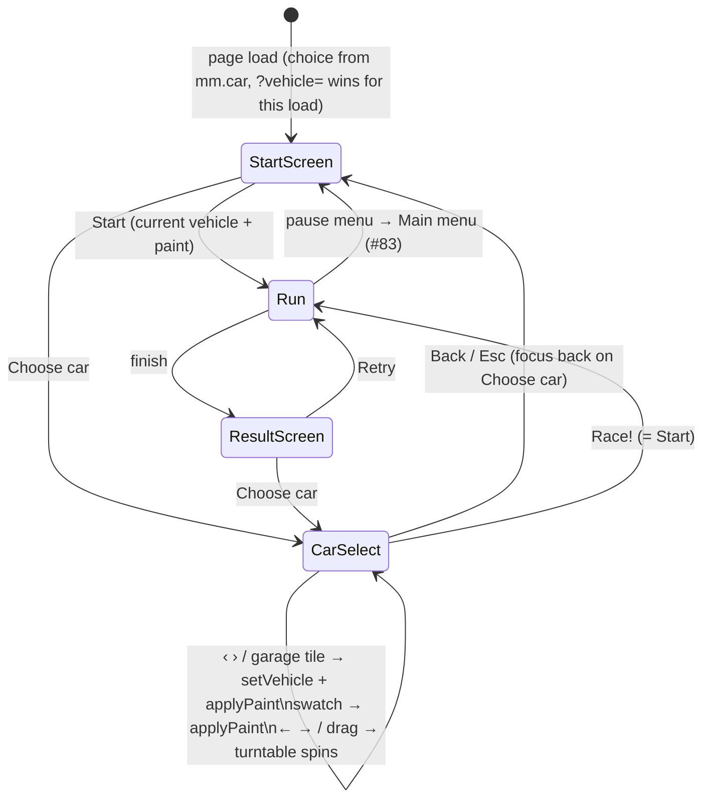

# Car selection screen — design

Status: approved in headless `/enrich` (quick mode, no human gate) 2026-10-03 · Issue #7 · builds on #5 (vehicle table, merged)

## Goal

Issue #7: a vehicle selection screen as in the mockup `design/mockups/CarSelect.dc.html` — turntable preview, stat bars (top speed, acceleration, handling, mass), paint colour, garage — following the UI rules in `TODO.md` („UI mockups"): design tokens from the mockups, real `<button>`s, keyboard navigation, works at phone width, no real-brand logos.

Success: from the start screen a **Choose car** button opens the screen. The real car turns on a turntable in the live 3D scene; ‹ › (and the garage tiles) step through every entry of the vehicle table `VEHICLES`; four stat bars are derived from the table's physical numbers; eleven paint swatches recolour the car at once; **Race!** starts the run with that vehicle and paint, **Back** / Esc returns to the start screen. Vehicle and paint survive a reload; `?vehicle=<id>` in the address (#6's way in) still works and is what the screen shows selected. Everything works with the keyboard alone, with the mouse, and with a finger at 360 px width, in English and German. The tractor and the bus from #6 appear in the screen the moment their table entries exist, with no change to the screen's code.

## Starting point (verified 2026-10-03 on `main` @ `13a4ef7`)

- **Start / result screen:** `#overlay` (`prototype/index.html:168-197`) holds one `.panel` with the title, the key list, a `.row` with `#startbtn` and `#stylebtn2` (`index.html:185-188`) and the terrain row. `#startbtn` calls `SFX.start(); startRace()` (`index.html:1042`). `renderOverlay` (`index.html:1041`) picks intro or result text from `R.state`. Phones (≤ 600 px) hide `#game-nav` while `#overlay` is visible (`index.html:1145`).
- **Vehicle table (#5):** `VEHICLES` (`index.html:856-862`) has one entry, `compact`, in physical units: `drive: { top: 60, topNitro: 90, accel: 16, accelNitro: 34, brake: 24, reverse: 8, reverseMax: 14, grip: 9, gripHandbrake: 1.8, steerRate: 2.6, airSteer: 0.4 }`, `mass: 1.0`, `scale: 1.3`, `camera.chase: { dist: 9, h: 3.4 }`. `let VEH` (`index.html:863`) is the active vehicle; `setVehicle(def)` (`index.html:895`) validates (`checkVehicle`, `:894`), clones and rebuilds the car through `buildCar()` (`index.html:892`), which refills the persistent `car` group with `MODELS[VEH.model](car, VEH)`; `setVehicle(VEH)` runs once at startup (`index.html:897`). The #5 spec deliberately left a normalised stats layer to #7 („the Car Select mockup's bars can be derived later").
- **Car materials:** `carMats` (`index.html:870`) is shared by every build and never disposed (`SHARED_CAR_MATS`, `index.html:890`); the body is `MeshPhongMaterial({ color: 0x1b2d5e })` — a navy that is not in the mockup palette. `applyStyle` (`index.html:907`) only flips `carMats.body.flatShading`; it never touches the colour.
- **Car position before a run:** `P` starts at `START` (`index.html:943`); in `R.state === 'ready'` the loop skips `stepCar` (`index.html:1135`), so the car stands still at `START` while a menu is open. `stepCamera` (`index.html:1022-1027`) sets `car.visible = !v.eye && !HUD.carHidden` every frame (`:1024`), writes `camera.position` every frame and lerps `camPos` to the chase target, then moves sky, sun sprite and sun with the camera (`:1027`). A different camera branch can take over while a flag is set and the chase cam takes back afterwards. Look-back (#65, merged): `keys.KeyB && $('overlay').hidden` (`:1023`). The camera is `PerspectiveCamera(62, …)` (`index.html:829`); `resize` keeps `camera.aspect` (`:909`).
- **Keys:** one `keydown` listener (`index.html:915`); the open J dialog takes every key first (`if (!$('jump').hidden) { jumpKey(e); return; }`). The arrows, Space, Ctrl and Tab are `preventDefault`ed at the end. `keyup` clears `keys[e.code]`; `blur` clears all. Pause (#83, spec and plan on `main`, not implemented) adds `if (pauseKey(e)) return;` after the J check and only acts in `armed` / `racing`; helicopter (#10) takes **F**, look-back (#65) **B**, night (#2) **L**. This screen claims **no new game key**: only Esc, ← →, Tab, Enter and Space while it is open.
- **Persistence:** `localStorage` holds `mm.odo` (`index.html:943`), `mm.best2` (`index.html:1031`) and the shared `gg-lang` (`prototype/i18n.js`). Every access is wrapped in `try/catch`. Night (#2) deliberately does **not** persist (a look, not progress); a vehicle choice is per-player state like `mm.odo`.
- **i18n (#9):** `tr()` (`index.html:210`) → `translate(lang, key, …args)` (`prototype/strings.js:205-209`) falls back to English, then to the key itself. Static markup carries `data-i18n` / `data-i18n-aria`; `rerenderAll` (`index.html:1075-1076`) runs on `gg-langchange`. `strings.test.mjs` enforces equal keys in `en` and `de` and no `ß`.
- **Design tokens** already in the page: `:root` vars `--sun --signal --cream --steel --steel-l --ink --charcoal --go --red` (`index.html:7`); fonts Bungee and Barlow Condensed loaded (`:5`); `.btn`, `.btn.primary`, `.btn:focus-visible` (`:69-73`), `.panel h1` (`:58`).
- **Test hooks:** `window.__mm.vehicles()`, `.vehicle()`, `.setVehicle(def)`, `.gpu()`, `.cam()`, `.hud()` (`index.html:985-989`). Tests: `node --test prototype/tests/*.test.mjs` for pure modules; pytest + Playwright `prototype/tests/test_*.py` in the hand layout (world and terrain blocked), e.g. `test_vehicles.py` (golden trace, `wait_frames`), `test_i18n.py` (locale, `pageerror` capture).
- **#6 tractor and bus** (spec + plan on `main`, not implemented): adds `VEHICLES.tractor` / `.bus` with `model: 'gltf'` (Kenney Car Kit glTF, texture-coloured, inserted asynchronously into the live `car` group after `setVehicle` returns), `collision.shape 'obb'`, `collision.bounce`, a pure `prototype/vehicle.js` with `vehicleFromQuery(search, ids)`, and **`?vehicle=<id>` as the only way to reach them until this picker exists** (its A7). The bus is yellow (`#f5c400`) by definition (docs/07: no PostAuto livery). Table values: tractor `top 11.1, accel 6, grip 30, steerRate 2.2, mass 2.5`; bus `top 22, accel 4, grip 6, steerRate 1.1, mass 8`.
- **#83 pause menu** (spec + plan on `main`): Esc / P only in a run; **Main menu** lands on the start screen (`toMainMenu`: `R.state = 'ready'`, `#overlay` shown, focus on Start). Three buttons, pinned by its tests.
- **#2 night driving** (spec + plan on `main`): adds `#nightbtn` to the same `.row` after `#stylebtn2`.
- **Related issues:** #25 „vehicle colour selection, also orange, purple, pink" — **absorbed into this issue** (user decision 2026-10-03): orange is the mockup's Signal, purple and pink are added to `PAINTS` (A5); #69 „car is too big" (may change `compact.scale`, orthogonal).
- **UI workflow (`CLAUDE.md`):** wireframe → flow → build → review. The mockup `CarSelect.dc.html` is the approved wireframe (user decision 2026-10-03). The flow diagram is in this spec (below) and is reviewed with the issue body before `/gh:implement` is applied — that label is the human gate for both; the plan writes both artefacts into `docs/design/car-select/` first.

## Flow

The pause menu (#83) keeps its three buttons; changing the car mid-run goes through **Main menu → Choose car**.

## Decisions

| Topic | Decision |
|---|---|
| Entry point | A third button `#carbtn` **Choose car** in the start / result screen's `.row`, between `#startbtn` and `#stylebtn2` (`data-i18n="chooseCar"`). **Start** / **Retry** keep starting at once with the current choice — the one-click flow stays. With #2 the row has four buttons; it is `flex-wrap: wrap` already. |
| Screen | A new full-screen `#carsel` (`hidden` by default, `role="dialog"`, `aria-modal="true"`, `aria-labelledby="carseltitle"`, `z-index: 15` — above `#hud` and `#touch`, below `#jump` 20 / `#help` 21) after `#overlay`. While it is open `#overlay` is hidden. Layout as the mockup, scaled to the viewport: header (title **Choose car** in the mockup's h1 style, subtitle = the existing `mode` string „Time trial · Hochrhein"), a two-column body (stage left 58 %, info panel right), a footer bar with **‹ Back** (`.btn`) left and **Race! ›** (`.btn.primary`) right. Class prefix `cs-`, ids `cs*`. |
| Dropped from the mockup | The 1 · 2 · 3 step tabs (there is no race setup screen), the „Fan favourite" badge, the lock / „Next unlock" text (nothing is locked) and the opponents line (v0 has no opponents, `TODO.md` „Decisions already made"). The stage's painted radial backdrop is replaced by the live scene (next row). Nothing else is invented; the mockup's colours, bevels, fonts and spacing are used as they are. |
| Turntable | No second renderer, no cloned mesh. The stage is a **see-through cut-out** onto the live scene: `#carsel` has no background, `#csstage` is transparent with the mockup's bevel border, and `box-shadow: 0 0 0 200vmax rgba(10,8,20,.72)` on the stage dims everything around it (ink overflow, no scroll impact); header, info panel and footer are `position: relative; z-index: 1`, so they sit on top of the dim. While `CARSEL.on`, `stepCamera` runs `stepTurntable(dt)` instead of the view branches: `camPos = camera.position = (P.x + cos a · d, P.y + h, P.z + sin a · d)` with `d = VEH.camera.chase.dist`, `h = VEH.camera.chase.h · 0.65`, looking at the car centre `(P.x, P.y + 0.8 · VEH.scale, P.z)` shifted along the camera's right and up vectors by `lookShift(ox, oy, …)` so the car sits in the **stage's** centre (`ox, oy` = the stage's centre in NDC from `getBoundingClientRect()`), not the screen's. `car.visible = true` in that branch whatever `HUD.carHidden` or the eye views say; `camPos` is set to the same point so the chase cam continues smoothly on close. The sky/sun tail of `stepCamera` is extracted into `camTail()` and runs in both branches. Starting angle `P.th − 0.6`: a three-quarter front view whatever the start heading. |
| Spin | Auto-rotation `SPIN_AUTO` 0.35 rad/s when idle. ← → (held) spin at `SPIN_KEY` 1.8 rad/s; pointer drag on the stage (not on its buttons, pointer capture) adds `dx · SPIN_DRAG` (0.01 rad/px). Any input stops the auto-rotation; it resumes `SPIN_RESUME` 2 s after the last input. Pure `spinStep(state, dt, input)` in `prototype/carselect.js`; the arrow state lives in `CARSEL.dir`, **not** in the game's `keys` (so nothing leaks into `stepCar` when Race! is pressed with an arrow held). |
| Vehicle order | `Object.keys(VEHICLES)` — table order, `compact` first. ‹ › wrap around (`cycle`). A counter top left of the stage: „Car i of n". Garage row: one `<button>` tile per vehicle (`aria-label` and `title` = name, `aria-pressed` on the selected one; selected = Sunflower with a cream border, others steel with a steel-light border, as the mockup). Clicking a tile selects it. |
| Selecting | `selectVehicle(id)`: `CHOICE.id = id`, `setVehicle(VEHICLES[id])` (#5 — rebuilds the car at `START`), `applyPaint(CHOICE.paint)`, `saveChoice()`, re-render keeping the focused swatch / tile (the lists are re-rendered with `innerHTML`, so the focused node is re-found by its `data-*` attribute). The camera keeps its angle so the new car turns in from the same side. |
| Stats | Four bars, 10 cells each, score 1–10 printed at the right (as the mockup). Pure `statBars(def)` in `carselect.js` with **fixed reference ceilings** `STAT_REF = { top: 80, accel: 20, grip: 12, steerRate: 3.2, mass: 3 }`: each ratio is clamped to 0..1 first, `top = drive.top / 80`, `accel = drive.accel / 20`, `handling = 0.5 · grip / 12 + 0.5 · steerRate / 3.2`, `mass = mass / 3`, each `× 10`, `Math.round`, clamped to 1..10. compact → **8 / 8 / 8 / 3**; with #6's values the tractor reads 1 / 3 / 8 / 8 and the bus 3 / 2 / 4 / 10. Fixed ceilings so adding a vehicle never moves the compact's bars. Lit cells Sunflower, the last lit cell Signal orange `#ff9a1a`, unlit `#2a2e38` (mockup); `barCells(score)` gives the ten cell classes. Labels `statTop` … `statMass`; the label column is `minmax(0, 1fr)` with ellipsis („Beschleunigung" fits at 360 px). |
| Vehicle texts | Per vehicle three string keys `veh_<id>_name`, `veh_<id>_class`, `veh_<id>_desc` in `strings.js`. compact uses the mockup copy: **Sissle Speedster** · „Compact · Class B" · „Small, light, a bit too eager. Fits through the old town like it was measured for it." (de: „Sissle Speedster" · „Kompakt · Klasse B" · „Klein, leicht, etwas übereifrig. Passt durch die Altstadt, als wäre sie dafür vermessen worden."). A vehicle without strings (a fresh #6 entry) shows its **id** as the name and empty class / description — never the raw key (`vehicleText(tr, id, part)` compares the result with the key). |
| Paint | `PAINTS` in `carselect.js`, eleven entries in hue order: **navy** `#1b2d5e` (today's factory colour, first, the default), sunflower `#ffc61a`, signal `#ff7a1a` (the orange of #25), swiss `#e0322d`, **flamingo** `#ff6fa8` (pink, #25), **plum** `#7b3fa0` (purple, #25), rhine `#2f6a96`, ice `#7fd1ff`, meadow `#5f8a4c`, cream `#f5efe0`, charcoal `#2a2e38` — the mockup's eight plus navy, plum and flamingo (absorbs #25). Swatches sit in a fixed six-column grid, two rows (6 + 5) at every width. One `<button>` swatch each (`aria-label` = the colour name, `aria-pressed` on the chosen one; chosen = cream border + Sunflower ring, as the mockup); the label row is „Paint" left and the colour name in Sunflower right (mockup). `applyPaint(id)` sets `carMats.body.color` **and** the colour of every mesh in `car` whose `material.userData.paint === true`. **Paintable** = `paintable(def)`: `def.paint === true`, or `def.paint !== false && def.model !== 'gltf'`. So the procedural compact takes paint; #6's texture-coloured glTF vehicles are **fixed by default** (swatches disabled, label „Paint · fixed"), and a glTF entry can opt in with `paint: true` plus `userData.paint` on its body materials (then it must re-apply `CHOICE.paint` when the model arrives). One paint for all vehicles. |
| Persistence | `localStorage['mm.car'] = JSON {"id","paint"}`, written on every change, read once at startup by `initialChoice(raw, location.search, ids, paintIds)`: `parseChoice` validates **field by field** (unknown id → `compact`, unknown paint → `navy`, non-JSON → both defaults), then **`?vehicle=<id>` overrides the id for this load** when it names a table entry (the #6 door stays open and the picker shows it selected; it is only *stored* when the player changes something). Restored **before the first frame**: the startup `setVehicle(VEH)` becomes `setVehicle(VEHICLES[CHOICE.id]); applyPaint(CHOICE.paint);`. If #6 has landed with its own `?vehicle=` startup line, that line is replaced by this one (its `vehicleFromQuery` stays as a tested helper; `initialChoice` is the single startup path). Consistent with `mm.odo` / `mm.best2`. |
| Keyboard | While `#carsel` is open the `keydown` listener hands every key to `carselKey(e)` right after the J check and returns (same slot as #83's `pauseKey`; the two states are exclusive — carsel only in `'ready'`, pause only in `'armed'` / `'racing'`): **Esc** → Back; **← →** → spin (held; `keyup` clears `CARSEL.dir`); **Tab / Shift+Tab**, **Enter**, **Space** → native focus and button activation (not prevented); every other key is ignored by the game, browser defaults untouched (no T, C, R, H, M, J, F, B, V, G, P, L, F1, F3 while choosing; `C` and `B` additionally guard on `$('overlay').hidden`, which is true here, so swallowing them matters). Focus order (DOM): ‹, ›, swatches, garage tiles, Back, Race!. The screen opens with focus on **Race!** (the primary, as the mockup; Enter races at once, Shift+Tab reaches the garage and swatches). Back returns focus to `#carbtn`. No focus trap: Tab may leave to `#game-nav` (the EN/DE toggle is useful here). All buttons have `:focus-visible` outlines (`.btn` rule exists; arrows, swatches and tiles get the same rule). `openCarSel` clears `keys`. |
| Touch / mouse | Drag on the stage spins (Pointer Events, `touch-action: none` on the stage). All buttons ≥ 44 px tall (swatches 56 px at desktop, 44 px at phone width; arrows 76 px; tiles 44 px). `#touch` is hidden while `#carsel` is visible (`body:has(#carsel:not([hidden])) #touch { display: none }`) so its round buttons do not show through the stage. |
| Phone width | `@media (max-width: 700px)`: header, stage (`flex: 0 0 38vh`, ‹ › inside), info panel and footer stack in one column; `#carsel` scrolls vertically, never horizontally at 360 px; tiles wrap (`grid-template-columns: repeat(auto-fill, minmax(44px, 1fr))`); the eleven swatches use a fixed `repeat(6, minmax(0, 1fr))` grid → **two rows** (6 + 5, each swatch ~42 × 44 px at 360 px), no scrolling — auto-fill would fit only 5 columns in the ~284 px inner panel width and need three rows; footer buttons share the width. The `#game-nav` phone rule (`index.html:1145`) becomes `body:has(#overlay:not([hidden]), #carsel:not([hidden])) #game-nav`. German labels (longest: „Beschleunigung", „Vorheriges Fahrzeug" as an aria-label only) fit. |
| Pause / helicopter / look-back / night | No interaction: `#carsel` is only open in `R.state === 'ready'`, so `canPause` (#83) is false; **F** (#10), **B** (#65) and **L** (#2) are ignored while the screen is open (night stays as it was). #83's Main menu lands on the start screen, where **Choose car** is available. |
| #6 contract | The screen reads only `VEHICLES`, `VEH.camera.chase`, `VEH.scale`, `def.drive`, `def.mass`, `def.model`, `def.paint`. #6 adds table entries (and may add strings `veh_<id>_*` — without them the ids „tractor" / „bus" show as names); its glTF models are fixed-paint by the `paintable` rule with no extra field; its asynchronous model arrival lands in the same `car` group the turntable shows. Nothing in this screen needs to change. |
| Pure logic | New module `prototype/carselect.js` (no DOM, no three.js): `PAINTS`, `DEFAULT_CHOICE`, `STAT_REF`, `STAT_KEYS`, `STAT_LABEL_KEYS`, `statBars(def)`, `barCells(score)`, `cycle(i, n, step)`, `paintable(def)`, `parseChoice(raw, ids, paintIds)`, `initialChoice(raw, search, ids, paintIds)`, `carselKeyAction(key)`, `SPIN_*`, `spinStep(state, dt, input)`, `lookShift(ox, oy, dist, fovDeg, aspect)`, `vehicleText(tr, id, part)`. Unit-tested with `node --test` like `debug.js` and `strings.js` (dry-run green during enrichment: 11 tests). `index.html` keeps the DOM glue (`CARSEL` state, `CHOICE`, `openCarSel`, `closeCarSel`, `selectVehicle`, `stepVehicle`, `applyPaint`, `renderCarSel`, `saveChoice`, `stepTurntable`, `carselKey`, `carselKeyUp`). |
| Strings | New keys (en / de): `chooseCar`, `carselTitle`, `carselCount(i, n)`, `carselPrev`, `carselNext`, `carselRotate`, `statTop`, `statAccel`, `statHandling`, `statMass`, `paintLabel`, `paintFixed`, `paintNavy`, `paintSunflower`, `paintSignal`, `paintSwiss`, `paintFlamingo`, `paintPlum`, `paintRhine`, `paintIce`, `paintMeadow`, `paintCream`, `paintCharcoal`, `garageLabel(n)`, `carselBack`, `carselRace`, `veh_compact_name`, `veh_compact_class`, `veh_compact_desc`. The subtitle reuses `mode`. |
| Test hooks | `__mm.carsel()` → `{ open, id, index, count, paint, paintable, bars, bodyColor, angle, focus, carVisible }` (`bodyColor` = `carMats.body.color.getHexString()`, `focus` = id of the focused element); `__mm.registerVehicle(id, def)` (test-only: `checkVehicle(def)`, then `VEHICLES[id] = structuredClone(def)`, re-render if open) so a test can prove the screen picks up a second entry before #6 exists. |
| Changelog / playtest | A player-facing entry under `[Unreleased] / Added` („Choose your car…"); `test-todo.md` gets a „Car selection (#7)" section. |

## Out of scope

- The tractor and bus models, OBB collision, glTF loading (#6).
- Unlocks, badges, opponents, a race setup screen (RaceSetup mockup), the title-screen A/B decision.
- A „Change car" entry in the pause menu (#83 keeps three buttons).
- Per-vehicle paint memory (one paint for all), wheel/rim colours, decals, paint on glTF textures.
- Any change to physics, cameras in a run, `applyStyle` or night lighting.

## Tests

1. **Node (`prototype/tests/carselect.test.mjs`):** `PAINTS` has eleven unique ids and unique hexes, navy first, every hex `#rrggbb`, plum `#7b3fa0` and flamingo `#ff6fa8` present, exactly one orange (signal); `statBars(compact)` = `{ top: 8, accel: 8, handling: 8, mass: 3 }`, the #6 tractor values give `1 / 3 / 8 / 8`, the bus `3 / 2 / 4 / 10`, a compact with `top 30, mass 2` gives `top 4, mass 7`, zeros clamp to 1 and huge values to 10, all integers; `barCells` lit / tip / off; `cycle` wraps both ways (also with n = 1); `paintable` (compact yes, glTF no, `paint: true` opts in, `paint: false` wins); `parseChoice` accepts a valid choice and falls back field by field on `null`, `''`, non-JSON, a number, unknown id, unknown paint, `'constructor'`; `initialChoice` lets `?vehicle=` win for a known id and ignores unknown ones; `carselKeyAction` maps Esc → `back`, ← → → `spin`, Tab / Enter / NumpadEnter / Space → `pass`, every game key and ↑ ↓ → `ignore`; `spinStep` auto-rotates when idle, holds still while an arrow is held, resumes after 2 s, drags by `dx · 0.01`, wraps into `[0, 2π)`; `lookShift(0, 0, …) = [0, 0]` and a stage left of and above centre shifts the look target right and down by the worked amounts; `vehicleText` returns strings, the id for a missing name and `''` for a missing class.
2. **Strings (`strings.test.mjs`):** the new keys exist in `en` and `de` with the expected English and German texts (equal-key and no-`ß` tests cover the rest).
3. **Playwright (`prototype/tests/test_carselect.py`, hand layout, `pageerror` captured):**
   - **Open:** Choose car hides `#overlay`, shows `#carsel`, counter „Car 1 of 1", name „Sissle Speedster", class „Compact · Class B", bars 8 / 8 / 8 / 3 (lit cell counts and printed scores), eleven swatches with navy pressed, one garage tile pressed, focus on `csrace`, `carVisible` true, no page errors.
   - **Spin and Back:** ArrowRight held across frames changes `angle`; releasing it stops the key spin; Esc closes, `#overlay` back, focus on `#carbtn`, `cam().view` unchanged; with V pressed before opening, the car is visible on the turntable and hidden again after Back (`hud().carVisible`).
   - **Paint persists:** click the Sunflower swatch → `bodyColor` `ffc61a`, `paint` `sunflower`, `mm.car` = `{"id":"compact","paint":"sunflower"}`, swatch `aria-pressed`; reload → body colour Sunflower before any click; a stored `{"id":"tank","paint":"zebra"}` falls back to compact / navy without errors; `?vehicle=slow` with a registered… (not possible before load) → covered by the node test; `?vehicle=unknown` → compact, no error.
   - **Second vehicle:** `registerVehicle('slow', compact with top 30, mass 2)` → „Car 1 of 2"; › → „2 of 2", name „slow", bars top 4 / mass 7, tile 2 `aria-pressed`, `vehicle().drive.top === 30`; ‹ wraps to „1 of 2"… › again, then Race! → `#carsel` and `#overlay` hidden, `R.state` leaves `'ready'` (`__mm.raceFlags` exists; use `__mm.carsel().open === false` and `#overlay` hidden plus `vehicle().drive.top === 30`). A tile click selects too.
   - **Fixed paint:** `registerVehicle('yellow', compact with paint: false)` → swatches disabled, label „fixed", `paintable` false; back to compact → enabled again.
   - **Phone:** 360 × 740, `de-CH`: title „Auto wählen", `#carsel.scrollWidth ≤ 360`, every visible button in `#carsel` ≥ 44 px tall, the swatches in exactly two rows, `#game-nav` and `#touch` hidden.
   - **Live language switch:** the EN/DE toggle re-renders the open screen's texts (`csname` stays, `csclass` → „Kompakt · Klasse B", counter „Auto 1 von 1", Race! → „Los! ›").
4. All existing tests stay unchanged and green (`test_vehicles.py` golden trace included — the restored choice is compact / navy by default, so nothing changes without a stored `mm.car`).

## Acceptance criteria

- [ ] The start **and** result screen show a third button **Choose car** (`#carbtn`) between Start / Retry and Style; Start / Retry still start at once with the current vehicle and paint.
- [ ] Choose car opens `#carsel` (`role="dialog"`, `aria-modal`), hides `#overlay`, and shows: title, „Time trial · Hochrhein", the live car turning on the stage with ‹ › and „Car i of n", name / class / description, four 10-cell stat bars with the score, eleven paint swatches (the mockup's eight plus navy, plum and flamingo; absorbs #25) in two rows with the colour name, the garage tiles with „Garage · n vehicles", **‹ Back** and **Race! ›**. Colours, bevels and fonts are the mockup's tokens; no step tabs, badge, unlock or opponents text.
- [ ] Stats come from `statBars(def)` with the fixed ceilings; compact reads 8 / 8 / 8 / 3. A second table entry (test: `__mm.registerVehicle`) appears in ‹ ›, the counter and the garage with its own bars and texts without any change to the screen code; a vehicle without strings shows its id, never a raw key.
- [ ] ‹ ›, swatches, garage tiles, Back and Race! are real `<button>`s; the turntable spins by itself, with ← → held and by dragging; Esc = Back; focus opens on Race!, Back returns focus to Choose car; Tab reaches every control; every other game key is ignored while the screen is open.
- [ ] A swatch recolours the car body at once (`carMats.body` and `userData.paint` meshes); a non-paintable vehicle (`paint: false`, or a glTF model without `paint: true`) disables the swatches and shows „Paint · fixed". Default paint is today's navy, so the game looks as before until the player chooses.
- [ ] Vehicle and paint are stored in `localStorage['mm.car']` and restored before the first frame; an invalid or unknown value falls back field by field to compact / navy without an error; `?vehicle=<id>` still selects a table entry for that load and the screen shows it selected.
- [ ] After Back or Race! the camera view (`camView`) and the car's visibility rules are as before the screen was opened; Race! behaves exactly like Start.
- [ ] At 360 px width in German there is no horizontal scrolling, all buttons are ≥ 44 px tall and `#game-nav` and `#touch` are hidden; the texts switch live with the EN/DE toggle.
- [ ] All new texts go through `tr()` with `en` and `de` entries (equal keys, Swiss spelling).
- [ ] `docs/design/car-select/wireframe.md` (pointer to the mockup plus the dropped elements) and `flow.md` (the Mermaid diagram above) exist.
- [ ] `node --test prototype/tests/*.test.mjs` and the full pytest / Playwright suite are green, `test_vehicles.py` unchanged; `CHANGELOG.md` and `test-todo.md` updated.

## Assumptions

- **A1** [high] [confirmed] The screen follows the mockup `design/mockups/CarSelect.dc.html` — turntable preview, stat bars (top speed, acceleration, handling, mass), paint colour, garage — with the `TODO.md` UI rules (mockup design tokens, real `<button>`s, keyboard navigation, phone width, no real-brand logos) and all text through `tr()` in de/en. Decided by the user on 2026-10-03.
- **A2** [med] Entry point is a **Choose car** button on the start / result screen; Start and Retry keep starting at once; the pause menu (#83) is unchanged (Main menu → Choose car). Rejected: routing Start through the screen (one more click for every run of a time trial); a fourth pause button (#83's `PAUSE_BUTTONS` and its tests pin three, and a swap mid-run would need a restart anyway).
- **A3** [med] The turntable shows the **real car in the live scene** through a see-through stage, with a camera branch in `stepCamera`. Rejected: a second `WebGLRenderer` with a cloned car in a studio scene (a second GL context and a second render per frame on a headless renderer that already draws under 1 fps, plus a clone to keep in sync with `setVehicle`, paint and #6's asynchronous models). Evidence: `camera.position` is rewritten every frame (`index.html:1022-1027`) and the car stands still in `'ready'` (`index.html:1135`).
- **A4** [med] Stat bars use **fixed reference ceilings** (`STAT_REF`) so a new vehicle never moves an existing bar. Rejected: normalising to the table's current max (the compact would read 10 everywhere today and jump when the bus lands). Evidence: the #5 spec left the normalised layer to #7 (`docs/superpowers/specs/2026-10-02-vehicle-table-design.md`, Units row); the ceilings give the #6 tractor 1 / 3 / 8 / 8 and the bus 3 / 2 / 4 / 10 (`docs/superpowers/specs/2026-10-03-tractor-and-bus-design.md`, Tractor / Bus entry rows).
- **A5** [med] [confirmed] Palette = the mockup's eight colours **plus** today's factory navy `#1b2d5e` as the first and default swatch, **plus** purple and pink from #25 (absorbed into #7, user decision 2026-10-03): **plum** `#7b3fa0` and **flamingo** `#ff6fa8`, eleven swatches in hue order. Orange is not duplicated — the mockup's Signal `#ff7a1a` is the orange #25 asks for. Plum and flamingo match the mockup's flat, saturated poster tones (Swiss red, Signal, Rhine blue) and stay clearly apart from navy, charcoal and Swiss red. At 360 px the swatches take **two rows** (fixed six-column grid, 6 + 5), no scrolling. Rejected: making Sunflower the default (changes every player's car and the hub screenshot with no decision behind it); dropping navy (the player could never get the familiar car back); a second orange (#25's orange is already there); `auto-fill` swatches (three rows at 360 px). Evidence: `carMats.body` colour `0x1b2d5e` (`index.html:870`).
- **A6** [med] Vehicle **and** paint persist in `localStorage['mm.car']`, restored before the first frame, validated field by field. Rejected: session-only (re-pick on every visit; the repo already persists per-player state in `mm.odo` / `mm.best2`, `index.html:943`, `:1031`); all-or-nothing validation (a table rename would also forget the paint). One paint for all vehicles. Night (#2) chose *not* to persist, but night is a look and the vehicle is progress-like player state.
- **A7** [med] The compact is called **Sissle Speedster** with the mockup's class and description copy. Rejected: naming it „Compact" (the mockup copy was written for exactly this car; „Sissle" is the river, not a brand — docs/07 lists Sissila and Volg, not Sissle).
- **A8** [med] Dropped from the mockup: step tabs, „Fan favourite", unlocks, opponents, the painted stage backdrop. Rejected: rendering them as dead decoration (`TODO.md`: race setup shows missing features as „v1", not as dead controls; there is no race setup screen and v0 has no opponents).
- **A9** [med] Focus opens on **Race!**; ← → spin the turntable (as the mockup's hint says) and ‹ › buttons switch the vehicle. Rejected: ← → switching vehicles (contradicts the mockup's „ROTATE · DRAG OR ← →" and leaves nothing for the turntable).
- **A10** [med] Every other game key is ignored while the screen is open (like the J dialog, `index.html:915`), browser defaults untouched. Rejected: letting T / C / M / L act (C would change the view behind the turntable, L the lighting; both are reachable from the start screen a click away).
- **A11** [high] New UI text goes through `tr()` with en and de entries (`strings.test.mjs` enforces equal keys and no `ß`).
- **A12** [high] Wireframe gate = the mockup, confirmed by the user 2026-10-03; flow gate = the Mermaid diagram in this spec, reviewed with the issue body before `/gh:implement` (applying that label is the gate). The plan writes both into `docs/design/car-select/` as `CLAUDE.md` asks; build = the plan's tasks, review = the PR review against this spec's AC.
- **A13** [high] `?vehicle=<id>` keeps working and wins over the stored id for that load; the picker shows it selected. User direction 2026-10-03 („#6's spec makes vehicles reachable only via `?vehicle=` until this picker exists, so wire #7 to that"). Evidence: #6 spec A7 and its `vehicleFromQuery` row.
- **A14** [med] glTF vehicles are **fixed-paint by default** (`paintable(def)`), with `paint: true` + `userData.paint` as the opt-in. Rejected: paint on by default for every vehicle (a Kenney model carries its colour in a texture, so a swatch would visibly do nothing — a dead control); requiring #6 to add `paint: false` (#6's plan is already on `main` and should not need an edit for this screen). Evidence: #6 spec „Model files" row (`colormap.png`), „Bus model" row (yellow by definition).

## Consequences

- The start screen's `.row` gets a third button (a fourth with #2); at phone width it wraps to a second line (the row is `flex-wrap: wrap` already).
- A player who never opens the screen sees no change: compact, navy, same camera, same physics (the golden trace holds).
- The car body colour is now player state: screenshots in bug reports may show any of eleven colours.
- Opening the screen rebuilds nothing until a different vehicle is chosen; each ‹ › press runs `setVehicle` (a rebuild, ~ms; `test_rebuilds_free_gpu_memory` already guards the leak).
- `mm.car` is a third `mm.*` key in the shared `github.freaxnx01.ch` origin (same pattern as `mm.odo`).
- #6 inherits a contract: without strings `veh_tractor_*` / `veh_bus_*` its vehicles show „tractor" / „bus" as names; their swatches are disabled („Paint · fixed") unless an entry opts in. #6's own startup `?vehicle=` line, if it lands first, is replaced by `initialChoice` (one startup path).
- #69 (car too big) may change `compact.scale`; the turntable distance scales with `VEH.camera.chase.dist`, not with `scale`, so a smaller car will look smaller on the stage — acceptable and honest.
- #83 and this screen both insert a guard at the top of the `keydown` listener and both edit the `#game-nav` phone rule; #2 adds a button to the same `.row`. Merge conflicts on those one-liners are likely but trivial.
- The dim outside the stage is a `box-shadow` of the stage: when `#carsel` scrolls at phone width, the cut-out scrolls with the stage. The HUD (speedometer, minimap) is dimmed but still drawn behind the panels.
- The turntable's look-target shift relies on the sign convention of `lookShift` and the camera's right vector; if the car sits off-centre in the stage in the first build, the fix is one sign in `stepTurntable`, never in the pure function's tests.
